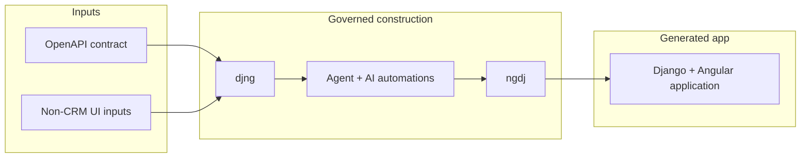
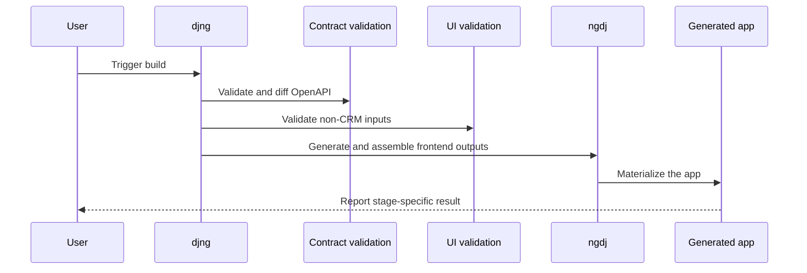

# Requirements

## 1. Introduction

### 1.1. Purpose of the Document

This document defines the baseline requirements for the full-stack application
platform and the governed construction model that the integration targets.

The terms `djng` and `ngdj` use the definitions in [ARCHITECTURE.md]
§§ 2.5-2.6.

The terms `AI automations`, `SKILLS`, `TOOLS`, `HOOKS`, `PLUGINS`, and
`AI-automation-based construction` use the definitions in
`ARCHITECTURE.md` §§ 2.14-2.15 and §19 (see [Claude Skills]).

The term `the agent` uses the definition in `ARCHITECTURE.md` §2.16.

Related architectural context: see `ARCHITECTURE.md` §§ 1, 3, and 7.

### 1.2. Business Problem Being Solved

Organizations need a repeatable way to connect [Django], [DRF - Django REST Framework]
(DRF), and [Angular Material] into a single full-stack application without
manual glue work between backend contracts, frontend generation, and
user-facing UI assembly.

They also need a governed way to derive and evolve full-stack outputs from the
OpenAPI contract and a separate structured input source for non-CRM pages and
reactive forms, rather than coordinating those changes manually across tools
and layers.

Because the business domain is not yet specified, the platform must provide a
maintainable, reusable, and modular foundation for business applications so
teams can deliver new business modules rapidly without reworking the core
architecture.

### 1.3. System Scope and Boundaries

These requirements are derived from and must remain aligned with
`ARCHITECTURE.md`.

This document does not define the internal subsystem design or authoring
process for AI automations; those subjects are covered separately in
[GENERATE_AI_AUTOMATIONS.md]. `SKILL_AUTHORING_PLAN.md` remains the
skills-specific authoring sub-plan within that broader automation model.

This document also does not define the detailed app-builder command contract,
change-set structure, build-plan serialization, or scenario-by-scenario test
examples. Those are covered separately in
[APP_BUILDER_REQUIREMENTS.md] and [TEST_EXAMPLES.md].

**Out of initial release scope:**

- Native mobile applications
- Public multi-tenant marketplace behavior
- Complex workflow engine features unless demanded by the first business module
- Real-time collaboration
- Advanced analytics or BI dashboards beyond operational summaries

### 1.4. Assumptions

- The application is first-party software owned by one organization
- Users access the product through a web browser
- The first release is focused on internal or partner-facing workflows rather
  than anonymous public traffic
- At least one business module will be implemented in the MVP, but the platform
  must support more modules later

## 2. Business/System Overview

### 2.1. System context and vision

`django-angular3` enables seamless integration of Django, Django REST
Framework (DRF), and Angular Material.

The system context is a production-ready full-stack business application in
which Django is the primary backend framework, DRF is the API layer, [Angular]
is the single-page application frontend, Angular Material is the design system
and component library, and OpenAPI is the contract source of truth for CRM-
facing functionality.

Within that context, `djng` governs the backend contract lifecycle and derives
Angular-side work from contract and configuration inputs, while `ngdj`
provides the Angular-side construction capabilities needed for workspace and
application assembly and for generation from OpenAPI contracts and non-CRM
content definitions.

These requirements therefore address the generated application platform
together with the governance and construction surfaces needed to support tight
frontend/backend integration for local development and production.

### 2.2. Business goals and expected value

The platform must support secure, role-based workflows for multiple user
types, provide a clean and accessible user experience for desktop-first
business work, and remain observable, testable, and ready for staged
deployment.

It must also support maintainable and rapid delivery of business modules
through shared patterns, generated integration artifacts, and one complete
end-to-end module implementation in the first scope of delivery.

The expected value is reduced manual integration effort between backend and
frontend work, faster iteration when adding or changing modules, safer change
handling through reusable patterns and governed generation, and stronger
deployment readiness through baseline automated tests, health checks, and
clear local-development and staging paths.

### 2.3. Major subsystems and external dependencies

The major subsystems in scope are the generated application platform, the
`djng` governance and construction surface, and the `ngdj` Angular-side
construction substrate consumed by governed construction.

The generated application depends on a durable, versioned OpenAPI schema
artifact as the contract input for CRM-facing content and on a separate
structured input source for non-CRM pages, reactive forms, and custom
workflows.

`djng` provides the Django/Python-side governance of the backend contract
lifecycle and derives Angular-side work from contract and configuration
inputs, while `ngdj` provides workspace assembly, application assembly, and
generation capabilities for contract-derived and non-CRM Angular artifacts.

External dependencies and services include:

- Swagger Studio / SwaggerHub-style authoring flow for designing or updating
  the OpenAPI specification before export
- versioned OpenAPI schema artifacts (see [OpenAPI 3.1 Specification]) exported into `spec/openapi/source/`. OAS 3.1 is the pinned version; the toolchain ([drf-spectacular], [oasdiff], [ng-openapi-gen]) does not yet support OAS 3.2.
- structured non-CRM UI inputs maintained in `spec/ui/`
- [oasdiff] for OpenAPI schema diffing and change detection
- [ng-openapi-gen] (source: [ng-openapi-gen-github]) where Angular-native client generation is required
- [datamodel-code-generator] (source: [datamodel-code-generator-github]; online playground: [datamodel-code-generator-playground]) for the contract-first use case: generating the Django data model from an existing OpenAPI Schema, using djng-owned custom Django templates, when no Django model exists yet (see [ARCHITECTURE.md] §§ 2.22 and 11.2)
- a web browser as the primary client environment
- an email delivery service when account or workflow notifications are enabled

### 2.4. High-level capabilities

At a high level, the platform must provide:

- authentication, authorization, and user-administration capabilities for
  secure role-based access
- a consistent application shell, navigation model, and responsive user-facing
  experience
- modular business features with reusable list, detail, create, update, and
  deactivate or delete patterns
- search, auditability, notifications, file handling, and administrative
  support capabilities needed for business operations
- contract-driven integration between backend and frontend through durable
  OpenAPI artifacts, generated Angular integration artifacts, and governed
  change handling
- support for non-CRM content through a separate structured input source for
  bespoke pages, reactive forms, and custom workflows
- baseline health, error-handling, observability, automated-testing, and
  deployment-readiness capabilities suitable for local development and staged
  delivery

## 3. Use Cases / User Journeys

### 3.1. Roles and Actors

#### 3.1.1. End-User Roles, Administrative and Operational Roles, permissions, and responsibilities

The platform must distinguish end-user, administrative, and operational roles
and apply role-based permissions consistently across UI navigation, API
endpoints, and administrative functions.

- Anonymous user: may access the login screen and other explicitly public
  pages only.
- Authenticated user: may use permitted business features and must be able to
  view and update personal profile details.
- Manager or supervisor: may review broader data sets and approve sensitive
  actions when required by the business domain.
- Administrator: may create, activate, deactivate, and update users; assign
  roles or permission groups; manage core configuration and centrally managed
  reference data; and perform administrative actions subject to audit.
- Support or operations user: may inspect logs, audit history, and system
  state within approved permissions.

Permission and responsibility expectations:

- access must be restricted to authenticated users unless a route is
  explicitly public
- role-based access control must be enforced on both API endpoints and UI
  navigation
- sensitive actions must be restricted by role and, where needed, object-level
  ownership or scope
- administrative changes must be auditable

#### 3.1.2. External systems and services

The platform interacts with external systems and services that provide
contract inputs, generation support, delivery support, and client access.

- OpenAPI authoring and export system: users may design or update the API
  contract in Swagger Studio / SwaggerHub-style tooling before exporting the
  schema artifact into `spec/openapi/source/`.
- OpenAPI schema artifacts: durable, versioned schema files are external input
  artifacts consumed by downstream validation and generation flows.
- Schema diff tool: `oasdiff` must participate in contract change detection and
  breaking-change analysis between schema versions.
- Angular code generation tool: `ng-openapi-gen` may be used when Angular-
  native client generation is required for contract-derived artifacts.
- Email service: external email delivery may be used for account and workflow
  notifications when notification features are enabled.
- Web browser client: users access the generated application primarily through
  a browser-based client environment.
- External identity provider: if single sign-on is added later, an external
  authentication provider may participate as a federated identity service.

#### 3.1.3. Actor goals and expectations

Each actor must be able to achieve the outcomes associated with that role and
must be able to judge success through secure access, predictable navigation,
effective task completion, and traceable system behavior.

- Anonymous user: expects access to the login screen and any explicitly public
  pages, with a clear boundary between public and protected functionality.
- Authenticated user: expects to sign in securely, recover account access when
  needed, navigate the application easily, search and filter records, and
  complete routine business tasks through responsive list, detail, and form
  workflows.
- Manager or supervisor: expects broader visibility into relevant records and
  the ability to review or approve sensitive actions when required by the
  business domain.
- Administrator: expects to manage users, roles, permission group assignment,
  and reference data efficiently while relying on audited administrative
  actions and clear account status information.
- Support or operations user: expects to inspect logs, authentication events,
  audit history, and system state so issues can be diagnosed and operational
  activity can be traced.

From the actor perspective, success means the system provides secure identity
handling, permission-appropriate navigation and access, reusable business
module workflows, deterministic search behavior, and auditable business and
security events.

#### 3.1.4. Trust and security boundaries

The platform must make trust and security boundaries explicit for all actors
and must enforce those boundaries through authenticated access, role-based
permissions, and server-side authorization controls.

- Anonymous users may access only explicitly public pages and must not gain
  access to protected routes, APIs, or administrative functions.
- Authenticated users may access only the routes, records, and actions allowed
  by their role and, where required, by object-level ownership or scope.
- Administrative and operational users may perform elevated actions only
  within approved permissions and with audit visibility for those actions.
- API endpoints must require authenticated access unless explicitly public and
  must enforce validation, authorization, and standard HTTP semantics on the
  server side.
- The Angular frontend may guide navigation and presentation behavior, but it
  must not be the final trust boundary for security decisions; backend
  enforcement in Django and DRF remains authoritative.
- The frontend/backend separation must preserve Angular as the user-facing
  route and interaction layer while Django and DRF remain responsible for
  backend business logic, service endpoints, authentication services,
  authorization enforcement, and administrative capabilities.
- Secure defaults must be maintained for cookies, CSRF, headers, transport,
  and secret handling, and sensitive tokens must not be stored in browser
  local storage.

### 3.2. Primary user workflows

The platform must support the following primary user workflows:

- **Sign in / sign out**: a user authenticates securely, accesses permitted
  application areas, and ends the session explicitly when work is complete.
- **Manage own profile**: an authenticated user views and updates personal
  profile details and maintains current account information.
- **Administer users and permissions**: an administrator creates, activates,
  deactivates, and updates users, assigns roles or permission groups, and
  manages related access configuration.
- **Browse, search, and filter business records**: an authorized user opens
  list views, applies filtering and sorting, pages through results, and finds
  relevant records for review or action.
- **Create, update, and deactivate a business record**: an authorized user
  completes list-detail-form workflows to create, edit, validate, and where
  appropriate deactivate or delete business records.
- **Manage administrative and reference data**: an authorized administrator
  maintains core configuration and centrally managed reference data used across
  business modules.
- **Run the first-time build from OpenAPI and UI inputs**: a user exports the
  OpenAPI artifact into `spec/openapi/source/`, provides non-CRM UI inputs in
  `spec/ui/`, triggers the build, and receives stage-specific feedback from
  validation, generation, and final assembly.

### 3.3. Preconditions and postconditions

Unless a route is explicitly public, the primary workflows assume a browser-
based client, authenticated access, role-appropriate permissions, and API
endpoints that enforce validation and authorization on the server side.

- **Sign in / sign out**
  - Preconditions: the login route is publicly reachable; the user accesses
    the application through a supported web browser; protected routes and APIs
    require authentication.
  - Postconditions: a successful sign-in establishes access only to permitted
    routes and API operations; sign-out ends that protected access.

- **Manage own profile**
  - Preconditions: the user is authenticated and permitted to access profile
    functionality.
  - Postconditions: profile changes are accepted through validated API
    requests, or predictable validation errors are returned.

- **Administer users and permissions**
  - Preconditions: the actor holds administrative permissions for user and
    access management.
  - Postconditions: user, role, and permission changes are applied only
    through authorized operations and remain within the defined access model.

- **Browse, search, and filter business records**
  - Preconditions: the actor is authorized to access the relevant records; the
    API supports authenticated access plus filtering, sorting, and pagination.
  - Postconditions: the user receives deterministic result sets and predictable
    API responses for the selected filters and sort order.

- **Create, update, and deactivate a business record**
  - Preconditions: the actor has permission to perform the requested action;
    the target API endpoint validates authenticated access and request data.
  - Postconditions: the record change is accepted through standard HTTP and
    validation behavior, or a predictable validation error is returned.

- **Manage administrative and reference data**
  - Preconditions: the actor is authorized for administrative configuration or
    reference-data maintenance.
  - Postconditions: approved configuration or reference-data changes are
    committed through validated administrative operations.

- **Run the first-time build from OpenAPI and UI inputs**
  - Preconditions: a versioned OpenAPI schema artifact is available in
    `spec/openapi/source/`; non-CRM inputs are available in `spec/ui/`; the
    OpenAPI contract is valid and generation-compatible; and non-CRM inputs are
    valid.
  - Postconditions: the build either produces generated CRM-facing artifacts,
    assembled application outputs, and stage results for valid inputs, or it
    fails fast with stage-specific feedback identifying contract validation,
    code generation, non-CRM input validation, or final app assembly.

### 3.4. Normal interaction sequences

The platform must support normal interaction sequences that are predictable,
role-appropriate, and validated through backend-enforced operations.

- **Sign in / sign out**
  1. The user opens the login page.
  2. The user submits credentials.
  3. The backend authenticates the request and establishes the permitted
    session.
  4. The frontend exposes only the routes and navigation items allowed for the
    authenticated role.
  5. The user signs out and protected access ends.

- **Administer users and permissions**
  1. An administrator opens the user-management area.
  2. The administrator creates, updates, activates, or deactivates a user.
  3. The administrator assigns or changes roles and permission groups.
  4. The backend validates and persists the authorized change.
  5. The updated access model becomes effective for subsequent interactions.

- **Browse, search, and filter business records**
  1. An authorized user opens a list view for a business module.
  2. The user applies search text, filters, sort order, or pagination.
  3. The frontend issues the corresponding API request.
  4. The backend returns the permitted, filtered, and ordered result set.
  5. The user reviews the returned records and selects one for further action
    where needed.

- **Create, update, and deactivate a business record**
  1. An authorized user opens a create, detail, or edit view.
  2. The user enters or modifies record data in the form workflow.
  3. The frontend submits the validated request to the backend.
  4. The backend validates, accepts, and stores the change, or returns
    validation errors.
  5. The user is returned to the updated detail or list context with the new
    record state reflected.

- **Run the first-time build from OpenAPI and UI inputs**
  1. A user designs or updates the OpenAPI specification in the authoring
    tool.
  2. The user exports the schema artifact into `spec/openapi/source/`.
  3. The user provides non-CRM UI inputs in `spec/ui/`.
  4. The user triggers the build from the repository.
  5. The build validates the contract and non-CRM inputs, generates CRM-facing
    artifacts, assembles the Angular application, and reports the stage
    outcome.

### 3.5. Alternative and failure flows

The platform must make alternative and failure flows explicit so users and
operators can identify what failed, why it failed, and whether the issue is
recoverable.

- **Invalid login or denied access**: when authentication fails or a user
  attempts an unauthorized route or action, access must be denied cleanly and
  protected functionality must remain unavailable.
- **Validation failure**: invalid form submissions or invalid API requests must
  return predictable validation errors that can be surfaced at field and form
  level.
- **Contract invalid**: if the OpenAPI contract is invalid or incompatible
  with generation, the build must fail fast before downstream construction
  continues.
- **Non-CRM input invalid**: if structured UI inputs in `spec/ui/` are
  invalid, the build must fail fast and identify the non-CRM input stage as
  the point of failure.
- **Build failure**: when generation or assembly fails, the flow must surface
  which stage failed — contract validation, code generation, non-CRM input
  validation, or final app assembly — rather than reporting a generic error.
- **Breaking schema change detected**: when `oasdiff` detects a breaking
  change, downstream construction must be blocked until the change is
  explicitly acknowledged or resolved.
- **Recoverable UI or server failure**: recoverable UI errors must not cause
  users to lose unsaved form state, and unexpected server errors must be
  logged while surfacing user-safe messages.
- **Development-time generation failure**: when app generation fails during
  development with `DEBUG=True`, the failure must surface through Django's
  standard error reporting path rather than being swallowed silently or shown
  only in console output.

### 3.6. State transitions and synchronization points

The platform must define the state transitions and synchronization points that
keep authentication state, business-record state, contract-derived outputs,
and assembled application outputs aligned.

- **Anonymous → authenticated → signed out**: a successful sign-in must move a
  user from anonymous access to an authenticated session with role-appropriate
  permissions, and sign-out or session expiry must return that user to a
  non-authenticated state.
- **Business-record lifecycle states**: where a module uses draft, active, and
  deactivated record states, transitions between those states must occur only
  through authorized and validated operations, and the visible UI state must
  match the persisted backend state.
- **Authentication and audit synchronization**: login, logout, failed-login,
  password-reset, and sensitive administrative actions must produce auditable
  events that remain consistent with the effective user and record state.
- **Contract change detected → generation blocked or continued**: when the
  OpenAPI schema changes, `oasdiff` must classify the change before downstream
  work continues; breaking changes must block generation until resolved or
  explicitly acknowledged, while acceptable changes may continue through the
  construction flow.
- **Generated artifacts → assembled app → verified app**: for valid inputs,
  construction must move from validated contract and non-CRM sources to
  generated CRM-facing artifacts, then to an assembled application, and then
  to verified outputs that satisfy the required acceptance checks.
- **Backend, frontend, and generated-output synchronization points**: the
  backend contract, generated Angular integration artifacts, and frontend
  composition must remain synchronized after authentication changes, schema
  changes, business-record changes, and each build or verification cycle so
  the application behavior stays aligned with the current contract and
  permissions model.

## 4. Functional Requirements

### 4.1. API Requirements

These requirements elaborate `ARCHITECTURE.md` §§ 8.3 and 11.1-11.4.

- The platform must not require API-level namespace versioning as the contract
  versioning mechanism
- API endpoints must support authenticated access, validation, and standard HTTP
  semantics
- List endpoints must support filtering, sorting, and pagination
- API errors must return a predictable structure usable by the Angular client
- The backend must expose a durable, versioned OpenAPI schema artifact for
  downstream tooling and generated CRM-facing content; schema versioning is the
  contract versioning mechanism that drives frontend alignment
- `oasdiff` must be used as the OpenAPI schema diff and change detection tool
- `oasdiff` must run as part of the contract normalization stage to detect
  breaking and non-breaking changes between schema versions
- Breaking changes detected by `oasdiff` must block downstream construction
  until explicitly acknowledged or resolved
- The governed construction flow must provide an explicit path for
  acknowledging or resolving breaking changes before downstream construction
  is permitted to resume; blocking a build without a supported resolution path
  is not acceptable behavior (see `--acknowledge-breaking` in
  `APP_BUILDER_REQUIREMENTS.md` FR-4 for the governed implementation)
- API schema generation and browsable documentation should be available in
  non-production environments

### 4.2. Construction Workflow

See `ARCHITECTURE.md` §§ 4.1-4.3 and 7.1-7.4 for the governing ownership
boundaries, architectural control-loop, verification, and build-flow model.

#### 4.2.1. Platform ownership

- Django and DRF must own the data model, persistence layer, backend business
  logic, authenticated APIs, authentication services, authorization
  enforcement, and backend integrations
- Django and DRF must own administrative capabilities for data administration,
  reference data, and operational tooling, including backend-oriented
  administration interfaces
- Django and DRF must own backend packaging and deployment-facing server
  artifacts
- Angular must own the user-facing application experience, page layout,
  navigation, forms, tables, dialogs, interaction design, and end-user
  application routing, with Angular Material as the primary UI system
- Angular must consume Django and DRF APIs as the backend contract surface and
  must not be the final trust boundary for security decisions

#### 4.2.2. Governed construction

- `djng` must provide the generation entry points that drive integrated Django-
  Angular construction, including backend contract lifecycle governance,
  change-requirement derivation, orchestration-facing work definitions,
  generator-app execution, and governed command wrappers around `ngdj` actions
- `ngdj` must provide the Angular-side commands, schematics, templates, and
  assembly actions consumed by governed construction, including generation
  from contract-derived and non-CRM inputs
- Governed construction must be carried out by the agent through the governed
  AI automation model, using SKILLS for AI-guided construction work, TOOLS for
  deterministic bounded operations, and HOOKS for lifecycle gates or mandatory
  side effects
- Governed construction must be driven by an agentically orchestrated procedure
  graph derived from change detection, with procedure kinds broad enough to
  represent AI-guided SKILL sessions, deterministic TOOL procedures,
  verification procedures, and enforced gate boundaries, and with each
  procedure producing or validating output directly in relation to the
  generated app workspace
- Primitive selection must follow an explicit policy: deterministic work must
  prefer TOOL contracts, AI-guided generation or repair work may use SKILLS,
  and mandatory lifecycle enforcement must not rely on optional agent behavior
  where a HOOK or gate is required
- Related automations may be packaged as PLUGINS, but those packaging
  boundaries must preserve the ownership split between `djng` and `ngdj`
- Governed construction must support iterative inspection, repair, retry, and
  refinement when emitted outputs are incomplete, inconsistent, or invalid,
  and must continue until deterministic acceptance conditions are satisfied or
  a blocking issue is surfaced explicitly (see `ARCHITECTURE.md` §7.2 for
  where the repair and refinement loop is located within the construction
  model)
- Governed construction must derive required work by comparing the current
  contract, configuration, and structured inputs against their previously
  accepted state; work derivation must not assume a clean-slate context unless
  no previous state exists
- The platform must support a contract-first backend origination mode (see
  [ARCHITECTURE.md] §§ 2.22 and 11.2) alongside the model-first mode: when no
  Django data model exists yet, the Django data model must be generatable from
  an existing OpenAPI Schema using [datamodel-code-generator] with djng-owned
  custom Django templates, after which DRF elaboration and the model-first
  steady state apply
- Any backend data model change that produces a Django migration must trigger
  OpenAPI schema re-extraction before the contract normalization stage proceeds

#### 4.2.3. First-time build flow

The initial authoring and build flow must support this sequence:

1. A user designs or updates the OpenAPI specification using SmartBear's
   OpenAPI authoring tools (Swagger Studio or SwaggerHub)
2. The user exports or dumps the OAS artifact into `spec/openapi/source/`
3. The user adds non-CRM changes such as bespoke reactive forms, page
   definitions, or workflow-specific UI content into `spec/ui/`
4. The user fires a build from the repository
5. The build validates the OAS artifact and non-CRM inputs, generates
   CRM-facing artifacts, assembles the Angular app, and reports any stage-
   specific contract or input errors clearly

For this flow:

- The repository must provide a clear location for the source OAS artifact at
  `spec/openapi/source/`
- The repository must provide a separate location for non-CRM content inputs at
  `spec/ui/`
- The build must fail fast when the OpenAPI contract is invalid or incompatible
  with generation
- The build must fail fast when non-CRM content inputs are invalid
- For the same OAS and non-CRM inputs, the build must preserve deterministic
  validation and acceptance behavior even if internal construction steps vary
- The build must allow a first-time user to understand which stage failed:
  contract validation, code generation, non-CRM input validation, or final app
  assembly

### 4.3. Authentication and Identity

- Users must be able to sign in and sign out securely
- The system must support password-based authentication at minimum
- The system should be designed to add SSO later without major rewrites
- Password reset and account recovery flows must be supported
- Session expiration and idle timeout behavior must be configurable

### 4.4. Authorization

- Access must be restricted to authenticated users unless a route is explicitly
  public
- The system must support role-based access control
- Permissions must be enforceable on both API endpoints and UI navigation
- Sensitive actions must be restricted by role and, where needed, object-level
  ownership or scope

### 4.5. User Management

- Administrators must be able to create, activate, deactivate, and update users
- Administrators must be able to assign roles or permission groups
- Users must be able to view and update their own profile details
- The system must track basic account status metadata such as creation date,
  last login, and active state

### 4.6. Application Shell and Navigation

- The frontend must provide a consistent shell with top-level navigation,
  breadcrumbs, and page titles
- The frontend must own client-side routing for the user-facing application
- Navigation items must be shown or hidden based on permissions
- The UI must support a responsive layout across standard desktop and mobile
  breakpoints
- Global feedback patterns must exist for loading, success, warning, and error
  states
- User-facing product screens should be implemented in Angular Material

### 4.7. Business Module Pattern

- The platform must support modular feature areas with isolated backend apps and
  frontend feature modules
- Each business module should support list, detail, create, update, and
  deactivate or delete flows where appropriate
- List screens must support filtering, sorting, and pagination
- Detail views must show key metadata and related records where relevant
- Forms must include client-side and server-side validation

### 4.8. Search and Data Discovery

- Users must be able to search records by primary identifying fields
- Filters must support common business cases such as status, owner, date range,
  and free text
- Large result sets must be paginated
- Default sorting must be deterministic

### 4.9. Auditability

- The application must record important security and business events
- Changes to sensitive data should capture who made the change and when
- Audit history must be viewable by authorized users
- Authentication events such as login, logout, failed login, and password reset
  should be traceable

### 4.10. Notifications

- The platform should support system notifications for important events
- Email delivery should be supported for account and workflow notifications
- In-app notifications are desirable but not required for the first release

### 4.11. File Handling

- The platform should support file attachments for business records where needed
- File upload validation must enforce size and type restrictions
- Download access must respect record-level permissions

### 4.12. Administration and Reference Data

- The system must provide administrative screens for core configuration
- Reference data used across business modules must be centrally manageable
- Administrative changes must be audited

### 4.13. Content Source Strategy

See `ARCHITECTURE.md` §§ 8.2-8.5 and 10.2 for the related architectural
content-boundary and generated-artifact model.

- Terms such as CRM, non-CRM content, OpenAPI contract, and Angular
  integration artifacts use the definitions in `ARCHITECTURE.md` §§ 2.8-
  2.11.
- The OpenAPI contract must be the source of truth for CRM-facing content,
  contracts, and generated Angular integration artifacts
- CRM list, detail, and standard form experiences should be derived from the
  OpenAPI contract where practical instead of being duplicated by hand
- Angular-related integration functionality shared across modules must be
  generated or maintained as reusable Angular integration artifacts
- Angular client generation may use `ng-openapi-gen` when its Angular-native
  output is a better fit than the baseline generator path
- Non-CRM content — such as bespoke reactive forms, standalone pages, and
  custom workflows — must come from a separate structured input source
- The non-CRM input source must be versioned, validated, and able to reference
  shared UI primitives and API contracts without becoming the CRM source of
  truth
- The Angular application must be assembled from two input streams: contract-
  derived Angular integration artifacts produced from the OpenAPI contract, and
  non-CRM content prepared from the structured input source; these two streams
  must remain separate and must not be merged into a single source of truth
- Angular integration artifacts must include OpenAPI-derived typed API clients,
  CRM-oriented resource adapters, shared Angular Material integration patterns
  for list, detail, and standard form experiences, and authentication, CSRF,
  and transport helpers needed for Django integration
- Angular integration artifacts must not own product-specific application shell
  decisions, fully bespoke pages that are not OpenAPI-derived, business content
  that belongs to the main frontend application, or backend data administration
  concerns that belong to Django and DRF

### 4.14. Error Handling and Recovery

- Validation errors must be presented clearly at field and form level
- Unexpected server errors must be logged and surfaced with user-safe messages
- Users must not lose unsaved form state because of recoverable UI errors

### 4.15. Development Experience and Tooling

- When the generated app's Django server runs with `DEBUG=True`, any failure
  during app generation (Python exceptions raised by djng management commands
  or app-builder invocations) must surface through Django's standard error
  reporting mechanism — the same traceback page the developer would see for any
  unhandled Python exception. Generation failures must not be swallowed silently
  or reported only to stdout.
- The generated app must expose a `/ng/build` page accessible during
  development. This page shows the current Angular build and health status from
  the Angular toolchain's point of view: last `ng build` exit status and
  timestamp, TypeScript compilation errors and warnings, bundle size summary,
  ESLint output if configured, and a re-trigger control. This page must be
  gated behind `DEBUG=True` or an explicit `ENABLE_NG_BUILD_PAGE=True` flag and
  must never be exposed in production.

### 4.16. Verification Requirements

See `ARCHITECTURE.md` §7.3 for the architectural verification model.

Verification must occur throughout construction and integration, not only as a
final check. The platform must support the following verification categories:

- **Contract verification**: the OpenAPI contract and non-CRM inputs must be
  validated and breaking changes detected before downstream construction
  proceeds; invalid or incompatible inputs must block the corresponding stage.
- **Construction-output verification**: generated and assembled outputs must be
  inspectable so they can be corrected, refined, or reused across iterations;
  emitted artifacts must not be treated as opaque or assumed correct without
  review.
- **Integration verification**: alignment between backend behavior, generated
  Angular integration artifacts, and frontend composition must be verified
  after schema changes, business-record changes, and each build or
  verification cycle.
- **Test-based verification**: automated tests must cover backend, frontend,
  and composed application flows and must be linked to the staged verification
  model rather than treated as a separate final phase.

### 4.17. Generated Application Structure

See `ARCHITECTURE.md` §§ 9-10 for the architectural structure model.

#### 4.17.1. Backend structure

The generated application backend must be organized as discrete Django apps
with bounded responsibilities:

- A `common` app must provide shared base models, utilities, and reusable
  pagination, filtering, and exception helpers
- An `accounts` app must own user account management, authentication, and
  authorization
- An `access` app must own roles, groups, permission mapping, and object-level
  authorization helpers where required
- Domain-specific business modules must be implemented as separate apps,
  keeping module logic isolated from the shared platform apps

#### 4.17.2. Frontend structure

The generated Angular application must be organized into areas with clearly
bounded responsibilities:

- A `core` area must own application bootstrap, authentication state, HTTP
  interceptors, shell layout, global navigation, route guards, and app-wide
  services
- A `shared` area must own reusable UI components, common form helpers, table
  wrappers, dialogs, and utility code
- A `features` area must own page components, feature routing, API service
  wrappers per module, and feature-specific models and forms
- The frontend must not depend on Django template rendering or DRF UI
  facilities for the main product experience

#### 4.17.3. UI patterns

The generated application must standardize and reuse patterns for tables,
lists, detail views, forms, dialogs, snackbars, and confirmation flows rather
than implementing these independently per feature.

## 5. Non-Functional Requirements

### 5.1. Architecture Constraints

### 5.2. Security

These requirements elaborate `ARCHITECTURE.md` §§ 13-16.

- Use secure defaults for authentication, cookies, CSRF, headers, and secret
  management
- Do not store sensitive tokens in browser local storage
- Enforce server-side permission checks even if the UI hides an action
- Use encrypted transport in non-local environments

### 5.3. Performance

- Standard list and detail API responses should feel interactive under normal
  business usage
- The UI should render common screens quickly on modern desktop browsers
- Expensive tasks such as bulk imports, exports, and email batches should be
  offloaded to background processing when implemented

### 5.4. Reliability

- The application must expose health checks for application and database status
- Failures in one module should not corrupt unrelated data
- Production deployments must support rollback or fast redeploy

### 5.5. Maintainability

- The codebase must be modular, readable, and covered by automated tests
- Shared backend and frontend patterns should be reused instead of duplicated
- Configuration must be environment-driven

### 5.6. Accessibility

- The UI must meet baseline accessibility expectations for keyboard use, focus
  visibility, labels, and color contrast
- Angular Material components should be used in accessible configurations

### 5.7. Observability

- Application logs must be structured and environment-appropriate
- Errors and warnings must be traceable to a request, user, or background job
  where possible
- Basic operational metrics should be collectable in staging and production

### 5.8. Internationalization and Time

- The system must store timestamps in UTC
- The UI must render dates and times in the user or deployment timezone
- Text and formatting should be designed so localization can be added later

### 5.9. Deployment Topology

See `ARCHITECTURE.md` § 5 for the architectural deployment model.

#### 5.9.1. Production deployment

The generated application must support a same-origin deployment model:

- The Angular application must be built into static assets served from the
  same origin as the Django backend
- Django must serve API endpoints under `/api/` and must own authentication
  and administration routes
- Static assets must be served either by Django with a static file layer or
  by a reverse proxy in front of Django
- The browser must communicate with one origin for both UI and API traffic
- User-facing application routes must resolve to the Angular entry point

#### 5.9.2. Local development topology

The generated application must support a local development topology in which:

- Django runs as the backend development server
- Angular runs its own local development server
- The Angular development server proxies API traffic to the Django backend
- The Angular development server owns user-facing route handling during
  development
- Frontend routes and backend routes remain distinct in both local and
  production configurations

## 6. Acceptance Criteria

### 6.1. System Acceptance Requirements

See `ARCHITECTURE.md` §§ 7.3, 14, and 17 for the related verification,
testing, and architectural decision model.

The generated platform is acceptable when:

- The OpenAPI contract and non-CRM input sources pass the required validation
  gates for downstream construction
- Generated and assembled outputs are sufficient to produce a runnable,
  integrated application rather than only isolated artifacts
- Backend behavior, generated Angular integration artifacts, and frontend
  composition remain aligned with the governing contract and ownership
  boundaries
- Required verification categories have passed, including contract
  verification, construction-output verification, integration verification,
  and test-based verification
- The assembled application satisfies the MVP scope expected for the current
  implementation stage, including one complete business module and the shared
  platform services it depends on
- Blocking failures are surfaced explicitly through the construction and
  verification flow rather than being hidden or silently ignored

### 6.2. Implementation Handoff Readiness

See `ARCHITECTURE.md` §§ 17-18 for the related architectural decision and
implementation-sequencing context.

The platform is ready for implementation handoff when:

- The backend/frontend integration model is agreed upon
- Authentication, authorization, and audit expectations are explicit
- OpenAPI and non-CRM content inputs have clear ownership and boundaries
- The MVP scope includes one full business module and the shared platform
  services it needs
- Non-functional requirements are concrete enough to guide engineering choices
- The architecture supports adding future modules without reworking the core
  stack

### 6.3. MVP Scope

The first implementation should include:

- Backend project setup with Django and DRF
- Angular frontend setup with Angular Material
- Generated Angular integration artifacts for shared Angular/Django integration
  logic
- Authentication and role-based authorization
- User profile and user administration
- OpenAPI export and consumption flow for CRM-facing features
- OpenAPI generator configuration committed to the repository and runnable in CI
- A structured non-CRM content input source for reactive forms and pages
- One complete business module implemented end to end
- Shared list, detail, and form patterns
- Audit logging for key actions
- Error handling, health checks, and baseline automated tests
- Local development workflow plus staging-ready deployment setup

### 6.4. Mandatory Acceptance Scenarios

See `TEST_EXAMPLES.md` for the scenario definitions and expected outputs.

The governed construction flow must support and correctly handle each of the
following scenario classes:

- **Start from scratch**: a cold-start build with no previous state, invoking
  the full automation chain from workspace creation through app assembly and
  verification
- **Schema evolution — add**: an incremental schema change that adds a
  resource; only the required automation procedures run, and existing
  workspace, app, and components are preserved
- **Schema evolution — breaking change blocked**: a breaking schema change is
  detected by `oasdiff`; construction halts before emitting a plan, and the
  explicit acknowledgement path must be available to unblock and resume
- **Config-only change**: a structured UI input change with no schema change;
  only config-derived automation procedures run
- **Combined schema and config change**: both the contract and the non-CRM
  input source change in the same build; both change paths activate and
  interleave correctly
- **Full replacement**: a resource is removed and a different resource is
  added; remove steps precede add steps at the same dependency level
- **Global acceptance gate**: terminal verification fails the run when local
  SKILL acceptance does not compose into cross-SKILL interface consistency,
  backend-contract / Angular-client alignment, and runnable application flows

## Appendix

### A. Glossary

For authoritative definitions see `ARCHITECTURE.md` §2 and §19.

| Term | Definition | See |
|---|---|---|
| **AI automations** | The full automation model used by `djng`: SKILLS, TOOLS, HOOKS, and PLUGINS working together for bounded construction and integration. | `ARCHITECTURE.md` §19, `GENERATE_AI_AUTOMATIONS.md` |
| **`djng`** | The `django-angular3` solution — this repository, the Django package, and the tool. Contains the agent, the AI automation subsystem, `build_app`, and all configuration files. | `ARCHITECTURE.md` §2.5 |
| **`ngdj`** | The `angular-django2` companion Angular package. Provides the Angular-side schematics and templates used during construction. | `ARCHITECTURE.md` §2.6 |
| **`build_app`** | The `djng` Django management command. Entry point that drives the agent through the procedure graph. | `APP_BUILDER_REQUIREMENTS.md` |
| **the agent** | The agentic orchestrator bundled in `djng`. At implementation level, driven by the [Claude Agent SDK - Python] (implementation repository: [Claude Agent SDK - Python - GitHub]). | `ARCHITECTURE.md` §2.16 |
| **SKILLS** | Bounded AI skills (`SKILL.md` files) bundled in `djng` that guide the agent within each guided agent session. | `ARCHITECTURE.md` §2.14, `GENERATE_AI_AUTOMATIONS.md` |
| **TOOLS** | Deterministic callable capabilities used for bounded operations without requiring AI judgment inside the operation itself. | `GENERATE_AI_AUTOMATIONS.md` |
| **HOOKS** | Deterministic lifecycle-triggered automations that enforce gates, logging, cleanup, and other mandatory side effects. | `GENERATE_AI_AUTOMATIONS.md` |
| **PLUGINS** | Packaging units that bundle related automations, templates, or supporting assets without changing the primitive responsibilities themselves. | `GENERATE_AI_AUTOMATIONS.md` |
| **AI-automation-based construction** | The construction model in which the agent executes each procedure through the appropriate governed primitive or combination of primitives, using SKILLS for AI-guided work, TOOLS for deterministic operations, and HOOKS for enforced lifecycle behavior. | `ARCHITECTURE.md` §2.15 |

### B. References diagrams

### C. Examples

- [TEST_EXAMPLES.md] — scenario definitions and expected outputs.
- [spec/examples/01_simple_crm/] — runnable example workspace with schema,
  UI, and build artifacts.
- [spec/openapi/source/example.openapi.json] — example OpenAPI source input.
- [spec/ui/example.ui.json] — example non-CRM UI input.

### D. References

Labels used in this document are defined in the link-definitions block at the end of this file. Internal labels (other docs in this repo and `spec/*` artifacts) are owned here. External labels mirror `ARCHITECTURE.md` §20 — update both files when changing an external URL.

<!-- External URLs below mirror ARCHITECTURE.md §20 — update both files when changing an external URL. -->
[ARCHITECTURE.md]: ARCHITECTURE.md
[APP_BUILDER_REQUIREMENTS.md]: APP_BUILDER_REQUIREMENTS.md
[GENERATE_AI_AUTOMATIONS.md]: GENERATE_AI_AUTOMATIONS.md
[SKILL_AUTHORING_PLAN.md]: SKILL_AUTHORING_PLAN.md
[TEST_EXAMPLES.md]: TEST_EXAMPLES.md
[spec/examples/01_simple_crm/]: ../spec/examples/01_simple_crm/
[spec/openapi/source/example.openapi.json]: ../spec/openapi/source/example.openapi.json
[spec/ui/example.ui.json]: ../spec/ui/example.ui.json
[Django]: https://www.djangoproject.com/
[DRF - Django REST Framework]: https://www.django-rest-framework.org/
[Angular]: https://angular.dev/
[Angular Material]: https://material.angular.dev/
[OpenAPI 3.1 Specification]: https://spec.openapis.org/oas/v3.1.0.html
[oasdiff]: https://www.oasdiff.com/
[ng-openapi-gen]: https://www.npmjs.com/package/ng-openapi-gen
[ng-openapi-gen-github]: https://github.com/cyclosproject/ng-openapi-gen
[datamodel-code-generator]: https://pypi.org/project/datamodel-code-generator/
[datamodel-code-generator-github]: https://github.com/koxudaxi/datamodel-code-generator
[datamodel-code-generator-playground]: https://datamodel-code-generator.koxudaxi.dev/playground/
[Claude Agent SDK - Python]: https://platform.claude.com/docs/en/agent-sdk/python
[Claude Agent SDK - Python - GitHub]: https://github.com/anthropics/claude-agent-sdk-python
[Claude Skills]: https://platform.claude.com/docs/en/agents-and-tools/agent-skills/overview
