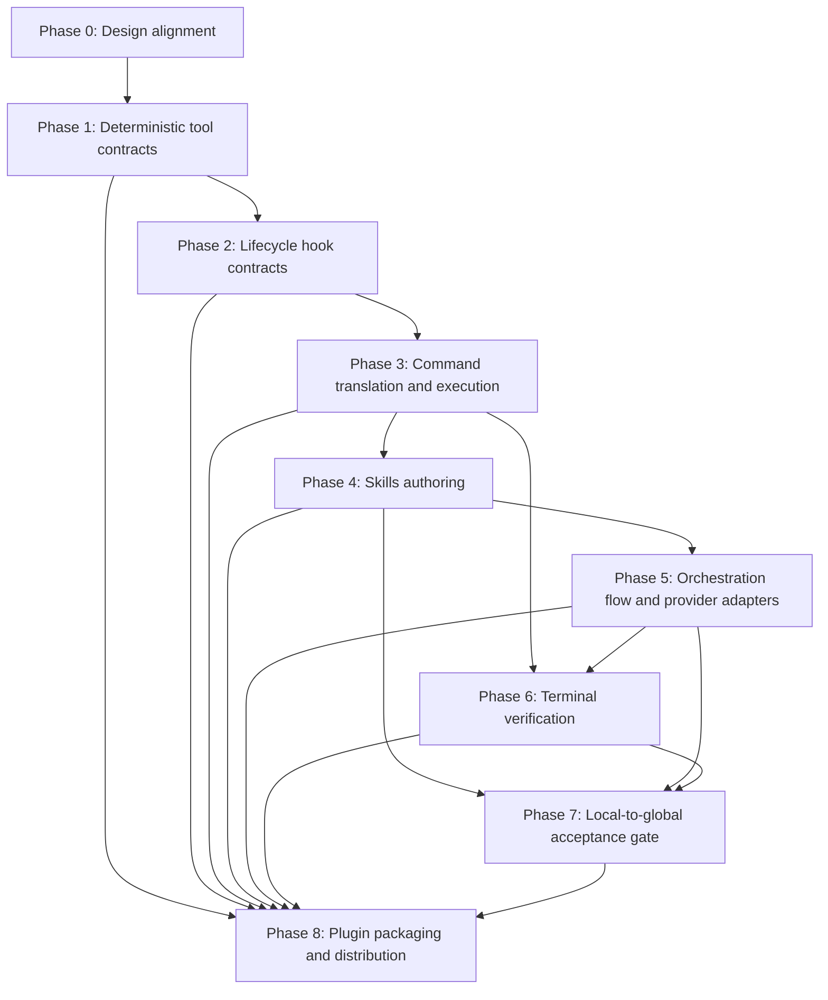

# Phased Implementation Plan — Tools, Hooks, Skills, Plugins

## Purpose

This document derives a phased implementation plan from the normative contracts
in `doc/GENERATE_AI_AUTOMATIONS.md` into an ordered, acceptance-gated sequence
of implementation work.

It fulfils the "phased implementation plan" deliverable of the
*Architecture alignment — Phased implementation plan* issue and feeds the
finalisation of `doc/GENERATE_AI_AUTOMATIONS.md` as the umbrella design spec for
the full automation model (Skills + Tools + Hooks + Plugins), not Skills alone.

### How to read this plan

- Each phase lists its **goal**, its **dependencies** (what must land first),
  the **work items**, **acceptance criteria** (the conditions that must hold
  before the phase is considered done), and **test / verification coverage**.
- Phases are ordered by dependency. A phase must not start while an upstream
  phase it is blocked on is unsatisfied — the same dependency-gating principle
  direct command execution enforces at runtime (`APP_BUILDER_REQUIREMENTS.md`
  FR-2, FR-7).
- Authoritative sources are the contracts in `doc/GENERATE_AI_AUTOMATIONS.md`
  and the functional requirements in `doc/APP_BUILDER_REQUIREMENTS.md`. Where
  this plan and those documents disagree, the contracts and FRs win; update this
  plan to match.

### Primitive-selection policy

This plan applies the primitive-selection policy from
`doc/GENERATE_AI_AUTOMATIONS.md` §Primitive-selection policy:

| If the work… | Use |
|---|---|
| Requires AI judgment, iteration, or multi-step code authoring | **Skill** |
| Is a single deterministic command, API call, or file operation | **Tool** |
| Must run automatically at a lifecycle event, regardless of agent choices | **Hook** |
| Is a coherent set of capabilities intended for distribution or reuse | **Plugin** |

---

## Current state (baseline)

The following already exist in the current workspace and are the starting point
for this plan:

- **CLI wrappers** (Django management commands): `export_schema`, `build_app`,
  `ng_new`, `ng_add`, `ng_config`, `ng_gen_app`, `ng_complex_component`,
  `ng_openapi_gen`, `ng_build`, `ng_workspace`, `ng_workspace_delete`,
  `ng_workspace_modify`
  (`django_angular3/management/commands/`).
- **oasdiff acquisition**: `django_angular3/tools.py:ensure_oasdiff()`.
- **Normative contracts** for every Tool, Hook, and Plugin
  (`doc/GENERATE_AI_AUTOMATIONS.md` §Tool / §Hook / §Plugin Contracts Catalog).
  Most of these contracts carry an *Implementation reference* of "planned" — the
  contract is defined but the backing artifact does not yet exist.
- **build_app functional requirements** for traversal, failure handling, and
  terminal verification (`doc/APP_BUILDER_REQUIREMENTS.md` FR-1…FR-9), including
  FR-8 (command and hook failure handling) and FR-9 (terminal verification
  contract).
- **Skill working copies** under `skill_creation/skills/` (split copies of the
  `GENERATE_AI_AUTOMATIONS.md` Skills Catalog); the eleven Skills are not yet
  authored as runnable `SKILL.md` units (`TODO.md` item 7).

What is *not* yet implemented and is therefore scheduled below: the deterministic
tool wrappers, the lifecycle hook scripts, the direct command translation and
execution that calls them, the SDK-driven Skill orchestration, terminal
validation commands, and the plugin packaging.

---

## Phase 0 — Design alignment (this issue)

**Goal**: Land the design alignment that lets implementation proceed against
stable contracts.

**Dependencies**: none.

**Work items**:
- Promote Tools / Hooks / Plugins recommendations into normative contracts in
  `doc/GENERATE_AI_AUTOMATIONS.md` (done — see its Contracts Catalogs).
- Add build_app FRs for failure handling and terminal verification
  (`doc/APP_BUILDER_REQUIREMENTS.md` FR-8 and FR-9) (done).
- Record this phased implementation plan (this document).
- Record the local-to-global acceptance decision (Phase 7).

**Acceptance criteria**:
- Every planned Tool, Hook, and Plugin maps to exactly one normative contract.
- This plan exists and references the contracts and FRs by name.

**Test / verification coverage**: documentation review only — no code behaviour
changes in this phase.

---

## Phase 1 — Deterministic tool contracts

**Goal**: Implement the deterministic tool wrappers so the agent calls bounded
operations and receives structured results, replacing raw CLI parsing.

**Dependencies**: Phase 0.

**Work items** (one per Tool contract in
`doc/GENERATE_AI_AUTOMATIONS.md` §Tool Contracts Catalog):
- `openapi_schema_export` — wrap `export_schema` to return schema path and a
  `schema_changed` flag.
- `oasdiff_diff` — wrap the `ensure_oasdiff()` binary to return
  `{ changes: [], schema_changed: bool }`.
- `validate_openapi_schema` — wrap an OAS 3.1 validator to return
  `{ valid: bool, errors: [] }`.
- `angular_api_client_generate` — wrap `ng_openapi_gen` to return
  `generated_files: []`.
- `angular_workspace_scaffold`, `angular_app_scaffold` — wrap `ng_new` / the
  app-scaffold wrapper to return structured result objects.
- `ngdj_add_feature`, `ngdj_add_component`, `ngdj_run_schematic` — expose the
  supported ngdj feature/component/schematic surface through validated,
  structured calls.
- `oasdiff_changelog` — generate and archive a human-readable schema-change
  report from the same artifact pair used by `oasdiff_diff`.

Each tool MUST honour the **Tool contract shape**
(`doc/GENERATE_AI_AUTOMATIONS.md` §Tool contract shape): structured inputs,
structured outputs, and a structured error object whose `category` is one of
`{ invalid_input, missing_dependency, external_tool_failed, output_invalid }`.

**Acceptance criteria**:
- Each tool's return value validates against its contract's declared output
  shape.
- Each tool surfaces failures through the structured error object — never as an
  unstructured exception or stdout-only message — so FR-8 handling can act on
  `category`.
- Tool names exactly match the contract names selected during command
  translation (FR-7).

**Test / verification coverage**:
- Unit tests per tool: success path, each error `category`, and diagnostic
  dry-run output where applicable.
- A contract-conformance test asserting each tool's output keys match its
  contract.

---

## Phase 2 — Lifecycle hook contracts

**Goal**: Implement the deterministic enforcement and side-effect hooks so gates
and mandatory side effects always run, independent of agent choices.

**Dependencies**: Phase 1 (hooks wrap tool outputs).

**Work items** (one per Hook contract in
`doc/GENERATE_AI_AUTOMATIONS.md` §Hook Contracts Catalog):
- `pre-construction` — `Pre*` gate: schema exists, is valid OAS 3.1, and is at
  least as fresh as the latest migration before any Angular generation tool.
- `migration-triggered` — `Post*`: re-export the schema when a new migration
  appears; append a status record to `build/hook-log.jsonl`.
- `post-generation` — `Post*`: run a structural check after each generation tool
  and append a pass/fail entry to `build/verification.log`.
- `session-stop` — `Stop`: archive durable artifacts and write a session
  summary; MUST NOT change the session exit code (FR-8).

**Acceptance criteria**:
- `Pre*` hook non-zero exit blocks the wrapped tool and every dependent command
  (FR-8).
- Hook failures return a distinct hook-failure exit code (FR-8).
- `session-stop` only appends warnings and never alters the exit code.
- Each hook writes its structured error fields to stderr / `build/hook-log.jsonl`.

**Test / verification coverage**:
- Per-hook tests: trigger event fires the hook, blocking hook halts command execution,
  non-blocking `Post*` failure halts and records, `Stop` hook cannot change exit
  code.
- Exit-code distinctness tests for hook and tool failures.

---

## Phase 3 — `build_app` command translation and execution

**Goal**: Make `build_app` translate changes into ordered commands and execute
each command through the right primitive.

**Dependencies**: Phases 1–2.

**Work items**:
- Translate selected TOOL, HOOK, and SKILL contracts into ordered commands whose
  contract names match the documented surfaces (FR-7).
- Execute in dependency order; TOOL commands call the Phase 1 tools and HOOK
  boundaries apply the Phase 2 hooks.
- Implement FR-8 failure handling: halt at the failed command, refuse
  to start dependents, emit a structured error, and exit with the
  contract-specific code.
- Keep `--dry-run` validating inputs, identifying changes, and reporting the
  ordered diagnostic command output without invoking automation (FR-3).

**Acceptance criteria**:
- A command never starts while a dependency it is blocked on is unsatisfied
  (FR-2, FR-7).
- A failed tool or `Pre*`/`Post*` hook stops execution and produces the correct,
  distinct exit code.
- `--dry-run` output is deterministic and human-readable for the same inputs.

**Test / verification coverage**:
- Command-translation determinism tests (same inputs → same command sequence).
- Execution tests: dependency ordering, halt-on-failure, dependent-skip,
  exit-code mapping.
- Dry-run snapshot tests for the documented `TEST_EXAMPLES.md` scenarios.

---

## Phase 4 — Skills authoring

**Goal**: Author the eleven Angular construction Skills as canonical `djng`
skill content with per-skill acceptance criteria and provider-specific renderings.

**Dependencies**: Phase 3 (Skills run as selected AI-guided commands).

**Work items**:
- Author each canonical Skill per `doc/SKILL_AUTHORING_PLAN.md` (plan,
  implementation + tests, build_app command integration, verification).
- Keep `skill_creation/skills/` working copies aligned with the authoritative
  `GENERATE_AI_AUTOMATIONS.md` Skills Catalog.
- Define provider-specific skill renderings and packaging as derived artifacts;
  no provider's native skill-file format is the canonical `djng` source.
- Define each Skill's local acceptance criteria during its Plan phase: the exact
  pass/fail conditions, the tools used to verify them, and what "done" means
  locally.

**Acceptance criteria**:
- Each Skill declares explicit, checkable acceptance criteria (no arbitrary
  termination).
- The Skill dependency chain matches the dependency ordering selected for
  AI-guided commands (FR-2).
- Canonical skill content has one source of truth, and each provider-specific
  rendering is verifiably derived from it.

**Test / verification coverage**:
- Per-skill component tests for the generated Angular artifacts.
- Skill-catalog-alignment check between `skill_creation/skills/` and
  `GENERATE_AI_AUTOMATIONS.md`.
- Provider-package conformance tests that verify each rendering preserves the
  canonical skill's name, purpose, inputs, and acceptance criteria.

---

## Phase 5 — Orchestration flow and provider adapters

**Goal**: Drive each selected AI-guided command through a provider adapter until
its acceptance criteria are satisfied, without changing the direct
command-execution semantics owned by `djng`.

**Dependencies**: Phases 3–4.

**Work items**:
- Define a provider-neutral adapter interface for session creation, canonical
  skill loading, tool dispatch, lifecycle-event normalization, structured
  results, cancellation, timeouts, and credential configuration.
- Implement adapters against that interface. The validated reference examples
  in `shlomoa/ai` are:
  - **Claude:** Agent SDK `query`, native hooks, filesystem skills, and plugins.
  - **OpenAI:** Responses API / `openai-agents`, a local function-tool guard,
    and a hook manager.
  - **Gemini:** `google-genai`, function tools, and decorator/wrapper hooks.
  - **Copilot:** `github-copilot-sdk`, sessions, permission handlers, and
    pre-/post-tool hooks.
- Keep `djng` direct command-execution gates authoritative for correctness.
  Provider-native hooks and local wrappers normalize provider events into the
  adapter interface; they do not create an independent gate or permit bypassing
  the `djng` enforcement boundary.
- Specify and implement what `build_app` does when an agent session ends without
  evidence of success — halt, surface a structured error, and refuse to advance
  (no silent advance past unmet acceptance criteria).

**Acceptance criteria**:
- The adapter interface can be exercised with a stub without changing direct
  command-execution, Tool, Hook, or terminal-validation semantics.
- `build_app` detects a session that ended without satisfying its acceptance
  criteria and halts instead of advancing.
- Session failures are surfaced as structured errors consistent with FR-8.
- Provider-native hook or wrapper behavior cannot bypass `djng` direct
  command-execution gates.

**Test / verification coverage**:
- Provider-independent adapter-contract tests with stubs: success advances,
  unmet acceptance halts, context exhaustion or timeout produces a structured
  error, tool denial is surfaced, post-tool failure halts, and teardown records
  its outcome without changing the completed run result.
- Credential- and runtime-gated integration suites per provider verify the
  corresponding adapter against its provider SDK. These suites are separate from
  provider-independent unit tests and do not claim any adapter is implemented
  until it passes its own suite.

**Adapter-contract test matrix**:

| Case | Stubbed adapter outcome | Required `build_app` assertion |
|---|---|---|
| Successful session | Returns acceptance evidence satisfying the selected Skill's criteria. | Advance only after recording the normalized evidence. |
| Unmet acceptance | Ends without sufficient acceptance evidence. | Halt; emit a structured `unmet_acceptance` error; do not select a dependent command. |
| Timeout or context exhaustion | Returns the normalized timeout or context-exhaustion failure. | Halt; preserve diagnostics in the durable run record; do not retry or advance implicitly. |
| Tool denial | Reports that the provider denied a requested Tool or permission. | Surface a structured `tool_denied` error and halt at the denied boundary. |
| Post-tool failure | The Tool succeeds but the normalized `post-tool` Hook outcome fails. | Halt with the Hook-failure result; do not treat the successful Tool result as acceptance. |
| Teardown | `session-stop` records a successful or warning-only cleanup outcome. | Record the outcome; a warning-only teardown failure does not change an already determined run result. |

Stubs MUST implement only the provider-neutral adapter interface and return
normalized results; they MUST NOT require credentials, a network connection, or
a provider SDK. Each provider runtime suite runs the same matrix against its
adapter with that provider's credentials and SDK available, and is skipped when
its explicit runtime prerequisites are absent. Runtime suites verify the
provider-specific skill loading, tool dispatch, lifecycle mapping, result
normalization, cancellation/timeout mapping, and teardown path in addition to
the shared assertions.

---

## Phase 6 — Terminal verification

**Goal**: Make every run terminate in validation commands that decide success
on recorded construction results, not a separate filesystem rescan.

**Dependencies**: Phases 3–5.

**Work items**:
- Implement the terminal validation commands that direct execution always ends
  in (FR-9), consuming structured tool outputs (for example the
  `generated_files` array from `angular_api_client_generate`).
- Cover the four verification categories in `doc/ARCHITECTURE.md` §7.3: contract,
  construction-output, integration, and test-based verification.

**Acceptance criteria**:
- A run is reported successful only when every terminal validation command
  reports success (FR-9).
- A failed terminal verification follows FR-8 failure handling.

**Test / verification coverage**:
- Terminal-verification tests: success only on all-pass; failure path mirrors
  FR-8; verification consumes recorded tool outputs rather than rescanning.

---

## Phase 7 — Local-to-global acceptance gate

**Goal**: Close the gap where each Skill declares "done" locally but the composed
application is still incorrect (the `getOrder(id: number)` →
`load(id: string)` interface-drift chain in `TODO.md` §9.3).

**Dependencies**: Phases 4–6.

**Local-to-global architectural decision** (records the decision required by the
issue for `doc/ARCHITECTURE.md` §7.2/§7.3):

> Local acceptance by an individual Skill session is necessary but **not
> sufficient** for global correctness. The architecture therefore requires a
> distinct **global acceptance gate**, applied after all Skill sessions and
> deterministic commands complete, that verifies properties no single Skill
> can see:
>
> 1. **Cross-Skill interface consistency** — types and signatures produced by one
>    Skill match what downstream Skills consume (no silent `number`/`string`
>    drift across the api → data-service → page chain).
> 2. **Backend-contract / Angular-client alignment** — the generated client
>    matches the exported OpenAPI contract.
> 3. **Runtime smoke tests** — the composed application starts and the main
>    flows run.
>
> This gate is owned by the terminal validation commands (Phase 6 / FR-9),
> not by any Skill. A run is "a correct working application"
> (`doc/ARCHITECTURE.md` §2.17) only when this global gate passes. This decision
> belongs in `doc/ARCHITECTURE.md` §7.2/§7.3 and the global acceptance criteria
> in `doc/REQUIREMENTS.md` §6.4.

**Acceptance criteria**:
- The global acceptance gate is documented in `doc/ARCHITECTURE.md` §7.2/§7.3 and
  `doc/REQUIREMENTS.md` §6.4 (recorded for the design-alignment phase; future
  implementation phases must keep those sections aligned with the executable
  gate).
- The gate fails the run on cross-Skill interface drift even when every Skill
  passed its local acceptance.

**Test / verification coverage**:
- A regression test reproducing the interface-drift failure chain and asserting
  the global gate catches it.

---

## Phase 8 — Plugin packaging and distribution

**Goal**: Package the coherent capability sets through provider-specific
distribution artifacts derived from the canonical `djng` Skills, Tools, and
Hooks.

**Dependencies**: Phases 1–7 (a plugin bundles already-implemented primitives).

**Work items** (one per Plugin contract in
`doc/GENERATE_AI_AUTOMATIONS.md` §Plugin Contracts Catalog):
- `djng-angular-construction` — all eleven Skills + schema/generation tools +
  validation/enforcement hooks.
- `ngdj-scaffold` — workspace/app/feature scaffold tools.
- `contract-lifecycle` — export → validate → diff → version tools and
  hooks.
- Define each provider's packaging and installation artifact as a derived
  distribution representation. A Claude plugin, including `.claude-plugin`, is
  one provider-specific representation and is not the canonical plugin source.

**Acceptance criteria**:
- Each plugin bundles exactly the Skills / Tools / Hooks named in its contract.
- Each provider-specific package is traceably derived from the canonical
  plugin contract and preserves its declared contents.
- Each package installs and versions independently of the Python package.

**Test / verification coverage**:
- Plugin-manifest conformance tests (declared contents match the contract).
- Provider-package conformance and install / smoke tests against a generated-app
  workspace.

---

## Dependency summary

## Test and verification coverage migration

As behaviour moves from AI-guided Skill flow to deterministic tool/hook
enforcement, test ownership moves with it:

- Operations promoted to **Tools** (Phase 1) gain deterministic unit tests with
  fixed inputs/outputs, replacing reliance on Skill self-checks.
- Gates and side effects promoted to **Hooks** (Phase 2) gain lifecycle-event
  and exit-code tests, replacing "the agent remembered to do it" assumptions.
- **Skills** (Phase 4) retain component/behaviour tests for generative output.
- **Terminal verification** (Phase 6) and the **global acceptance gate**
  (Phase 7) own cross-Skill and integration correctness — the properties no
  single primitive's tests can establish.

## Related documents

- `doc/GENERATE_AI_AUTOMATIONS.md` — authoritative Tool / Hook / Plugin / Skill
  contracts.
- `doc/APP_BUILDER_REQUIREMENTS.md` — FR-1…FR-9 (traversal, failure handling,
  terminal verification).
- `doc/ARCHITECTURE.md` — §2 automation primitive definitions, §7 construction
  and verification flow.
- `TODO.md` — open backlog items this plan sequences (notably items 6–9, 12).
