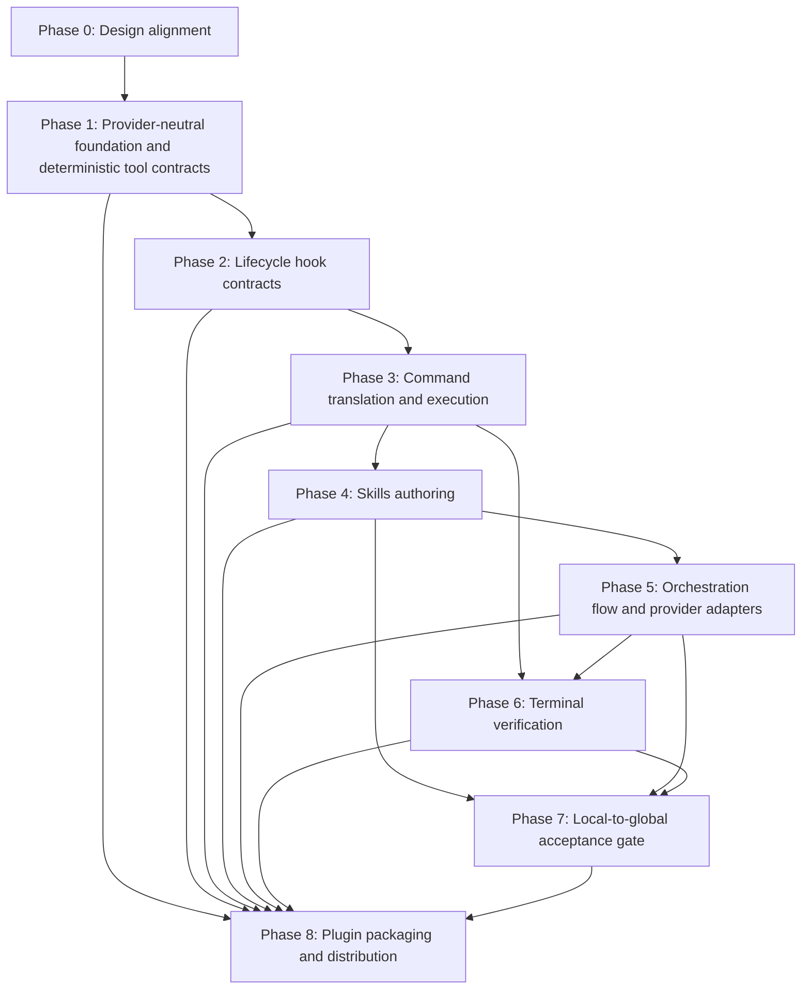

# Phased Implementation Plan — Tools, Hooks, Skills, Plugins

## Purpose

This document derives a phased implementation plan from the normative contracts
in `doc/GENERATE_AI_AUTOMATIONS.md` into an ordered, acceptance-gated sequence
of implementation work. It also incorporates the provider-portability research
and code-level implementation details formerly maintained in a separate AI
knowledge integration plan, making this document the single sequencing
authority for that work.

It fulfils the "phased implementation plan" deliverable of the
*Architecture alignment — Phased implementation plan* issue and feeds the
finalisation of `doc/GENERATE_AI_AUTOMATIONS.md` as the umbrella design spec for
the full automation model (Skills + Tools + Hooks + Plugins), not Skills alone.

### How to read this plan

- Each phase lists its **goal**, its **dependencies** (what must land first),
  the **work items**, **acceptance criteria** (the conditions that must hold
  before the phase is considered done), and **test / verification coverage**.
- Phases are ordered by dependency. A phase must not start while an upstream
  phase it is blocked on is unsatisfied — the same dependency-gating principle
  direct command execution enforces at runtime (`APP_BUILDER_REQUIREMENTS.md`
  FR-2, FR-7).
- Authoritative sources are the contracts in `doc/GENERATE_AI_AUTOMATIONS.md`
  and the functional requirements in `doc/APP_BUILDER_REQUIREMENTS.md`. Where
  this plan and those documents disagree, the contracts and FRs win; update this
  plan to match.

### Primitive-selection policy

This plan applies the primitive-selection policy from
`doc/GENERATE_AI_AUTOMATIONS.md` §Primitive-selection policy:

| If the work… | Use |
|---|---|
| Requires AI judgment, iteration, or multi-step code authoring | **Skill** |
| Is a single deterministic command, API call, or file operation | **Tool** |
| Must run automatically at a lifecycle event, regardless of agent choices | **Hook** |
| Is a coherent set of capabilities intended for distribution or reuse | **Plugin** |

---

## Current state (baseline)

The following already exist in the current workspace and are the starting point
for this plan:

- **CLI wrappers** (Django management commands): `export_schema`, `build_app`,
  `ng_new`, `ng_add`, `ng_config`, `ng_gen_app`, `ng_page`, `ng_component`,
  `ng_complex_component`, `ng_reactive_form`, `ng_site`,
  `ng_openapi_gen`, `ng_build`, `ng_workspace`, `ng_workspace_delete`,
  `ng_workspace_modify`
  (`django_angular3/management/commands/`).
- **oasdiff acquisition**: `django_angular3/tools.py:ensure_oasdiff()`.
- **Normative contract catalogs** for Tools, Hooks, and Plugins
  (`doc/GENERATE_AI_AUTOMATIONS.md` §Tool / §Hook / §Plugin Contracts Catalog).
  The catalogs define the primitives scheduled in Phases 1, 2, and 8; most
  carry an *Implementation reference* of "planned" because the backing artifact
  does not yet exist. The additional OpenUI wrapper contracts identified in
  `APP_BUILDER_REQUIREMENTS.md` remain undefined and must be added before the
  corresponding operations can be claimed as supported.
- **build_app functional requirements** for traversal, failure handling, and
  terminal verification (`doc/APP_BUILDER_REQUIREMENTS.md` FR-1…FR-9), including
  FR-8 (command and hook failure handling) and FR-9 (terminal verification
  contract).
- **Skill working copies** under `skill_creation/skills/` (split copies of the
  `GENERATE_AI_AUTOMATIONS.md` Skills Catalog); the eleven Skills are not yet
  authored as runnable `SKILL.md` units (`TODO.md` item 7).
- **Provider research evidence** in the private `shlomoa/ai` repository,
  validated through authenticated access: Claude Agent SDK `query`, MCP tools,
  native hooks, filesystem Skills, and `.claude-plugin`; OpenAI Responses API /
  `openai-agents` with local function-tool guards and hook management; Gemini
  `google-genai` function tools with decorator/wrapper hooks; and Copilot SDK
  sessions, permission handlers, and pre-/post-tool handlers. This evidence
  informs adapter mappings; it is not a runtime dependency or contract source.
- **No provider orchestration implementation**: `django_angular3` has no
  provider SDK import, session call, or adapter. The required
  `claude-agent-sdk` dependency is transitional until a Claude adapter exists
  and can own it as an optional extra.

What is *not* yet implemented and is therefore scheduled below: the deterministic
tool wrappers, the lifecycle hook scripts, the direct command translation and
execution that calls them, the SDK-driven Skill orchestration, terminal
validation commands, and the plugin packaging.

---

## Phase 0 — Design alignment (this issue)

**Goal**: Land the design alignment that lets implementation proceed against
stable contracts.

**Dependencies**: none.

**Work items**:
- Promote Tools / Hooks / Plugins recommendations into normative contracts in
  `doc/GENERATE_AI_AUTOMATIONS.md` (done — see its Contracts Catalogs).
- Add build_app FRs for failure handling and terminal verification
  (`doc/APP_BUILDER_REQUIREMENTS.md` FR-8 and FR-9) (done).
- Record this phased implementation plan (this document).
- Record the local-to-global acceptance decision (Phase 7).
- Define every additional Tool contract that `APP_BUILDER_REQUIREMENTS.md`
  identifies as planned before claiming Phase 0 contract coverage (open).

**Acceptance criteria**:
- Every planned Tool, Hook, and Plugin has exactly one canonical normative
  contract, as defined by `doc/GENERATE_AI_AUTOMATIONS.md`
  §Contract identity and relationship cardinality. Multiple commands, Hooks,
  Plugins, and provider bindings may reference or compose that contract; they
  must not redefine it.
- This plan exists and references the contracts and FRs by name.

**Test / verification coverage**: documentation review only — no code behaviour
changes in this phase.

---

## Phase 1 — Provider-neutral foundation and deterministic tool contracts

**Goal**: Establish provider-neutral result and evidence contracts, then
implement deterministic tool wrappers so bounded operations return structured
results instead of requiring raw CLI parsing.

**Dependencies**: Phase 0.

**Work items** (one per Tool contract in
`doc/GENERATE_AI_AUTOMATIONS.md` §Tool Contracts Catalog):
- Add a provider-free `django_angular3/automation/` package. Define immutable,
  serializable contracts for structured errors, Tool invocations/results, Hook
  outcomes, acceptance evidence, command outcomes, and run outcomes. Use
  standard-library types, deterministic `to_dict()`/parsing behavior, and
  execution-boundary injection for identifiers and timestamps.
- Add an append-only, dependency-injected `EvidenceRecorder` that writes stable
  UTF-8 JSON Lines below the selected build output. Record run metadata plus an
  ordered stream of Tool, Hook, and acceptance events; flush completed events
  so halted runs remain inspectable. Convert recorder failures into structured
  direct-execution failures, and prohibit secrets, credentials, request headers,
  and provider-native payloads from serialized evidence.
- Define the future adapter-result hand-off as a provider-neutral protocol:
  adapter results reference the run and canonical Skill/command but cannot
  mutate `RunOutcome` or write directly to the evidence stream. `build_app`
  remains responsible for normalization and recording after direct gates pass.
- Implement these boundaries in `automation/contracts.py` and
  `automation/evidence.py`, keeping `automation/__init__.py` free of SDK
  imports. Cover them in `tests/test_automation_contracts.py` and
  `tests/test_automation_evidence.py`.
- `openapi_schema_export` — wrap `export_schema` to return schema path and a
  `schema_changed` flag.
- `oasdiff_diff` — wrap the `ensure_oasdiff()` binary to return
  `{ changes: [], schema_changed: bool }`.
- `validate_openapi_schema` — wrap an OAS 3.1 validator to return
  `{ valid: bool, errors: [] }`.
- `angular_api_client_generate` — wrap `ng_openapi_gen` to return
  `generated_files: []`.
- `angular_workspace_scaffold`, `angular_app_scaffold` — wrap `ng_new` / the
  app-scaffold wrapper to return structured result objects.
- `ngdj_add_feature`, `ngdj_add_component`, `ngdj_run_schematic` — expose the
  supported ngdj feature/component/schematic surface through validated,
  structured calls.
- `oasdiff_changelog` — generate and archive a human-readable schema-change
  report from the same artifact pair used by `oasdiff_diff`.

Each tool MUST honour the **Tool contract shape**
(`doc/GENERATE_AI_AUTOMATIONS.md` §Tool contract shape): structured inputs,
structured outputs, and a structured error object whose `category` is one of
`{ invalid_input, missing_dependency, external_tool_failed, output_invalid }`.

**Acceptance criteria**:
- The automation foundation imports no provider SDK and makes no network call.
- Contract objects round-trip deterministically, reject invalid categories or
  shapes, and serialize no secret-bearing fields.
- Evidence remains ordered and machine-readable after success, failure, or a
  halted run.
- Each tool's return value validates against its contract's declared output
  shape.
- Each tool surfaces failures through the structured error object — never as an
  unstructured exception or stdout-only message — so FR-8 handling can act on
  `category`.
- Tool names exactly match the contract names selected during command
  translation (FR-7).

**Test / verification coverage**:
- Contract serialization, validation, deterministic ID/timestamp injection,
  redaction, ordered JSONL events, metadata finalization, malformed prior
  events, and recorder-write failures.
- Unit tests per tool: success path, each error `category`, and diagnostic
  dry-run output where applicable.
- A contract-conformance test asserting each tool's output keys match its
  contract.

---

## Phase 2 — Lifecycle hook contracts

**Goal**: Implement the deterministic enforcement and side-effect hooks so gates
and mandatory side effects always run, independent of agent choices.

**Dependencies**: Phase 1 (hooks wrap tool outputs).

**Work items** (one per Hook contract in
`doc/GENERATE_AI_AUTOMATIONS.md` §Hook Contracts Catalog):
- Add a provider-neutral Hook registry keyed by canonical Hook name and
  lifecycle family (`pre-tool`, `post-tool`, or `session-stop`). Definitions
  declare Tool/command scope, block/halt/warn consequence, evidence payload,
  and idempotency behavior; shared matching must not depend on raw shell strings
  or provider event names.
- Implement the registry and contract bindings in `automation/hooks.py`; keep
  direct dispatch tests in `tests/test_hooks.py` and provider event-mapping
  assertions in the adapter suites.
- `pre-construction` — `Pre*` gate: schema exists, is valid OAS 3.1, and is at
  least as fresh as the latest migration before any Angular generation tool.
- `migration-triggered` — `Post*`: re-export the schema when a new migration
  appears; append a status record to `build/hook-log.jsonl`.
- `post-generation` — `Post*`: run a structural check after each generation tool
  and append a pass/fail entry to `build/verification.log`.
- `session-stop` — `Stop`: archive durable artifacts and write a session
  summary; MUST NOT change the session exit code (FR-8).

**Acceptance criteria**:
- Every Hook start, skip, outcome, and failure is correlated with its run,
  command, and Tool invocation in the provider-independent evidence stream.
- Duplicate lifecycle observations do not repeat destructive Hook work or emit
  conflicting acceptance evidence.
- `Pre*` hook non-zero exit blocks the wrapped tool and every dependent command
  (FR-8).
- Hook failures return a distinct hook-failure exit code (FR-8).
- `session-stop` only appends warnings and never alters the exit code.
- Each hook writes its structured error fields to stderr / `build/hook-log.jsonl`.

**Test / verification coverage**:
- Per-hook tests: trigger event fires the hook, blocking hook halts command execution,
  non-blocking `Post*` failure halts and records, `Stop` hook cannot change exit
  code.
- Registry scope, event ordering, idempotency, exception normalization, and
  equivalent normalized outcomes from provider-shaped lifecycle observations.
- Exit-code distinctness tests for hook and tool failures.

---

## Phase 3 — `build_app` command translation and execution

**Goal**: Make `build_app` translate changes into ordered commands and execute
each command through the right primitive.

**Dependencies**: Phases 1–2.

**Work items**:
- Add a synchronous direct-execution controller in
  `django_angular3/automation/execution.py`; the current Django command and
  subprocess model does not require a new asynchronous framework. Its injected
  context contains the validated project configuration, output path, run ID,
  dry-run/acknowledgement flags, and evidence recorder.
- Implement `run_tool` and pre-/post-/session-stop Hook boundaries that normalize
  expected failures and unexpected exceptions, record outcomes, and enforce
  block/halt/warn consequences. Only this controller may make dependency,
  gate, terminal-validation, and final run-acceptance decisions.
- Translate selected TOOL, HOOK, and SKILL contracts into ordered commands whose
  contract names match the documented surfaces (FR-7).
- Execute in dependency order; TOOL commands call the Phase 1 tools and HOOK
  boundaries apply the Phase 2 hooks.
- Implement FR-8 failure handling: halt at the failed command, refuse
  to start dependents, emit a structured error, and exit with the
  contract-specific code.
- Keep `--dry-run` validating inputs, identifying changes, and reporting the
  ordered diagnostic command output without invoking automation (FR-3).
- Integrate at `build_app` entry and error boundaries: create the execution
  context after project-config validation, record validation and schema-diff
  outcomes, and finalize evidence on every normal or error exit. Preserve the
  current OpenUI-diff and `NotImplementedError` limitations until their owning
  work lands; foundation wiring must not imply complete execution.
- Keep existing validation functions authoritative and preserve their public
  diagnostics, messages, and return types. They may receive an injected
  recorder only after producing their normal result; they must not open ad-hoc
  logs.
- Keep controller coverage in `tests/test_automation_execution.py` and focused
  command-boundary coverage in a dedicated `build_app` test module. Do not add
  provider fixtures or adapter SDK stubs to this phase.

**Acceptance criteria**:
- A provider result cannot invoke direct gates, mark a command successful,
  mutate the run outcome, or substitute for terminal validation.
- A command never starts while a dependency it is blocked on is unsatisfied
  (FR-2, FR-7).
- A failed tool or `Pre*`/`Post*` hook stops execution and produces the correct,
  distinct exit code.
- `--dry-run` output is deterministic and human-readable for the same inputs.

**Test / verification coverage**:
- Direct controller tests: successful evidence; pre-tool block without Tool
  invocation; post-tool halt; warning-only session stop; wrapper-exception and
  recorder-failure normalization; and absence of provider imports/network use.
- Focused `build_app` tests assert invalid input and schema-diff exits finalize
  evidence while preserving existing Django command errors and exit behavior.
- Command-translation determinism tests (same inputs → same command sequence).
- Execution tests: dependency ordering, halt-on-failure, dependent-skip,
  exit-code mapping.
- Dry-run snapshot tests for the documented `TEST_EXAMPLES.md` scenarios.

---

## Phase 4 — Skills authoring

**Goal**: Author the eleven Angular construction Skills as canonical `djng`
skill content with per-skill acceptance criteria and provider-specific renderings.

**Dependencies**: Phase 3 (Skills run as selected AI-guided commands).

**Work items**:
- Author each canonical Skill per `doc/SKILL_AUTHORING_PLAN.md` (plan,
  implementation + tests, build_app command integration, verification).
- Keep `skill_creation/skills/` working copies aligned with the authoritative
  `GENERATE_AI_AUTOMATIONS.md` Skills Catalog.
- Define an executable canonical Skill catalog containing each Skill's name,
  purpose, inputs, outputs, dependencies, acceptance criteria, Tool/Hook
  bindings, and version. Generate or validate it against the authoritative
  catalog instead of parsing Markdown during `build_app` execution.
- Add a provider-neutral Skill resolver. It rejects unknown Skills, incomplete
  dependencies, and unknown Tool bindings before a session request can be
  created. Provider-specific rendering remains derived work in Phase 8; no
  provider's native skill-file format is the canonical `djng` source.
- Implement the resolver and catalog in `automation/skills.py` and
  `automation/skill_catalog.py`; cover catalog integrity in
  `tests/test_skill_catalog.py`. A temporary fixture registry is acceptable
  only until the executable catalog lands.
- Define each Skill's local acceptance criteria during its Plan phase: the exact
  pass/fail conditions, the tools used to verify them, and what "done" means
  locally.

**Acceptance criteria**:
- Each Skill declares explicit, checkable acceptance criteria (no arbitrary
  termination).
- The Skill dependency chain matches the dependency ordering selected for
  AI-guided commands (FR-2).
- Canonical skill content has one source of truth, and each provider-specific
  rendering is verifiably derived from it.
- Runtime Skill resolution consumes the executable catalog and does not parse
  provider-native files or the planning documents.

**Test / verification coverage**:
- Per-skill component tests for the generated Angular artifacts.
- Skill-catalog-alignment check between `skill_creation/skills/` and
  `GENERATE_AI_AUTOMATIONS.md`.
- Catalog validation for unique identifiers, valid dependencies, known
  Tool/Hook bindings, and complete acceptance criteria.

---

## Phase 5 — Orchestration flow and provider adapters

**Goal**: Drive each selected AI-guided command through a provider adapter until
its acceptance criteria are satisfied, without changing the direct
command-execution semantics owned by `djng`.

**Dependencies**: Phases 3–4.

**Work items**:
- Define a provider-neutral adapter interface for session creation, canonical
  skill loading, tool dispatch, lifecycle-event normalization, structured
  results, cancellation, timeouts, and credential configuration.
- Implement the interface in a provider-free adapter base package with
  synchronous methods for session creation, Skill loading, command execution,
  cancellation, and close. Use immutable session request/handle/result objects;
  handles must not expose provider clients to `build_app`.
- Normalize adapter failures into stable categories including
  `unmet_acceptance`, `timeout`, `context_exhausted`, `tool_denied`,
  `provider_unavailable`, `cancelled`, and `provider_protocol_error`, with
  redacted details only.
- Add a guided-session orchestrator injected with the adapter, Skill resolver,
  direct execution context, and recorder. It validates dependencies, resolves
  canonical Skills, creates a sanitized request, runs one guided command,
  normalizes and records its result, requires contract-matching evidence, and
  closes the session in a `finally` path. The first implementation performs no
  implicit retries.
- Add an internal adapter registry/factory. Every adapter declares immutable
  capabilities for Skill loading, Tool calling, lifecycle observation,
  structured results, cancellation/timeouts, and teardown, distinguishing
  native support from a local mapping. Reject registrations or command requests
  that lack required normalization capabilities.
- Use `automation/adapters/base.py` for the SDK-free interface,
  `automation/adapters/capabilities.py` for metadata, and
  `automation/orchestrator.py` for guided sessions. Keep adapter registration in
  the package boundary rather than branching on providers in `build_app`.
- Implement adapters against that interface. The validated reference examples
  in `shlomoa/ai` are:
  - **Claude:** Agent SDK `query`, native hooks, filesystem skills, and plugins.
  - **OpenAI:** Responses API / `openai-agents`, a local function-tool guard,
    and a hook manager.
  - **Gemini:** `google-genai`, function tools, and decorator/wrapper hooks.
  - **Copilot:** `github-copilot-sdk`, sessions, permission handlers, and
    pre-/post-tool hooks.
- Keep `djng` direct command-execution gates authoritative for correctness.
  Provider-native hooks and local wrappers normalize provider events into the
  adapter interface; they do not create an independent gate or permit bypassing
  the `djng` enforcement boundary.
- Specify and implement what `build_app` does when an agent session ends without
  evidence of success — halt, surface a structured error, and refuse to advance
  (no silent advance past unmet acceptance criteria).
- Pass adapters only sanitized canonical command context and allowed Tool names,
  never the mutable execution controller or `RunOutcome`. Provider permission,
  Tool-use, and lifecycle events are correlated observations; the direct
  controller decides and records their consequences.
- Keep `build_app --dry-run` provider-free: resolve and render the planned
  canonical selection without constructing an adapter, importing an SDK,
  discovering credentials, opening a session, or writing provider artifacts.
- Keep provider selection internal until the configuration taxonomy assigns its
  public ownership. Deterministic-only runs require no adapter.
- Isolate each implementation in its own module and optional dependency extra.
  Move `claude-agent-sdk` out of required dependencies only when the Claude
  adapter owns all consumers; add OpenAI, Gemini, and Copilot extras only with
  their adapters. Importing one adapter must not import any other SDK.
- Name implementation modules `automation/adapters/claude.py`, `openai.py`,
  `gemini.py`, and `copilot.py`. Each module may import only its own optional
  SDK; the factory maps an unavailable SDK to `missing_dependency` with
  installation guidance naming the relevant extra.
- Keep credential discovery inside the selected adapter and use only the
  provider-approved runtime mechanism. Never store credentials in source,
  fixtures, evidence, or command output.

**Acceptance criteria**:
- The adapter interface can be exercised with a stub without changing direct
  command-execution, Tool, Hook, or terminal-validation semantics.
- `build_app` detects a session that ended without satisfying its acceptance
  criteria and halts instead of advancing.
- Session failures are surfaced as structured errors consistent with FR-8.
- Provider-native hook or wrapper behavior cannot bypass `djng` direct
  command-execution gates.
- Every registered adapter exposes auditable capabilities consistent with the
  architecture matrix; metadata alone is not proof that a capability works.
- Session close runs on success, failure, and cancellation, and teardown
  warnings do not mask an earlier result.
- Each adapter is considered implemented only after both credential-free
  contract tests and its explicitly opted-in runtime suite pass.

**Test / verification coverage**:
- Provider-independent adapter-contract tests with stubs: success advances,
  unmet acceptance halts, context exhaustion or timeout produces a structured
  error, tool denial is surfaced, post-tool failure halts, and teardown records
  its outcome without changing the completed run result.
- Credential- and runtime-gated integration suites per provider verify the
  corresponding adapter against its provider SDK. These suites are separate from
  provider-independent unit tests and do not claim any adapter is implemented
  until it passes its own suite.
- Skill resolution and dependency failures; close behavior on every path;
  redaction; optional-SDK import isolation; capability registration/rejection;
  local-vs-native lifecycle mappings; and proof that provider allow/deny or
  success signals cannot bypass a direct Hook or terminal-validation failure.
- Keep shared contract and capability coverage in
  `tests/test_adapter_contracts.py` and `tests/test_adapter_capabilities.py`.
  Put live suites under `tests/integration/adapters/`, one module per provider,
  and centralize prerequisite/skip behavior in one helper.

**Adapter-contract test matrix**:

| Case | Stubbed adapter outcome | Required `build_app` assertion |
|---|---|---|
| Successful session | Returns acceptance evidence satisfying the selected Skill's criteria. | Advance only after recording the normalized evidence. |
| Unmet acceptance | Ends without sufficient acceptance evidence. | Halt; emit a structured `unmet_acceptance` error; do not select a dependent command. |
| Timeout or context exhaustion | Returns the normalized timeout or context-exhaustion failure. | Halt; preserve diagnostics in the durable run record; do not retry or advance implicitly. |
| Tool denial | Reports that the provider denied a requested Tool or permission. | Surface a structured `tool_denied` error and halt at the denied boundary. |
| Post-tool failure | The Tool succeeds but the normalized `post-tool` Hook outcome fails. | Halt with the Hook-failure result; do not treat the successful Tool result as acceptance. |
| Teardown | `session-stop` records a successful or warning-only cleanup outcome. | Record the outcome; a warning-only teardown failure does not change an already determined run result. |

Stubs MUST implement only the provider-neutral adapter interface and return
normalized results; they MUST NOT require credentials, a network connection, or
a provider SDK. Each provider runtime suite runs the same matrix against its
adapter with that provider's credentials and SDK available, and is skipped when
its explicit runtime prerequisites are absent. Runtime suites verify the
provider-specific skill loading, tool dispatch, lifecycle mapping, result
normalization, cancellation/timeout mapping, and teardown path in addition to
the shared assertions.

---

## Phase 6 — Terminal verification

**Goal**: Make every run terminate in validation commands that decide success
on recorded construction results, not a separate filesystem rescan.

**Dependencies**: Phases 3–5.

**Work items**:
- Implement the terminal validation commands that direct execution always ends
  in (FR-9), consuming structured tool outputs (for example the
  `generated_files` array from `angular_api_client_generate`).
- Cover the four verification categories in `doc/ARCHITECTURE.md` §7.3: contract,
  construction-output, integration, and test-based verification.
- Record terminal outcomes as acceptance evidence through the same
  provider-neutral recorder. Adapter-reported success remains insufficient.

**Acceptance criteria**:
- A run is reported successful only when every terminal validation command
  reports success (FR-9).
- A failed terminal verification follows FR-8 failure handling.

**Test / verification coverage**:
- Terminal-verification tests: success only on all-pass; failure path mirrors
  FR-8; verification consumes recorded tool outputs rather than rescanning.

---

## Phase 7 — Local-to-global acceptance gate

**Goal**: Close the gap where each Skill declares "done" locally but the composed
application is still incorrect (the `getOrder(id: number)` →
`load(id: string)` interface-drift chain in `TODO.md` §9.3).

**Dependencies**: Phases 4–6.

**Local-to-global architectural decision** (records the decision required by the
issue for `doc/ARCHITECTURE.md` §7.2/§7.3):

> Local acceptance by an individual Skill session is necessary but **not
> sufficient** for global correctness. The architecture therefore requires a
> distinct **global acceptance gate**, applied after all Skill sessions and
> deterministic commands complete, that verifies properties no single Skill
> can see:
>
> 1. **Cross-Skill interface consistency** — types and signatures produced by one
>    Skill match what downstream Skills consume (no silent `number`/`string`
>    drift across the api → data-service → page chain).
> 2. **Backend-contract / Angular-client alignment** — the generated client
>    matches the exported OpenAPI contract.
> 3. **Runtime smoke tests** — the composed application starts and the main
>    flows run.
>
> This gate is owned by the terminal validation commands (Phase 6 / FR-9),
> not by any Skill. A run is "a correct working application"
> (`doc/ARCHITECTURE.md` §2.17) only when this global gate passes. This decision
> belongs in `doc/ARCHITECTURE.md` §7.2/§7.3 and the global acceptance criteria
> in `doc/REQUIREMENTS.md` §6.4.

**Acceptance criteria**:
- The global acceptance gate is documented in `doc/ARCHITECTURE.md` §7.2/§7.3 and
  `doc/REQUIREMENTS.md` §6.4 (recorded for the design-alignment phase; future
  implementation phases must keep those sections aligned with the executable
  gate).
- The gate fails the run on cross-Skill interface drift even when every Skill
  passed its local acceptance.

**Test / verification coverage**:
- A regression test reproducing the interface-drift failure chain and asserting
  the global gate catches it.

---

## Phase 8 — Plugin packaging and distribution

**Goal**: Package the coherent capability sets through provider-specific
distribution artifacts derived from the canonical `djng` Skills, Tools, and
Hooks.

**Dependencies**: Phases 1–7 (a plugin bundles already-implemented primitives).

**Work items** (one per Plugin contract in
`doc/GENERATE_AI_AUTOMATIONS.md` §Plugin Contracts Catalog):
- `djng-angular-construction` — all eleven Skills + schema/generation tools +
  validation/enforcement hooks.
- `ngdj-scaffold` — workspace/app/feature scaffold tools.
- `contract-lifecycle` — export → validate → diff → version tools and
  hooks.
- Define each provider's packaging and installation artifact as a derived
  distribution representation. A Claude plugin, including `.claude-plugin`, is
  one provider-specific representation and is not the canonical plugin source.
- Add provider-neutral Skill and package renderer interfaces that consume only
  canonical catalog records. Renderers preserve canonical identity, purpose,
  inputs, outputs, dependencies, acceptance criteria, Tool/Hook bindings, and
  lifecycle families; provider-native metadata stays namespaced in derived
  output.
- Implement the interfaces in `automation/rendering.py`; cover canonical
  preservation and provider derivation in `tests/test_provider_rendering.py`.
- Define a generic package manifest with canonical plugin identity/version and
  exact bundled Skills, Tools, and Hooks. Keep rendered output under ignored
  build/distribution directories with source provenance and content hashes;
  never write native frontmatter or manifests back into canonical sources.
- Implement renderers incrementally with their adapters. Claude may emit
  `SKILL.md` and `.claude-plugin`; other providers may use session/tool
  registrations rather than an invented common filesystem format.
- Make provider installation/discovery opt-in and absent from dry runs and
  default tests.
- Establish release controls: the credential-free Ruff/unittest/catalog
  baseline remains required; optional import/conformance tests run for affected
  adapters; live suites run only in approved secret-managed environments. Do
  not advertise an adapter until its dependency bounds, shared matrix, live
  runtime suite, capability metadata, and package conformance all pass.

**Acceptance criteria**:
- Each plugin bundles exactly the Skills / Tools / Hooks named in its contract.
- Each provider-specific package is traceably derived from the canonical
  plugin contract and preserves its declared contents.
- Each package installs and versions independently of the Python package.
- Every generated artifact is traceable to canonical content and cannot add an
  uncontracted capability.
- Release status reflects verified provider support; a skipped live suite is
  not implementation evidence.

**Test / verification coverage**:
- Plugin-manifest conformance tests (declared contents match the contract).
- Provider-package conformance and install / smoke tests against a generated-app
  workspace.
- Temporary-directory renderer tests proving canonical inputs are unchanged,
  required fields are preserved, manifests match exactly, and stale artifacts
  can be detected by provenance/hash.
- Maintain one shared adapter contract matrix for stub and opted-in runtime
  suites. Centralize prerequisite/skip checks, bound live Skills and Tool
  allowlists, and record only provider/SDK version plus normalized redacted
  outcomes—not prompts, conversations, headers, or credentials.

---

## Dependency summary

## Test and verification coverage migration

As behaviour moves from AI-guided Skill flow to deterministic tool/hook
enforcement, test ownership moves with it:

- Operations promoted to **Tools** (Phase 1) gain deterministic unit tests with
  fixed inputs/outputs, replacing reliance on Skill self-checks.
- Gates and side effects promoted to **Hooks** (Phase 2) gain lifecycle-event
  and exit-code tests, replacing "the agent remembered to do it" assumptions.
- **Skills** (Phase 4) retain component/behaviour tests for generative output.
- **Terminal verification** (Phase 6) and the **global acceptance gate**
  (Phase 7) own cross-Skill and integration correctness — the properties no
  single primitive's tests can establish.
- **Provider adapters** (Phase 5) first share a credential-free stub matrix;
  each real adapter then runs that matrix plus provider-specific rendering and
  lifecycle checks in an isolated, explicitly opted-in runtime suite. Missing
  credentials or SDKs skip live tests without prompting or exposing values.

The default verification path remains credential-free:

1. `ruff format django_angular3 tests`
2. `ruff check django_angular3 tests`
3. focused tests for the affected automation/build boundaries
4. `python -m unittest discover -s tests -p 'test*.py'`
5. generated-app-compatible `django-admin build_app --dry-run` coverage

Update implementation status, capability metadata, and the backlog only from
actual test evidence. Provider-neutral stub success alone does not establish
provider support.

## Related documents

- `doc/GENERATE_AI_AUTOMATIONS.md` — authoritative Tool / Hook / Plugin / Skill
  contracts.
- `doc/APP_BUILDER_REQUIREMENTS.md` — FR-1…FR-9 (traversal, failure handling,
  terminal verification).
- `doc/ARCHITECTURE.md` — §2 automation primitive definitions, §7 construction
  and verification flow.
- `shlomoa/ai` — private, authenticated provider examples used as portability
  research evidence only; not a runtime dependency or normative source.
- `TODO.md` — open backlog items this plan sequences (notably items 6–9, 12).
