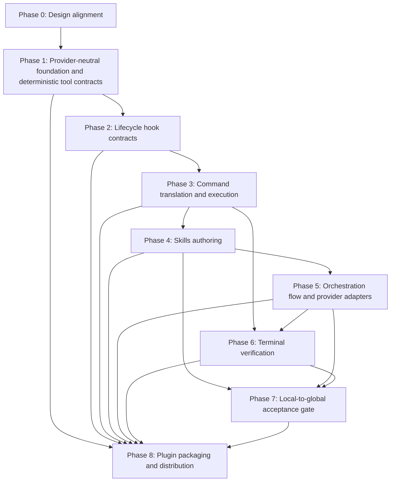

# Phased Implementation Plan — Tools, Hooks, Skills, Plugins

## Purpose

This document derives a phased implementation plan from the normative contracts
in `doc/contracts/` and the requirements in
`doc/requirements/AI_AUTOMATION_REQUIREMENTS.md` into an ordered,
acceptance-gated sequence of implementation work. It also incorporates the
provider-portability research and code-level implementation details formerly
maintained in a separate AI knowledge integration plan, making this document
the single sequencing authority for that work.

It fulfils the "phased implementation plan" deliverable of the
*Architecture alignment — Phased implementation plan* issue. Contract changes
identified while executing the plan are made only in the owning contract file
under `doc/contracts/`.
The full automation model is defined in `doc/ARCHITECTURE.md` §3.6.

### How to read this plan

- Each phase lists its **goal**, its **dependencies** (what must land first),
  the **work items**, **acceptance criteria** (the conditions that must hold
  before the phase is considered done), and **test / verification coverage**.
- Phases are ordered by dependency. A phase must not start while an upstream
  phase it is blocked on is unsatisfied — the same dependency-gating principle
  direct command execution enforces at runtime
  (`doc/requirements/APP_BUILDER_REQUIREMENTS.md` FR-2, FR-7).
- Authoritative sources are the contracts in
  `doc/contracts/` and the requirements in
  `doc/requirements/AI_AUTOMATION_REQUIREMENTS.md` and
  `doc/requirements/APP_BUILDER_REQUIREMENTS.md`. Exact automation realization
  is defined in `doc/specifications/AI_AUTOMATION_SPECIFICATIONS.md`. This plan
  sequences those sources and does not redefine them. Where this plan
  disagrees with an authoritative source, update this plan to match.

This plan applies the primitive-selection policy defined in
`doc/ARCHITECTURE.md` §3.6.3.

---

## Current state (baseline)

The following already exist in the current workspace and are the starting point
for this plan:

- **CLI wrappers** (Django management commands): `export_schema`, `build_app`,
  `ng_new`, `ng_add`, `ng_config`, `ng_gen_app`, `ng_page`, `ng_component`,
  `ng_complex_component`, `ng_reactive_form`, `ng_site`,
  `ng_openapi_gen`, `ng_build`, `ng_workspace`, `ng_workspace_delete`,
  `ng_workspace_modify`
  (`django_angular3/management/commands/`).
- **oasdiff acquisition**: `django_angular3/tools.py:ensure_oasdiff()`.
- **Normative contract catalogs** for Tools, Hooks, and Plugins
  (`doc/contracts/TOOL_CONTRACTS.md`, `doc/contracts/HOOK_CONTRACTS.md`, and
  `doc/contracts/PLUGIN_CONTRACTS.md`). The catalogs define the primitives scheduled in Phases 1, 2, and 8;
  most carry an *Implementation reference* of "planned" because the backing
  artifact does not yet exist. The additional OpenUI wrapper contracts
  identified in `doc/requirements/APP_BUILDER_REQUIREMENTS.md` remain undefined
  and must be added before the corresponding operations can be claimed as
  supported.
- **build_app functional requirements** for traversal, failure handling, and
  terminal verification (`doc/requirements/APP_BUILDER_REQUIREMENTS.md`
  FR-1…FR-10), including FR-8 (command and hook failure handling) and FR-9
  (terminal verification contract).
- **Skill working copies** under `skill_creation/skills/` (split copies of the
  `doc/contracts/SKILL_CONTRACTS.md` Skills Catalog); the eleven Skills
  are not yet authored as runnable `SKILL.md` units (`doc/plan/TODO.md` item 7).
- **Provider research evidence** in the private `shlomoa/ai` repository,
  validated through authenticated access: Claude Agent SDK `query`, MCP tools,
  native hooks, filesystem Skills, and `.claude-plugin`; OpenAI Responses API /
  `openai-agents` with local function-tool guards and hook management; Gemini
  `google-genai` function tools with decorator/wrapper hooks; and Copilot SDK
  sessions, permission handlers, and pre-/post-tool handlers. This evidence
  informs adapter mappings; it is not a runtime dependency or contract source.
- **No provider orchestration implementation**: `django_angular3` has no
  provider SDK import, session call, or adapter. The required
  `claude-agent-sdk` dependency is transitional until a Claude adapter exists
  and can own it as an optional extra.

What is *not* yet implemented and is therefore scheduled below: the
deterministic tool wrappers, the lifecycle hook scripts, the direct command
translation and execution that calls them, the SDK-driven Skill orchestration,
terminal validation commands, and the plugin packaging.

---

## Phase 0 — Design alignment (this issue)

**Goal**: Land the design alignment that lets implementation proceed against
stable contracts.

**Dependencies**: none.

**Work items**:
- Promote Tools / Hooks / Plugins recommendations into normative contracts in
  `doc/contracts/TOOL_CONTRACTS.md`, `doc/contracts/HOOK_CONTRACTS.md`, and
  `doc/contracts/PLUGIN_CONTRACTS.md` (done — see their Contracts Catalogs).
- Add build_app FRs for failure handling and terminal verification
  (`doc/requirements/APP_BUILDER_REQUIREMENTS.md` FR-8 and FR-9) (done).
- Record this phased implementation plan (this document).
- Record the local-to-global acceptance decision (Phase 7).
- Define every additional Tool contract that
  `doc/requirements/APP_BUILDER_REQUIREMENTS.md` identifies as planned before
  claiming Phase 0 contract coverage (open).

**Acceptance criteria**:
- The design and contract sources satisfy
  `doc/requirements/AI_AUTOMATION_REQUIREMENTS.md` AIR-1.
- This plan exists and references the contracts and FRs by name.

**Test / verification coverage**: documentation review only — no code behaviour
changes in this phase.

---

## Phase 1 — Provider-neutral foundation and deterministic tool contracts

**Goal**: Establish provider-neutral result and evidence contracts, then
implement deterministic tool wrappers so bounded operations return structured
results instead of requiring raw CLI parsing.

**Dependencies**: Phase 0.

**Work items** (one per Tool contract in
`doc/contracts/TOOL_CONTRACTS.md` §Tool Contracts Catalog):
- Implement the provider-neutral foundation and evidence persistence defined
  in `doc/specifications/AI_AUTOMATION_SPECIFICATIONS.md` §§2–3.
- Implement the provider-neutral result hand-off defined in the specification
  and governed by AIR-3 and AIR-5.
- Implement every Tool contract in the catalog without redefining its identity,
  input, output, or error boundary here.
- Add the Phase 1 contract, evidence, and Tool tests listed below.

**Acceptance criteria**:
- The implemented foundation satisfies AIR-2 through AIR-4, AIR-NFR-1, and
  AIR-NFR-2 in `doc/requirements/AI_AUTOMATION_REQUIREMENTS.md`.
- Every implemented Tool passes its canonical contract-conformance checks and
  the applicable FR-7 and FR-8 checks in
  `doc/requirements/APP_BUILDER_REQUIREMENTS.md`.

**Test / verification coverage**:
- Contract serialization, validation, deterministic ID/timestamp injection,
  redaction, ordered JSONL events, metadata finalization, malformed prior
  events, and recorder-write failures.
- Unit tests per tool: success path, each error `category`, and diagnostic
  dry-run output where applicable.
- A contract-conformance test asserting each tool's output keys match its
  contract.

---

## Phase 2 — Lifecycle hook contracts

**Goal**: Implement the deterministic enforcement and side-effect hooks so gates
and mandatory side effects always run, independent of agent choices.

**Dependencies**: Phase 1 (hooks wrap tool outputs).

**Work items** (one per Hook contract in
`doc/contracts/HOOK_CONTRACTS.md` §Hook Contracts Catalog):
- Implement the Hook registry, dispatch, idempotency, and persistence mechanics
  defined in `doc/specifications/AI_AUTOMATION_SPECIFICATIONS.md` §§3–4.
- Implement every Hook contract in the catalog without redefining its trigger,
  action, artifact, or failure consequence here.
- Add the Phase 2 direct-dispatch and provider-event-mapping tests listed
  below.

**Acceptance criteria**:
- The implemented Hook registry and Hooks satisfy AIR-3 through AIR-5 in
  `doc/requirements/AI_AUTOMATION_REQUIREMENTS.md` and FR-8 in
  `doc/requirements/APP_BUILDER_REQUIREMENTS.md`.

**Test / verification coverage**:
- Per-hook tests: trigger event fires the hook, blocking hook halts command
  execution, non-blocking `Post*` failure halts and records, `Stop` hook cannot
  change exit code.
- Registry scope, event ordering, idempotency, exception normalization, and
  equivalent normalized outcomes from provider-shaped lifecycle observations.
- Exit-code distinctness tests for hook and tool failures.

---

## Phase 3 — `build_app` command translation and execution

**Goal**: Make `build_app` translate changes into ordered commands and execute
each command through the right primitive.

**Dependencies**: Phases 1–2.

**Work items**:
- Implement the direct controller, execution context, Hook boundaries, and
  validation integration defined in
  `doc/specifications/AI_AUTOMATION_SPECIFICATIONS.md` §5.
- Translate selected TOOL, HOOK, and SKILL contracts into ordered commands whose
  contract names match the documented surfaces (FR-7).
- Execute in dependency order; TOOL commands call the Phase 1 tools and HOOK
  boundaries apply the Phase 2 hooks.
- Implement FR-3 dry-run behavior and FR-8 failure handling.
- Integrate at `build_app` entry and error boundaries: create the execution
  context after project-config validation and finalize evidence on every
  normal or error exit. Preserve the current OpenUI-diff and
  `NotImplementedError` limitations until their owning work lands; foundation
  wiring must not imply complete execution.
- Keep controller coverage in `tests/test_automation_execution.py` and focused
  command-boundary coverage in a dedicated `build_app` test module. Do not add
  provider fixtures or adapter SDK stubs to this phase.

**Acceptance criteria**:
- Direct execution satisfies AIR-5 in
  `doc/requirements/AI_AUTOMATION_REQUIREMENTS.md` and FR-2, FR-3, FR-7, and
  FR-8 in `doc/requirements/APP_BUILDER_REQUIREMENTS.md`.

**Test / verification coverage**:
- Direct controller tests: successful evidence; pre-tool block without Tool
  invocation; post-tool halt; warning-only session stop; wrapper-exception and
  recorder-failure normalization; and absence of provider imports/network use.
- Focused `build_app` tests assert invalid input and schema-diff exits finalize
  evidence while preserving existing Django command errors and exit behavior.
- Command-translation determinism tests (same inputs → same command sequence).
- Execution tests: dependency ordering, halt-on-failure, dependent-skip,
  exit-code mapping.
- Dry-run snapshot tests for the documented `TEST_EXAMPLES.md` scenarios.

---

## Phase 4 — Skills authoring

**Goal**: Author the eleven Angular construction Skills as canonical `djng`
skill content with per-skill acceptance criteria and provider-specific
renderings.

**Dependencies**: Phase 3 (Skills run as selected AI-guided commands).

**Work items**:
- Author each canonical Skill per `doc/SKILL_AUTHORING_PLAN.md` (plan,
  implementation + tests, build_app command integration, verification).
- Keep `skill_creation/skills/` working copies aligned with the authoritative
  `doc/contracts/SKILL_CONTRACTS.md` Skills Catalog.
- Implement the executable catalog and provider-neutral resolver defined in
  `doc/specifications/AI_AUTOMATION_SPECIFICATIONS.md` §6.
- Cover catalog integrity in `tests/test_skill_catalog.py`.
- Define each Skill's local acceptance criteria during its Plan phase: the exact
  pass/fail conditions, the tools used to verify them, and what "done" means
  locally.

**Acceptance criteria**:
- Skill authoring and runtime resolution satisfy AIR-1 and AIR-6 in
  `doc/requirements/AI_AUTOMATION_REQUIREMENTS.md` and FR-2 in
  `doc/requirements/APP_BUILDER_REQUIREMENTS.md`.

**Test / verification coverage**:
- Per-skill component tests for the generated Angular artifacts.
- Skill-catalog-alignment check between `skill_creation/skills/` and
  `doc/contracts/SKILL_CONTRACTS.md`.
- Catalog validation for unique identifiers, valid dependencies, known
  Tool/Hook bindings, and complete acceptance criteria.

---

## Phase 5 — Orchestration flow and provider adapters

**Goal**: Drive each selected AI-guided command through a provider adapter until
its acceptance criteria are satisfied, without changing the direct
command-execution semantics owned by `djng`.

**Dependencies**: Phases 3–4.

**Work items**:
- Implement the provider-neutral adapter boundary, guided-session algorithm,
  capability registration, provider isolation, and credential handling defined
  in `doc/specifications/AI_AUTOMATION_SPECIFICATIONS.md` §7.
- Implement adapters against that interface. The validated reference examples
  in `shlomoa/ai` are:
  - **Claude:** Agent SDK `query`, native hooks, filesystem skills, and plugins.
  - **OpenAI:** Responses API / `openai-agents`, a local function-tool guard,
    and a hook manager.
  - **Gemini:** `google-genai`, function tools, and decorator/wrapper hooks.
  - **Copilot:** `github-copilot-sdk`, sessions, permission handlers, and
    pre-/post-tool hooks.
- Apply AIR-5 enforcement ownership to every adapter implementation.
- Implement AIR-7 handling for an agent session that ends without sufficient
  acceptance evidence.
- Apply FR-3 and AIR-8 to keep dry runs provider-free.
- Keep provider selection internal until the configuration taxonomy assigns its
  public ownership. Deterministic-only runs require no adapter.
- Package each provider SDK as an optional dependency extra. Move
  `claude-agent-sdk` out of required dependencies only when the Claude adapter
  owns all consumers; add OpenAI, Gemini, and Copilot extras only with their
  adapters.

**Acceptance criteria**:
- Provider adapters and guided-session orchestration satisfy AIR-5 and AIR-7
  through AIR-9 in `doc/requirements/AI_AUTOMATION_REQUIREMENTS.md` and FR-7
  and FR-8 in `doc/requirements/APP_BUILDER_REQUIREMENTS.md`.

**Test / verification coverage**:
- Provider-independent stub tests cover every outcome in
  `doc/contracts/PROVIDER_ADAPTER_CONTRACTS.md` §Provider adapter contracts.
- Credential- and runtime-gated integration suites per provider verify the
  corresponding adapter against its provider SDK. These suites are separate
  from provider-independent unit tests and do not claim any adapter is
  implemented until it passes its own suite.
- Skill resolution and dependency failures; close behavior on every path;
  redaction; optional-SDK import isolation; capability registration/rejection;
  local-vs-native lifecycle mappings; and proof that provider allow/deny or
  success signals cannot bypass a direct Hook or terminal-validation failure.
- Keep shared contract and capability coverage in
  `tests/test_adapter_contracts.py` and `tests/test_adapter_capabilities.py`.
  Put live suites under `tests/integration/adapters/`, one module per provider,
  and centralize prerequisite/skip behavior in one helper.
- Apply the provider adapter contracts in
  `doc/contracts/PROVIDER_ADAPTER_CONTRACTS.md` §Provider adapter contracts to
  both credential-free stubs and opted-in provider runtime suites.

---

## Phase 6 — Terminal verification

**Goal**: Implement the terminal validation required by FR-9 and FR-10.

**Dependencies**: Phases 3–5.

**Work items**:
- Implement the terminal validation commands required by FR-9 and FR-10.
- Cover the four verification categories in `doc/ARCHITECTURE.md` §7.3:
  contract, construction-output, integration, and test-based verification.
- Apply AIR-3 and AIR-5 to terminal acceptance evidence.

**Acceptance criteria**:
- Terminal verification satisfies FR-8 and FR-9 in
  `doc/requirements/APP_BUILDER_REQUIREMENTS.md`.

**Test / verification coverage**:
- Terminal-verification tests: success only on all-pass; failure path mirrors
  FR-8; verification consumes recorded tool outputs rather than rescanning.

---

## Phase 7 — Local-to-global acceptance gate

**Goal**: Close the gap where each Skill declares "done" locally but the
composed application is still incorrect (the `getOrder(id: number)` →
`load(id: string)` interface-drift chain in `doc/plan/TODO.md` §9.3).

**Dependencies**: Phases 4–6.

The global acceptance requirement is defined by
`doc/requirements/APP_BUILDER_REQUIREMENTS.md` FR-10. Its architectural
ownership and rationale are defined in `doc/ARCHITECTURE.md` §§7.2–7.3.

**Work items**:
- Implement the FR-10 global acceptance gate after the Phase 6 terminal
  validation foundation exists.
- Keep the global gate independent of any individual Skill's local acceptance
  decision.

**Acceptance criteria**:
- The implemented gate satisfies FR-10 in
  `doc/requirements/APP_BUILDER_REQUIREMENTS.md`.

**Test / verification coverage**:
- A regression test reproducing the interface-drift failure chain and asserting
  the global gate catches it.

---

## Phase 8 — Plugin packaging and distribution

**Goal**: Package the coherent capability sets through provider-specific
distribution artifacts derived from the canonical `djng` Skills, Tools, and
Hooks.

**Dependencies**: Phases 1–7 (a plugin bundles already-implemented primitives).

**Work items** (one per Plugin contract in
`doc/contracts/PLUGIN_CONTRACTS.md` §Plugin Contracts Catalog):
- Implement every Plugin contract in the catalog without redefining its
  identity or bundled capabilities here.
- Implement the derived package rendering, generic manifest realization, and
  artifact storage defined in
  `doc/specifications/AI_AUTOMATION_SPECIFICATIONS.md` §8.
- Cover canonical preservation and provider derivation in
  `tests/test_provider_rendering.py`.
- Implement renderers incrementally with their adapters.
- Apply AIR-10 to provider installation and discovery.
- Establish release controls: the credential-free Ruff/unittest/catalog
  baseline remains required; optional import/conformance tests run for affected
  adapters; live suites run only in approved secret-managed environments. Do
  not advertise an adapter until its dependency bounds, shared matrix, live
  runtime suite, capability metadata, and package conformance all pass.

**Acceptance criteria**:
- Packaging, distribution, and release evidence satisfy AIR-9 and AIR-10 in
  `doc/requirements/AI_AUTOMATION_REQUIREMENTS.md`.

**Test / verification coverage**:
- Plugin-manifest conformance tests (declared contents match the contract).
- Provider-package conformance and install / smoke tests against a generated-app
  workspace.
- Temporary-directory renderer tests proving canonical inputs are unchanged,
  required fields are preserved, manifests match exactly, and stale artifacts
  can be detected by provenance/hash.
- Maintain one shared adapter contract matrix for stub and opted-in runtime
  suites. Centralize prerequisite/skip checks, bound live Skills and Tool
  allowlists, and record only provider/SDK version plus normalized redacted
  outcomes—not prompts, conversations, headers, or credentials.

---

## Dependency summary

## Test and verification coverage migration

As behaviour moves from AI-guided Skill flow to deterministic tool/hook
enforcement, test ownership moves with it:

- Operations promoted to **Tools** (Phase 1) gain deterministic unit tests with
  fixed inputs/outputs, replacing reliance on Skill self-checks.
- Gates and side effects promoted to **Hooks** (Phase 2) gain lifecycle-event
  and exit-code tests, replacing "the agent remembered to do it" assumptions.
- **Skills** (Phase 4) retain component/behaviour tests for generative output.
- **Terminal verification** (Phase 6) and the **global acceptance gate**
  (Phase 7) own cross-Skill and integration correctness — the properties no
  single primitive's tests can establish.
- **Provider adapters** (Phase 5) first share a credential-free stub matrix;
  each real adapter then runs that matrix plus provider-specific rendering and
  lifecycle checks in an isolated, explicitly opted-in runtime suite. Missing
  credentials or SDKs skip live tests without prompting or exposing values.

The default verification path remains credential-free:

1. `ruff format django_angular3 tests`
2. `ruff check django_angular3 tests`
3. focused tests for the affected automation/build boundaries
4. `python -m unittest discover -s tests -p 'test*.py'`
5. generated-app-compatible `django-admin build_app --dry-run` coverage

Update implementation status, capability metadata, and the backlog only from
actual test evidence. Provider-neutral stub success alone does not establish
provider support.

## Related documents

- `doc/contracts/TOOL_CONTRACTS.md`, `doc/contracts/HOOK_CONTRACTS.md`,
  `doc/contracts/PLUGIN_CONTRACTS.md`, `doc/contracts/SKILL_CONTRACTS.md`, and
  `doc/contracts/PROVIDER_ADAPTER_CONTRACTS.md` — authoritative Tool / Hook /
  Plugin / Skill and provider-adapter contracts.
- `doc/specifications/AI_AUTOMATION_SPECIFICATIONS.md` — exact automation
  module organization, persistence, execution, adapter, and rendering
  realization.
- `doc/requirements/AI_AUTOMATION_REQUIREMENTS.md` — AIR-1…AIR-10 and
  AIR-NFR-1…AIR-NFR-3 for the automation subsystem.
- `doc/requirements/APP_BUILDER_REQUIREMENTS.md` — FR-1…FR-10 (traversal,
  failure handling, terminal verification, and global acceptance).
- `doc/ARCHITECTURE.md` — §2 automation primitive definitions, §7 construction
  and verification flow.
- `shlomoa/ai` — private, authenticated provider examples used as portability
  research evidence only; not a runtime dependency or normative source.
- `doc/plan/TODO.md` — open backlog items this plan sequences (notably items
  6–9, 12).
