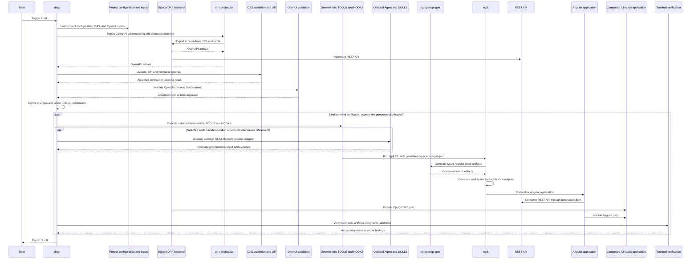

# Temporary Plan Extraction

## Moved from the former `doc/REQUIREMENTS.md`

### Section map

| Original section | Planning role | Target section |
|---|---|---|
| §4.2.3 | Planned static djng configuration | §4.2.3 below |
| §4.2.4 | Planned generated-app project configuration | §4.2.4 below |
| §4.2.5 | Planned generated `ng-openapi-gen` configuration | §4.2.5 below |
| §4.2.6 | Planned `drf-spectacular` configuration | §4.2.6 below |
| §4.2.7 | Planned `oasdiff` configuration | §4.2.7 below |
| §4.3 | Construction implementation workflow | §4.3 below |
| §4.3.1 | Planned platform ownership during construction | §4.3.1 below |
| §4.3.2 | Planned governed-construction behavior | §4.3.2 below |
| §4.3.3 | Planned first-time build sequence | §4.3.3 below |
| §6.2 | Implementation handoff plan | §6.2 below |
| §6.3 | MVP delivery plan | §6.3 below |
| §6.4 | Planned mandatory acceptance scenarios | §6.4 below |

---

#### 4.2.3. Planned `django-angular3.json` contents

`django-angular3.json` is the canonical, user-editable static configuration
for `djng`; it configures the tool, not project configuration. The package
must release it at
`django_angular3/templates/django_angular3/django-angular3.json`. Normal
commands consume the file without creating, replacing, or resetting it, and
released examples must use its schema.

Its derivation chain is:

`django-angular3.json` → `DJANGO_ANGULAR3` → `DjangoAngularSettings`

`DJANGO_ANGULAR3` is derived from the file and is not independently editable;
`DjangoAngularSettings` is extracted from it. `config_path` is only a reference to
the static tool configuration, and public command interfaces must not accept
configuration-file paths.

```json
{
  "ngOpenApiGen": {
    "serviceSuffix": "Api",
    "modelIndex": true
  },
  "drfSpectacular": {
    "settings": {
      "TITLE": "Example API",
      "VERSION": "1.0.0",
      "SERVE_INCLUDE_SCHEMA": false
    }
  },
  "oasdiff": {
    "format": "json"
  },
  "angular": {
    "workspace": {
      "packageManager": "pnpm",
      "style": "scss",
      "routing": true
    },
    "application": {
      "ssr": false,
      "zoneless": true
    },
    "build": {
      "configuration": "production"
    }
  },
  "tool": {
    "executables": {
      "node": "node",
      "pnpm": "pnpm",
      "ng": "ng"
    },
    "commandAllowlist": ["ng_openapi_gen"],
    "ngAddPackage": "angular-django2"
  }
}
```

#### 4.2.4. Planned `django-angular3-<project_name>.json` contents

Project configuration must be a separate, `djng` package user-owned
configuration source named `django-angular3-<project_name>.json`. It supplies the
project identity and command run-time artifact locations used by `djng`. The
package must release its template at
`django_angular3/templates/django_angular3/django-angular-project.json`; the
generated-application scaffold must create the file at the application root
alongside `manage.py`, and rename it to `django-angular3-<project_name>.json`.

The project configuration must have these required fields:

- `project.name`: a non-empty generated-application name;
- `artifacts.openapiSchema`: a non-empty relative path to the OAS schema;
- `artifacts.openuiSpecification`: a non-empty relative path to the OpenUI
  concrete UI document;
- `artifacts.angularWorkspace`: a non-empty relative path to the Angular
  workspace.

All artifact paths must be resolved relative to the project configuration file.
The `project_name` is the Django project name derived from
`DJANGO_SETTINGS_MODULE`. `djng` must discover
`django-angular3-<project_name>.json` at the project root path.

For incremental `build_app` runs, the current and previous project
configurations must each resolve their own artifact selectors. The current
configuration selects the candidate OpenAPI and OpenUI documents; the previous
configuration selects the baseline OpenAPI and OpenUI documents. A separate
previous-OpenUI argument or filename convention is not part of the project
configuration contract.

For example, a generated application can declare its identity and artifact
locations with:

```json
{
  "project": {
    "name": "django-angular3-scaffold"
  },
  "artifacts": {
    "openapiSchema": "django_angular3/examples/01_simple_crm/schema.yaml",
    "openuiSpecification": "app.openui.json",
    "angularWorkspace": "build/angular"
  }
}
```

The project configuration must remain outside the
`django-angular3.json` → `DJANGO_ANGULAR3` → `DjangoAngularSettings` derivation
chain. It defines the generated application's identity and the locations of
its OAS schema, OpenUI concrete UI document, and Angular workspace. It must
not duplicate `djng` tool settings or OAS/OpenUI document content.

#### 4.2.5. Planned `ng-openapi-gen.json` contents

For `ng_openapi_gen`, `djng` must derive a per-run `ng-openapi-gen.json` in
the configured project Angular workspace immediately before invocation. The
derived file must combine the global `ngOpenApiGen` settings with the command
run-time `input` from `ProjectConfig.artifacts.openapiSchema`, the derived
`output` `<ProjectConfig.artifacts.angularWorkspace>/generated/ng-openapi-gen`,
and the upstream `$schema` property. `djng` must invoke the workspace-local
generator through:

`pnpm exec ng-openapi-gen -c <generated-config-path>`

The derived file is an implementation artifact and must not be independently
editable. `ngOpenApiGen` must not contain per-run `input` or `output` values.

For example, a derived file for a project with an OAS schema at
`django_angular3/examples/01_simple_crm/schema.yaml` and an Angular workspace
at `build/angular` is:

```json
{
  "$schema": "https://raw.githubusercontent.com/cyclosproject/ng-openapi-gen/master/ng-openapi-gen-schema.json",
  "input": "django_angular3/examples/01_simple_crm/schema.yaml",
  "output": "build/angular/generated/ng-openapi-gen",
  "serviceSuffix": "Api",
  "modelIndex": true
}
```

`tests/fixtures/artifacts/ng-openapi-gen/ng-openapi-gen.json` is a
validation-only fixture, not a released or production configuration source.

#### 4.2.6. Planned `drfSpectacular.settings` contents
`drfSpectacular.settings` is derived from django-angular3.json and used by `djng` for schema export. 
The resulting OpenAPI document is an OAS schema, not `drf-spectacular` tool configuration.
See example `drfSpectacular.settings` clause in `django-angular3.json` schema above.

#### 4.2.7. Planned `oasdiff.settings` contents

`oasdiff.settings` is derived from the `oasdiff` clause in
`django-angular3.json` and used by `djng` when it invokes `oasdiff` for schema
comparison. The static setting selects JSON output so `djng` can parse the
diff result deterministically; it is not an OAS schema or independently
editable project configuration.

For example, the `oasdiff` clause above derives:

```json
{
  "format": "json"
}
```

For each comparison, `djng` obtains the platform-specific executable from
`ensure_oasdiff()` and invokes:

```text
<oasdiff-executable> diff <previous-schema> <current-schema> --format json
```

`<previous-schema>` and `<current-schema>` are required run-time parameters,
selected from the previous and current project configurations respectively.
The `diff` subcommand and resolved executable are owned by `djng`, not exposed
as user-editable project settings.

### 4.3. Construction Workflow

See `ARCHITECTURE.md` §§ 4.1-4.3 and 7.1-7.4 for the governing ownership
boundaries, architectural control-loop, verification, and build-flow model.

#### 4.3.1. Platform ownership

- Django and DRF must own the data model, persistence layer, backend business
  logic, authenticated APIs, authentication services, authorization
  enforcement, and backend integrations
- Django and DRF must own administrative capabilities for data administration,
  reference data, and operational tooling, including backend-oriented
  administration interfaces
- Django and DRF must own backend packaging and deployment-facing server
  artifacts
- Angular must own the user-facing application experience, page layout,
  navigation, forms, tables, dialogs, interaction design, and end-user
  application routing, with Angular Material as the primary UI system
- Angular must consume Django and DRF APIs as the backend contract surface and
  must not be the final trust boundary for security decisions

#### 4.3.2. Governed construction

- `djng` must provide the generation entry points that drive integrated Django-
  Angular construction, including backend contract lifecycle governance,
  change-requirement derivation, orchestration-facing work definitions,
  generator-app execution, and governed command wrappers around `ngdj` actions
- Governed construction may consume only the Angular-side commands,
  schematics, templates, and assembly behavior defined by the authoritative
  `ngdj` sources in `ARCHITECTURE.md` §2.6. A missing capability is an upstream
  dependency, not a locally defined `ngdj` requirement.
- OpenUI-derived construction must be a discrete governed construction stage,
  as defined by `ARCHITECTURE.md` §7.1 stage 4
- Governed construction must execute deterministic bounded operations,
  including `ngdj` schematics, through TOOL/wrapper contracts without
  requiring an agent or provider session. Optional AI-guided work may run
  through the agent using SKILLS only when the selected task is genuinely
  underspecified or non-deterministic. HOOKS provide lifecycle gates or
  mandatory side effects independently of either execution path.
- Governed construction must translate change-detection results into an
  ordered command sequence that selects deterministic TOOL commands directly
  and may also select AI-guided SKILL sessions, validation commands, and
  enforced gate boundaries. Each selected command must produce or validate
  output directly in relation to the generated-app workspace.
- Primitive selection must follow an explicit policy: deterministic work must
  prefer TOOL contracts, AI-guided generation or repair work may use SKILLS,
  and mandatory lifecycle enforcement must not rely on optional agent behavior
  where a HOOK or gate is required
- Related automations may be packaged as PLUGINS, but those packaging
  boundaries must preserve the ownership split between `djng` and `ngdj`
- Governed construction must support iterative inspection, repair, retry, and
  refinement when emitted outputs are incomplete, inconsistent, or invalid,
  and must continue until deterministic acceptance conditions are satisfied or
  a blocking issue is surfaced explicitly (see `ARCHITECTURE.md` §7.2 for
  where the repair and refinement loop is located within the construction
  model)
- Governed construction must derive required work by comparing the current
  contract, configuration, and structured inputs against their previously
  accepted state; work derivation must not assume a clean-slate context unless
  no previous state exists
- The platform must support a contract-first backend origination mode (see
  [ARCHITECTURE.md] §§ 2.21 and 11.2) alongside the model-first mode: when no
  Django data model exists yet, the Django data model must be generatable from
  an existing OpenAPI Schema using [datamodel-code-generator] with djng-owned
  custom Django templates, after which DRF elaboration and the model-first
  steady state apply
- Any backend data model change that produces a Django migration must trigger
  OpenAPI schema re-extraction before the contract normalization stage proceeds

#### 4.3.3. First-time build flow

The initial authoring and build flow must support this sequence:

##### Build (app-generation) sequence



1. A user designs or updates the OpenAPI specification using SmartBear's
   OpenAPI authoring tools (Swagger Studio or SwaggerHub)
2. The user exports or dumps the OAS artifact to the path selected by
  `artifacts.openapiSchema` in the project configuration
3. The user adds the OpenUI concrete UI document describing pages, forms,
  navigation, workflows, and related UI concerns at the path selected by
  `artifacts.openuiSpecification`
4. The user fires a build from the repository
5. The build validates the OAS and OpenUI artifacts, generates
  API-contract-derived artifacts, assembles the Angular app, and reports any stage-
   specific contract or input errors clearly

For this flow:

- The project configuration must select the source OAS artifact through
  `artifacts.openapiSchema`
- The project configuration must select the separate OpenUI concrete UI
  document through `artifacts.openuiSpecification`
- The build must fail fast when the OpenAPI contract is invalid or incompatible
  with generation
- The build must fail fast when the OpenUI input is invalid
- For the same OAS and OpenUI inputs, the build must preserve deterministic
  validation and acceptance behavior even if internal construction steps vary
- The build must allow a first-time user to understand which stage failed:
  contract validation, code generation, OpenUI input validation, or final app
  assembly

### 6.2. Implementation Handoff Readiness

See `ARCHITECTURE.md` §§ 17-18 for the related architectural decision and
implementation-sequencing context.

The platform is ready for implementation handoff when:

- The backend/frontend integration model is agreed upon
- Authentication, authorization, and audit expectations are explicit
- OpenAPI and OpenUI inputs have clear ownership and boundaries
- The MVP scope includes one full business module and the shared platform
  services it needs
- Non-functional requirements are concrete enough to guide engineering choices
- The architecture supports adding future modules without reworking the core
  stack

### 6.3. MVP Scope

The first implementation should include:

- Backend project setup with Django and DRF
- Angular frontend setup with Angular Material
- Generated Angular integration artifacts for shared Angular/Django integration
  logic
- Authentication and role-based authorization
- User profile and user administration
- OpenAPI export and consumption flow for API-contract-derived features
- `ng-openapi-gen` configuration generated from the canonical tool and project
  configurations and runnable in CI
- An OpenUI concrete UI document for pages, forms, navigation, and workflows
- One complete business module implemented end to end
- Shared list, detail, and form patterns
- Audit logging for key actions
- Error handling, health checks, and baseline automated tests
- Local development workflow plus staging-ready deployment setup

### 6.4. Mandatory Acceptance Scenarios

See `TEST_EXAMPLES.md` for the scenario definitions and expected outputs.

The governed construction flow must support and correctly handle each of the
following scenario classes:

- **Start from scratch**: a cold-start build with no previous state, invoking
  the full automation chain from workspace creation through app assembly and
  verification
- **Schema evolution — add**: an incremental schema change that adds a
  resource; only the required automation commands run, and existing
  workspace, app, and components are preserved
- **Schema evolution — removal**: an incremental schema change removes a
  resource or contract element; affected downstream construction commands run
  in dependency order.
- **OpenUI-only change**: an `app.openui.json` change with no schema change; only
  OpenUI-derived automation commands run
- **Combined schema and OpenUI change**: both the contract and the OpenUI
  input source change in the same build; both change paths activate and
  interleave correctly
- **Full replacement**: a resource is removed and a different resource is
  added; remove steps precede add steps at the same dependency level
- **Global acceptance gate**: terminal verification fails the run when local
  Skill acceptance does not compose into cross-Skill interface consistency,
  backend-contract / Angular-client alignment, and runnable application flows

---

## django-angular3 GitHub tasks

Snapshot dated 2026-08-31: all **39 open issues** are ordered topologically so every open same-repository dependency appears before the issue it blocks, with issue number as the stable tie breaker.

### [56 — [shadow] Track ngdj construction capabilities required by djng](https://github.com/shlomoa/django-angular3/issues/56)

- **State:** open
- **Milestone:** djangoangular e2e POC
- **Labels:** Epic
- **Assignees:** None
- **Author:** @shlomoa
- **Created:** 2026-05-07T05:57:53Z
- **Updated:** 2026-08-27T13:21:07Z
- **Comments:** 0
- **Parent issue:** None
- **Child issues:** None
- **Blocked by:** [shlomoa/angular-django2#24](https://github.com/shlomoa/angular-django2/issues/24) — Expand ngdj schematics and command surface required by djng (closed); [shlomoa/angular-django2#25](https://github.com/shlomoa/angular-django2/issues/25) — Scaffold generated Angular frontend structure (`core`, `shared`, `features`) (closed); [shlomoa/angular-django2#26](https://github.com/shlomoa/angular-django2/issues/26) — Generate OpenAPI-derived Angular integration artifacts (closed); [shlomoa/angular-django2#27](https://github.com/shlomoa/angular-django2/issues/27) — Assemble UI-description-derived content into the generated Angular application (open)
- **Blocking:** [#57](https://github.com/shlomoa/django-angular3/issues/57) — Complete djng generation entry points and governed ngdj wrappers (open); [#58](https://github.com/shlomoa/django-angular3/issues/58) — Execute governed construction through bounded SKILLS (open); [#66](https://github.com/shlomoa/django-angular3/issues/66) — [shadow] Consume ngdj Angular frontend structure capability (open); [#74](https://github.com/shlomoa/django-angular3/issues/74) — [integration] Assemble OpenAPI and OpenUI input streams across djng/ngdj (open)

#### Full issue details

> ## Objective
> 
> Coordinate the ngdj capabilities that downstream djng construction depends on without redefining ngdj's public contracts in this repository.
> 
> ## Authority and ownership
> 
> `doc/ARCHITECTURE.md` §2.6 governs ngdj identity, ownership, and upstream sources. Upstream implementation, command, option, schema, test, and status facts must be resolved there. This issue records only djng dependencies and consumption work.
> 
> ## Upstream dependency status
> 
> - [x] `shlomoa/angular-django2#24` — construction schematic surface delivered; issue closed.
> - [x] `shlomoa/angular-django2#25` — generated Angular frontend structure delivered; issue closed.
> - [x] `shlomoa/angular-django2#26` — OpenAPI-derived Angular integration artifacts delivered; issue closed.
> - [ ] `shlomoa/angular-django2#27` — site-input/OpenUI contract-alignment boundary remains open.
> 
> Do not copy an upstream command or option inventory into this issue. If an upstream source conflicts with implementation or tests, resolve that conflict in `angular-django2` under §2.6.
> 
> ## Remaining djng coordination work
> 
> - [ ] Track the resolution of upstream #27 and reflect only its consumable public contract in djng requirements, wrappers, Tools, Skills, and tests.
> - [ ] Keep djng wrapper and Tool decisions in #57 aligned with delivered upstream contracts without mirroring the full ngdj surface.
> - [ ] Ensure direct `build_app` work in #164 rejects missing or unsupported construction capabilities explicitly.
> - [ ] Verify selected ngdj operations through djng wrapper/contract tests and composed generated-app acceptance, while leaving schematic unit/integration/E2E ownership upstream.
> - [ ] Remove this issue as a blocker from downstream work that depends only on already delivered upstream capabilities.
> 
> ## Completion criteria
> 
> Close this shadow tracker when upstream #27's boundary is resolved and every remaining djng consumer either uses the resulting public contract, explicitly declares it unsupported, or tracks its own integration work. Closure does not imply completion of djng Tool contracts, `build_app`, or guided Skill execution; those remain owned by their dedicated issues.
> 

### [57 — Complete djng generation entry points and governed ngdj wrappers](https://github.com/shlomoa/django-angular3/issues/57)

- **State:** open
- **Milestone:** djangoangular e2e POC
- **Labels:** None
- **Assignees:** None
- **Author:** @shlomoa
- **Created:** 2026-05-07T05:57:53Z
- **Updated:** 2026-08-26T15:58:53Z
- **Comments:** 0
- **Parent issue:** None
- **Child issues:** None
- **Blocked by:** [#55](https://github.com/shlomoa/django-angular3/issues/55) — Implement durable, versioned OpenAPI schema artifacts (closed); [#56](https://github.com/shlomoa/django-angular3/issues/56) — [shadow] Track ngdj construction capabilities required by djng (open)
- **Blocking:** [#58](https://github.com/shlomoa/django-angular3/issues/58) — Execute governed construction through bounded SKILLS (open); [#61](https://github.com/shlomoa/django-angular3/issues/61) — Derive required work from the previously accepted state (open); [#63](https://github.com/shlomoa/django-angular3/issues/63) — Add generation-compatibility gating and stage-specific first-build failures (open); [#65](https://github.com/shlomoa/django-angular3/issues/65) — Scaffold the generated backend app structure (`common`, `accounts`, `access`, domain apps)` (open); [#66](https://github.com/shlomoa/django-angular3/issues/66) — [shadow] Consume ngdj Angular frontend structure capability (open); [#74](https://github.com/shlomoa/django-angular3/issues/74) — [integration] Assemble OpenAPI and OpenUI input streams across djng/ngdj (open); [#83](https://github.com/shlomoa/django-angular3/issues/83) — Add generated-app developer diagnostics and the gated `/ng/build` page (open)

#### Full issue details

> ## Objective
> 
> Complete the djng-owned generation entry points, wrapper decisions, deterministic Tool contracts, and direct-build integration required to invoke ngdj safely without redefining ngdj's public contracts.
> 
> ## Authority and ownership
> 
> - `doc/ARCHITECTURE.md` §2.6 governs ngdj identity, ownership, and upstream sources. Resolve every ngdj command, option, schema, implementation, test, and status fact through that policy; this issue does not maintain an ngdj command inventory.
> - `django_angular3/angular.py` (`_COMMAND_BUILDERS`) is the executable source for djng wrapper mappings.
> - `docs/commands.md` owns djng wrapper arguments and interface availability.
> - `doc/contracts/AI_AUTOMATION_CONTRACTS.md` owns canonical djng Tool contracts.
> - `doc/requirements/APP_BUILDER_REQUIREMENTS.md` owns direct-build requirements and change-to-execution mappings.
> - `doc/phased_implementation_plan.md` owns implementation sequencing.
> - `TODO.md` tracks remaining djng integration decisions and status.
> 
> Upstream schematic contracts are not substitutes for djng Tool contracts. Conversely, djng wrappers and Tools must not redefine upstream ngdj behavior.
> 
> ## Current djng state
> 
> The executable `_COMMAND_BUILDERS` registry currently contains 17 djng wrappers:
> 
> - workspace lifecycle: `ng_new`, `ng_workspace`, `ng_config`, `ng_add`, `ng_workspace_modify`, `ng_workspace_delete`;
> - application and construction: `ng_gen_app`, `ng_material_setup`, `ng_page`, `ng_component`, `ng_complex_component`, `ng_reactive_form`, `ng_site`;
> - API/client generation: `ng_openapi_gen`, `ng_openapi_setup`, `ng_data_service`; and
> - terminal compilation: `ng_build`.
> 
> These wrappers have dry-run and command-contract coverage in `tests/test_angular_commands.py` and `tests/test_ngdj_requirements.py`, and their public djng interfaces are documented in `docs/commands.md`.
> 
> Wrapper availability does **not** mean that a deterministic Tool contract, direct `build_app` selection/execution path, terminal integration acceptance, provider adapter, or guided Skill orchestration is implemented. Those remain separate, sequenced responsibilities.
> 
> Upstream angular-django2 #24 is complete and closed. Any future missing ngdj behavior must be recorded and resolved upstream under §2.6 rather than specified locally in this issue.
> 
> ## Remaining djng work
> 
> ### Wrapper and composition decisions
> 
> - [ ] Decide, from approved djng requirements, whether each remaining construction concern needs a dedicated wrapper, bounded composition of existing wrappers, direct Tool implementation, or explicit unsupported status.
> - [ ] Do not add wrappers merely to mirror the upstream ngdj surface.
> - [ ] Keep direct upstream invocation examples clearly labeled as ngdj usage rather than implying that a djng wrapper exists.
> 
> ### Deterministic construction contracts
> 
> For page, standalone component, complex component, reactive form, and site/navigation concerns:
> 
> - [ ] Define the complete `create` / `update` / `delete` / `move` support matrix.
> - [ ] Classify each operation as directly supported, supported by bounded composition, explicitly unsupported, or blocked on a required upstream change.
> - [ ] Resolve one canonical djng Tool identity per concern; reuse or extend an existing contract where possible rather than introducing competing identities.
> - [ ] Define structured inputs, source-derived change mapping, supported operations, outputs, ownership/idempotence behavior, structured errors, allowed invocation contexts, dependencies, implementation references, and terminal validation in `doc/contracts/AI_AUTOMATION_CONTRACTS.md`.
> - [ ] Align `doc/requirements/APP_BUILDER_REQUIREMENTS.md`, `doc/phased_implementation_plan.md`, and `doc/plan/TODO.md` by reference to those canonical contracts without duplicating them.
> - [ ] Verify that implementation issues #162 and #164 can consume the completed contracts without redefining them.
> 
> ### Direct build integration
> 
> - [ ] Map every supported configuration, OpenAPI, and UI-description-derived atomic change to an executable wrapper or Tool boundary.
> - [ ] Fail explicitly for unsupported changes; never silently omit a required operation.
> - [ ] Execute selected operations in deterministic dependency order through the provider-neutral Tool/Hook boundaries.
> - [ ] Preserve diagnostic-only, non-mutating `--dry-run` behavior.
> - [ ] Halt on the first wrapper, Tool, Hook, or validation failure and surface it through Django's normal error handling.
> - [ ] Run terminal compilation and the required cross-repository/generated-app acceptance checks after construction.
> 
> ## Dependencies and boundaries
> 
> - #139 and its phase issues sequence the provider-neutral execution foundation.
> - #162 implements deterministic Tool contracts after their canonical definitions are complete.
> - #164 implements direct `build_app` planning and execution.
> - #58 and #165 cover bounded Skills and guided-session orchestration only after direct execution is real.
> - Source-derived terminology and UI input boundaries must follow the maintained architecture, requirements, and `TODO.md` §15 decisions.
> 
> This issue does not own provider SDK integration, guided-session acceptance, upstream ngdj implementation, or canonical OpenUI schemas/vocabulary.
> 
> ## Completion criteria
> 
> Close this issue when:
> 
> 1. all approved djng wrapper/composition decisions are explicit and tested;
> 2. required deterministic construction Tool contracts are canonical and complete;
> 3. every supported atomic change has an executable, ordered, failure-aware direct-build mapping; and
> 4. documentation and tests distinguish wrapper availability, Tool execution, direct `build_app` integration, and guided Skill orchestration accurately.
> 
> Do not use closure of this issue to imply that provider adapters or guided Skill execution are complete; those retain their dedicated issues and acceptance criteria.
> 

### [61 — Derive required work from the previously accepted state](https://github.com/shlomoa/django-angular3/issues/61)

- **State:** open
- **Milestone:** djangoangular e2e POC
- **Labels:** None
- **Assignees:** None
- **Author:** @shlomoa
- **Created:** 2026-05-07T05:57:56Z
- **Updated:** 2026-08-24T15:43:50Z
- **Comments:** 0
- **Parent issue:** None
- **Child issues:** None
- **Blocked by:** [#55](https://github.com/shlomoa/django-angular3/issues/55) — Implement durable, versioned OpenAPI schema artifacts (closed); [#57](https://github.com/shlomoa/django-angular3/issues/57) — Complete djng generation entry points and governed ngdj wrappers (open)
- **Blocking:** None

#### Full issue details

> ## Requirement references
>     - `doc/contracts/CONTRACTS.md` §2 — compare candidate normalized semantic state against its accepted baseline
> 
>     ## Architecture references
>     - `doc/ARCHITECTURE.md` §§7.2, 11.2, 17
> 
>     ## Current gap
>     `build_app` can compare optional previous schema/config inputs, but the repo does not yet model the previously accepted state as a durable, governed baseline for work derivation.
> 
>     ## Deliverables
>     - define the persisted accepted-state model for schema, config, and structured UI inputs
> - update work derivation to compare against the accepted baseline
> - handle start-from-scratch versus incremental evolution explicitly
> - add tests for accepted-state transitions and change classification
> 

### [63 — Add generation-compatibility gating and stage-specific first-build failures](https://github.com/shlomoa/django-angular3/issues/63)

- **State:** open
- **Milestone:** djangoangular e2e POC
- **Labels:** None
- **Assignees:** None
- **Author:** @shlomoa
- **Created:** 2026-05-07T05:57:58Z
- **Updated:** 2026-08-27T15:49:50Z
- **Comments:** 0
- **Parent issue:** None
- **Child issues:** None
- **Blocked by:** [#55](https://github.com/shlomoa/django-angular3/issues/55) — Implement durable, versioned OpenAPI schema artifacts (closed); [#57](https://github.com/shlomoa/django-angular3/issues/57) — Complete djng generation entry points and governed ngdj wrappers (open)
- **Blocking:** [#74](https://github.com/shlomoa/django-angular3/issues/74) — [integration] Assemble OpenAPI and OpenUI input streams across djng/ngdj (open); [#84](https://github.com/shlomoa/django-angular3/issues/84) — Implement staged verification across contract, construction, integration, and tests (open)

#### Full issue details

> ## Requirement references
>     - `doc/requirements/REQUIREMENTS.md` §3.5 — fail fast when the OpenAPI contract is invalid or incompatible with generation
> - `doc/requirements/APP_BUILDER_REQUIREMENTS.md` FR-2 — deterministic command translation for the same inputs
> - `doc/requirements/REQUIREMENTS.md` §3.5 — identify whether failure happened in contract validation, code generation, OpenUI input validation, or final assembly
> 
>     ## Architecture references
>     - `doc/ARCHITECTURE.md` §§7.1-7.4, 11.2, 17
> 
>     ## Current gap
>     The scaffold validates inputs and emits a simple plan, but it does not yet implement full generation-compatibility gating or stage-typed failures across the end-to-end first-build flow.
> 
>     ## Deliverables
>     - add compatibility checks before generation starts
> - model and surface stage-specific failure categories consistently
> - keep the same inputs deterministic from validation through acceptance
> - add tests for invalid-contract, invalid-OpenUI-input, codegen-failure, and assembly-failure paths
> 

### [65 — Scaffold the generated backend app structure (`common`, `accounts`, `access`, domain apps)`](https://github.com/shlomoa/django-angular3/issues/65)

- **State:** open
- **Milestone:** djangoangular e2e POC
- **Labels:** None
- **Assignees:** None
- **Author:** @shlomoa
- **Created:** 2026-05-07T05:58:00Z
- **Updated:** 2026-08-24T15:43:52Z
- **Comments:** 0
- **Parent issue:** None
- **Child issues:** None
- **Blocked by:** [#57](https://github.com/shlomoa/django-angular3/issues/57) — Complete djng generation entry points and governed ngdj wrappers (open)
- **Blocking:** [#62](https://github.com/shlomoa/django-angular3/issues/62) — Trigger OpenAPI re-extraction after migration-producing backend changes (open); [#64](https://github.com/shlomoa/django-angular3/issues/64) — Expose non-production schema generation and browsable API docs (open); [#68](https://github.com/shlomoa/django-angular3/issues/68) — Implement authentication, password reset, recovery, and session timeout flows (open); [#69](https://github.com/shlomoa/django-angular3/issues/69) — Implement role-based authorization across API endpoints and UI navigation (open); [#70](https://github.com/shlomoa/django-angular3/issues/70) — Implement authenticated DRF endpoints with validation and standard HTTP semantics (open); [#71](https://github.com/shlomoa/django-angular3/issues/71) — Add filtering, sorting, pagination, and deterministic ordering for list endpoints (open); [#72](https://github.com/shlomoa/django-angular3/issues/72) — Normalize API error responses for Angular form and notification handling (open); [#75](https://github.com/shlomoa/django-angular3/issues/75) — Deliver the reusable business module pattern with list/detail/create/update/deactivate flows (open); [#77](https://github.com/shlomoa/django-angular3/issues/77) — Add audit logging for security and business events with authorized history views (open); [#78](https://github.com/shlomoa/django-angular3/issues/78) — Implement user administration and self-service profile management (open); [#79](https://github.com/shlomoa/django-angular3/issues/79) — Add administrative screens and centrally managed reference data (open)

#### Full issue details

> ## Requirement references
>     - `doc/specifications/SPECIFICATIONS.md` §4.1 — generated backend structure (`common`, `accounts`, `access`, and domain apps)
> - `doc/ARCHITECTURE.md` §3.3 — Django/DRF ownership of backend responsibilities
> 
>     ## Architecture references
>     - `doc/ARCHITECTURE.md` §§4.1, 9.1-9.4, 17-18
> 
>     ## Current gap
>     This repo is a reusable Django app scaffold, not a generated application scaffold. The required generated backend app topology does not yet exist.
> 
>     ## Deliverables
>     - generate the `common`, `accounts`, and `access` apps plus domain-app scaffolding
> - place shared helpers in the correct bounded app
> - preserve the ownership boundary between backend platform apps and domain apps
> - add tests that verify generated backend structure and module boundaries
> 

### [62 — Trigger OpenAPI re-extraction after migration-producing backend changes](https://github.com/shlomoa/django-angular3/issues/62)

- **State:** open
- **Milestone:** djangoangular e2e POC
- **Labels:** None
- **Assignees:** None
- **Author:** @shlomoa
- **Created:** 2026-05-07T05:57:58Z
- **Updated:** 2026-08-24T15:43:50Z
- **Comments:** 0
- **Parent issue:** None
- **Child issues:** None
- **Blocked by:** [#55](https://github.com/shlomoa/django-angular3/issues/55) — Implement durable, versioned OpenAPI schema artifacts (closed); [#65](https://github.com/shlomoa/django-angular3/issues/65) — Scaffold the generated backend app structure (`common`, `accounts`, `access`, domain apps)` (open)
- **Blocking:** None

#### Full issue details

> ## Requirement references
>     - `doc/ARCHITECTURE.md` §11.2 — any backend data-model change that produces a Django migration must trigger OpenAPI schema re-extraction before contract normalization proceeds
> 
>     ## Architecture references
>     - `doc/ARCHITECTURE.md` §11.2
> 
>     ## Current gap
>     The repo does not yet connect Django migration-producing changes to schema export and downstream contract normalization.
> 
>     ## Deliverables
>     - detect migration-producing model changes in the generated backend workflow
> - re-extract the OpenAPI schema before normalization/diffing continues
> - prevent stale-schema downstream generation
> - cover the trigger behavior with tests
> 

### [64 — Expose non-production schema generation and browsable API docs](https://github.com/shlomoa/django-angular3/issues/64)

- **State:** open
- **Milestone:** djangoangular e2e POC
- **Labels:** None
- **Assignees:** None
- **Author:** @shlomoa
- **Created:** 2026-05-07T05:57:59Z
- **Updated:** 2026-08-24T15:43:51Z
- **Comments:** 0
- **Parent issue:** None
- **Child issues:** None
- **Blocked by:** [#55](https://github.com/shlomoa/django-angular3/issues/55) — Implement durable, versioned OpenAPI schema artifacts (closed); [#65](https://github.com/shlomoa/django-angular3/issues/65) — Scaffold the generated backend app structure (`common`, `accounts`, `access`, domain apps)` (open)
- **Blocking:** None

#### Full issue details

> ## Requirement references
>     - `doc/requirements/APPLICATION_FUNCTIONAL_REQUIREMENTS.md` §4.1 — API schema generation and browsable documentation should be available in non-production environments
> 
>     ## Architecture references
>     - `doc/ARCHITECTURE.md` §§11.1-11.2, 16-17
> 
>     ## Current gap
>     The project depends on DRF and drf-spectacular, but it does not yet expose a supported non-production schema/documentation surface for the generated app.
> 
>     ## Deliverables
>     - wire schema generation into the generated backend environment
> - expose browsable API/schema documentation only in allowed environments
> - document configuration and routing expectations
> - add tests for visibility in non-production and absence in production-like settings
> 

### [66 — [shadow] Consume ngdj Angular frontend structure capability](https://github.com/shlomoa/django-angular3/issues/66)

- **State:** open
- **Milestone:** djangoangular e2e POC
- **Labels:** None
- **Assignees:** None
- **Author:** @shlomoa
- **Created:** 2026-05-07T05:58:00Z
- **Updated:** 2026-08-27T13:21:11Z
- **Comments:** 0
- **Parent issue:** None
- **Child issues:** None
- **Blocked by:** [#56](https://github.com/shlomoa/django-angular3/issues/56) — [shadow] Track ngdj construction capabilities required by djng (open); [#57](https://github.com/shlomoa/django-angular3/issues/57) — Complete djng generation entry points and governed ngdj wrappers (open); [shlomoa/angular-django2#25](https://github.com/shlomoa/angular-django2/issues/25) — Scaffold generated Angular frontend structure (`core`, `shared`, `features`) (closed)
- **Blocking:** [#67](https://github.com/shlomoa/django-angular3/issues/67) — Standardize reusable UI patterns for tables, detail views, forms, dialogs, and feedback (open); [#68](https://github.com/shlomoa/django-angular3/issues/68) — Implement authentication, password reset, recovery, and session timeout flows (open); [#73](https://github.com/shlomoa/django-angular3/issues/73) — Build the Angular shell, routing, responsive navigation, and global feedback patterns (open); [#74](https://github.com/shlomoa/django-angular3/issues/74) — [integration] Assemble OpenAPI and OpenUI input streams across djng/ngdj (open); [#75](https://github.com/shlomoa/django-angular3/issues/75) — Deliver the reusable business module pattern with list/detail/create/update/deactivate flows (open); [#83](https://github.com/shlomoa/django-angular3/issues/83) — Add generated-app developer diagnostics and the gated `/ng/build` page (open)

#### Full issue details

> ## Objective
> 
> Consume and verify the generated Angular frontend structure delivered by ngdj within djng-governed construction flows.
> 
> ## Authority and upstream status
> 
> `doc/ARCHITECTURE.md` §2.6 governs all ngdj implementation and contract facts. Canonical upstream implementation issue `shlomoa/angular-django2#25` is complete and closed.
> 
> This issue does not redefine the upstream structure contract. It tracks only djng consumption and generated-app acceptance.
> 
> ## Requirement and architecture references
> 
> - `doc/specifications/SPECIFICATIONS.md` §4.2 — generated frontend structure.
> - `doc/ARCHITECTURE.md` §§2.6, 4.2–4.3, 10.1–10.3, 17–18.
> - `doc/requirements/APP_BUILDER_REQUIREMENTS.md` — direct-build selection, ordering, execution, and acceptance.
> 
> ## Remaining djng work
> 
> - [ ] Ensure the applicable workspace/application wrapper and Tool contracts consume the delivered structure without duplicating its upstream definition.
> - [ ] Verify generated-app paths used by downstream page, component, form, service, and site construction resolve consistently against that structure.
> - [ ] Add direct-build/generated-app acceptance proving the selected ngdj operations compose into a buildable application.
> - [ ] Keep failures attributable: upstream schematic contract failures remain ngdj concerns; incorrect djng selection, arguments, ordering, or composition remain djng concerns.
> 
> ## Dependencies
> 
> - #57 — djng wrapper and deterministic construction-contract decisions.
> - #164 — direct `build_app` planning and execution.
> - #84 — composed generated-app verification.
> 
> ## Completion criteria
> 
> Close this issue when djng consumes the delivered frontend structure through its approved execution boundaries and generated-app acceptance verifies that downstream construction composes correctly. Upstream #25 being closed is necessary evidence, not sufficient evidence of djng integration completion.
> 

### [67 — Standardize reusable UI patterns for tables, detail views, forms, dialogs, and feedback](https://github.com/shlomoa/django-angular3/issues/67)

- **State:** open
- **Milestone:** djangoangular e2e POC
- **Labels:** None
- **Assignees:** None
- **Author:** @shlomoa
- **Created:** 2026-05-07T05:58:01Z
- **Updated:** 2026-08-24T15:43:53Z
- **Comments:** 0
- **Parent issue:** None
- **Child issues:** None
- **Blocked by:** [#66](https://github.com/shlomoa/django-angular3/issues/66) — [shadow] Consume ngdj Angular frontend structure capability (open)
- **Blocking:** [#73](https://github.com/shlomoa/django-angular3/issues/73) — Build the Angular shell, routing, responsive navigation, and global feedback patterns (open); [#75](https://github.com/shlomoa/django-angular3/issues/75) — Deliver the reusable business module pattern with list/detail/create/update/deactivate flows (open)

#### Full issue details

> ## Requirement references
>     - `doc/specifications/SPECIFICATIONS.md` §4.3 — standardize and reuse patterns for tables, lists, detail views, forms, dialogs, snackbars, and confirmation flows
> - `doc/requirements/APPLICATION_FUNCTIONAL_REQUIREMENTS.md` §4.7 — global feedback patterns and Angular Material screens
> 
>     ## Architecture references
>     - `doc/ARCHITECTURE.md` §§10.2, 10.5
> 
>     ## Current gap
>     The docs describe reusable UI patterns, but the generated Angular UI pattern library and its enforcing generation logic do not yet exist.
> 
>     ## Deliverables
>     - define reusable Angular Material patterns for core CRUD and feedback flows
> - make those patterns consumable by generated features and pages
> - keep the pattern set separate from product-specific pages
> - add coverage that verifies generated features reuse the standard patterns
> 

### [68 — Implement authentication, password reset, recovery, and session timeout flows](https://github.com/shlomoa/django-angular3/issues/68)

- **State:** open
- **Milestone:** djangoangular e2e POC
- **Labels:** None
- **Assignees:** None
- **Author:** @shlomoa
- **Created:** 2026-05-07T05:58:02Z
- **Updated:** 2026-08-24T15:43:54Z
- **Comments:** 0
- **Parent issue:** None
- **Child issues:** None
- **Blocked by:** [#65](https://github.com/shlomoa/django-angular3/issues/65) — Scaffold the generated backend app structure (`common`, `accounts`, `access`, domain apps)` (open); [#66](https://github.com/shlomoa/django-angular3/issues/66) — [shadow] Consume ngdj Angular frontend structure capability (open)
- **Blocking:** [#69](https://github.com/shlomoa/django-angular3/issues/69) — Implement role-based authorization across API endpoints and UI navigation (open); [#70](https://github.com/shlomoa/django-angular3/issues/70) — Implement authenticated DRF endpoints with validation and standard HTTP semantics (open); [#77](https://github.com/shlomoa/django-angular3/issues/77) — Add audit logging for security and business events with authorized history views (open); [#78](https://github.com/shlomoa/django-angular3/issues/78) — Implement user administration and self-service profile management (open); [#80](https://github.com/shlomoa/django-angular3/issues/80) — Add notification support for account and workflow events (open)

#### Full issue details

> ## Requirement references
>     - `doc/requirements/APPLICATION_FUNCTIONAL_REQUIREMENTS.md` §4.4 — secure sign in/sign out, password-based auth, future SSO readiness, password reset/account recovery, configurable expiration and idle timeout
> 
>     ## Architecture references
>     - `doc/ARCHITECTURE.md` §§12.1-12.3, 15, 17
> 
>     ## Current gap
>     The reusable package does not yet generate or provide the end-to-end authentication and identity flows required for the generated application.
> 
>     ## Deliverables
>     - implement backend and frontend sign-in/sign-out flows
> - support password reset and recovery
> - keep the design ready for later SSO integration without major rewrites
> - expose configurable session expiry/idle timeout behavior
> - add automated tests for the authentication lifecycle
> 

### [69 — Implement role-based authorization across API endpoints and UI navigation](https://github.com/shlomoa/django-angular3/issues/69)

- **State:** open
- **Milestone:** djangoangular e2e POC
- **Labels:** None
- **Assignees:** None
- **Author:** @shlomoa
- **Created:** 2026-05-07T05:58:02Z
- **Updated:** 2026-08-24T15:43:54Z
- **Comments:** 0
- **Parent issue:** None
- **Child issues:** None
- **Blocked by:** [#65](https://github.com/shlomoa/django-angular3/issues/65) — Scaffold the generated backend app structure (`common`, `accounts`, `access`, domain apps)` (open); [#68](https://github.com/shlomoa/django-angular3/issues/68) — Implement authentication, password reset, recovery, and session timeout flows (open)
- **Blocking:** [#73](https://github.com/shlomoa/django-angular3/issues/73) — Build the Angular shell, routing, responsive navigation, and global feedback patterns (open); [#77](https://github.com/shlomoa/django-angular3/issues/77) — Add audit logging for security and business events with authorized history views (open); [#78](https://github.com/shlomoa/django-angular3/issues/78) — Implement user administration and self-service profile management (open); [#81](https://github.com/shlomoa/django-angular3/issues/81) — Add file attachment support with upload validation and permission-aware downloads (open)

#### Full issue details

> ## Requirement references
>     - `doc/requirements/APPLICATION_FUNCTIONAL_REQUIREMENTS.md` §4.5 — authenticated-by-default access, RBAC, permission enforcement on API and UI, and role/object-scope restrictions for sensitive actions
> 
>     ## Architecture references
>     - `doc/ARCHITECTURE.md` §§4.1-4.3, 12.2-12.3, 15
> 
>     ## Current gap
>     The scaffold has architecture guidance for backend-authoritative permissions, but it does not yet implement generated RBAC behavior across DRF and Angular navigation.
> 
>     ## Deliverables
>     - define the baseline role/group/permission model
> - enforce permissions on API endpoints and UI route/navigation surfaces
> - support object-level restrictions where required
> - add tests that prove frontend hints never replace backend enforcement
> 

### [70 — Implement authenticated DRF endpoints with validation and standard HTTP semantics](https://github.com/shlomoa/django-angular3/issues/70)

- **State:** open
- **Milestone:** djangoangular e2e POC
- **Labels:** None
- **Assignees:** None
- **Author:** @shlomoa
- **Created:** 2026-05-07T05:58:03Z
- **Updated:** 2026-08-24T15:43:55Z
- **Comments:** 0
- **Parent issue:** None
- **Child issues:** None
- **Blocked by:** [#65](https://github.com/shlomoa/django-angular3/issues/65) — Scaffold the generated backend app structure (`common`, `accounts`, `access`, domain apps)` (open); [#68](https://github.com/shlomoa/django-angular3/issues/68) — Implement authentication, password reset, recovery, and session timeout flows (open)
- **Blocking:** [#75](https://github.com/shlomoa/django-angular3/issues/75) — Deliver the reusable business module pattern with list/detail/create/update/deactivate flows (open); [#84](https://github.com/shlomoa/django-angular3/issues/84) — Implement staged verification across contract, construction, integration, and tests (open)

#### Full issue details

> ## Requirement references
>     - `doc/requirements/APPLICATION_FUNCTIONAL_REQUIREMENTS.md` §4.1 — API endpoints must support authenticated access, validation, and standard HTTP semantics
> 
>     ## Architecture references
>     - `doc/ARCHITECTURE.md` §§11.3, 12.2-12.3
> 
>     ## Current gap
>     The repo currently validates example OpenAPI documents but does not yet generate or scaffold the authenticated DRF endpoint behavior described by the requirements.
> 
>     ## Deliverables
>     - provide baseline DRF endpoint scaffolding with authentication and serializer/domain validation
> - keep backend authorization authoritative
> - use predictable HTTP semantics for CRUD and failure cases
> - add endpoint tests that exercise auth, validation, and response semantics
> 

### [71 — Add filtering, sorting, pagination, and deterministic ordering for list endpoints](https://github.com/shlomoa/django-angular3/issues/71)

- **State:** open
- **Milestone:** djangoangular e2e POC
- **Labels:** None
- **Assignees:** None
- **Author:** @shlomoa
- **Created:** 2026-05-07T05:58:04Z
- **Updated:** 2026-08-24T15:35:51Z
- **Comments:** 0
- **Parent issue:** None
- **Child issues:** None
- **Blocked by:** [#65](https://github.com/shlomoa/django-angular3/issues/65) — Scaffold the generated backend app structure (`common`, `accounts`, `access`, domain apps)` (open)
- **Blocking:** [#75](https://github.com/shlomoa/django-angular3/issues/75) — Deliver the reusable business module pattern with list/detail/create/update/deactivate flows (open); [#76](https://github.com/shlomoa/django-angular3/issues/76) — Implement search and data-discovery workflows for business records (open); [#84](https://github.com/shlomoa/django-angular3/issues/84) — Implement staged verification across contract, construction, integration, and tests (open)

#### Full issue details

> ## Requirement references
>     - `doc/requirements/APPLICATION_FUNCTIONAL_REQUIREMENTS.md` §4.1 — list endpoints must support filtering, sorting, and pagination
> - `doc/requirements/APPLICATION_FUNCTIONAL_REQUIREMENTS.md` §§4.8–4.9 — list screens, filters, pagination, and deterministic default sorting
> - `doc/specifications/SPECIFICATIONS.md` §4.1 — `common` app provides reusable pagination/filtering helpers
> 
>     ## Architecture references
>     - `doc/ARCHITECTURE.md` §§9.1, 11.3
> 
>     ## Current gap
>     The codebase depends on `django-filter`, but the generated backend conventions and reusable helpers for list behavior are not yet implemented.
> 
>     ## Deliverables
>     - add reusable filtering/sorting/pagination helpers to the generated backend
> - define deterministic default ordering rules
> - wire the conventions into generated module endpoints
> - cover list behavior with API tests
> 

### [72 — Normalize API error responses for Angular form and notification handling](https://github.com/shlomoa/django-angular3/issues/72)

- **State:** open
- **Milestone:** djangoangular e2e POC
- **Labels:** None
- **Assignees:** None
- **Author:** @shlomoa
- **Created:** 2026-05-07T05:58:04Z
- **Updated:** 2026-08-24T15:35:52Z
- **Comments:** 0
- **Parent issue:** None
- **Child issues:** None
- **Blocked by:** [#65](https://github.com/shlomoa/django-angular3/issues/65) — Scaffold the generated backend app structure (`common`, `accounts`, `access`, domain apps)` (open)
- **Blocking:** [#75](https://github.com/shlomoa/django-angular3/issues/75) — Deliver the reusable business module pattern with list/detail/create/update/deactivate flows (open); [#82](https://github.com/shlomoa/django-angular3/issues/82) — Implement user-safe error handling and recoverable unsaved-form behavior (open); [#84](https://github.com/shlomoa/django-angular3/issues/84) — Implement staged verification across contract, construction, integration, and tests (open)

#### Full issue details

> ## Requirement references
>     - `doc/requirements/APPLICATION_FUNCTIONAL_REQUIREMENTS.md` §4.1 — predictable API error structure usable by Angular
> - `doc/requirements/APPLICATION_FUNCTIONAL_REQUIREMENTS.md` §4.15 — clear field/form validation errors and user-safe unexpected-error messages
> 
>     ## Architecture references
>     - `doc/ARCHITECTURE.md` §§8.4, 11.3, 13.1
> 
>     ## Current gap
>     There is no generated backend error-normalization layer yet, so Angular-facing forms and notifications do not have a defined contract for validation and unexpected-error responses.
> 
>     ## Deliverables
>     - define a consistent error response shape for validation and server failures
> - support field-level and form-level mapping in Angular
> - log unexpected errors while returning safe user-facing messages
> - add tests for serializer validation and unexpected exception paths
> 

### [73 — Build the Angular shell, routing, responsive navigation, and global feedback patterns](https://github.com/shlomoa/django-angular3/issues/73)

- **State:** open
- **Milestone:** djangoangular e2e POC
- **Labels:** None
- **Assignees:** None
- **Author:** @shlomoa
- **Created:** 2026-05-07T05:58:05Z
- **Updated:** 2026-08-24T15:35:52Z
- **Comments:** 0
- **Parent issue:** None
- **Child issues:** None
- **Blocked by:** [#66](https://github.com/shlomoa/django-angular3/issues/66) — [shadow] Consume ngdj Angular frontend structure capability (open); [#69](https://github.com/shlomoa/django-angular3/issues/69) — Implement role-based authorization across API endpoints and UI navigation (open); [#67](https://github.com/shlomoa/django-angular3/issues/67) — Standardize reusable UI patterns for tables, detail views, forms, dialogs, and feedback (open)
- **Blocking:** [#78](https://github.com/shlomoa/django-angular3/issues/78) — Implement user administration and self-service profile management (open); [#82](https://github.com/shlomoa/django-angular3/issues/82) — Implement user-safe error handling and recoverable unsaved-form behavior (open)

#### Full issue details

> ## Requirement references
>     - `doc/requirements/APPLICATION_FUNCTIONAL_REQUIREMENTS.md` §4.7 — consistent shell, client-side routing, permission-aware navigation, responsive layout, global loading/success/warning/error feedback, Angular Material user-facing screens
> 
>     ## Architecture references
>     - `doc/ARCHITECTURE.md` §§4.2-4.3, 10.3.1, 10.5, 12.2
> 
>     ## Current gap
>     The repository has no generated Angular shell yet, so the required top-level navigation, routing, responsiveness, and feedback patterns are still missing.
> 
>     ## Deliverables
>     - create the generated Angular shell and route tree foundation
> - add breadcrumbs/page-title/navigation patterns
> - gate visible navigation by permissions without treating the frontend as the trust boundary
> - provide global feedback components for loading/success/warning/error
> - add UI tests for navigation and responsive behavior
> 

### [74 — [integration] Assemble OpenAPI and OpenUI input streams across djng/ngdj](https://github.com/shlomoa/django-angular3/issues/74)

- **State:** open
- **Milestone:** djangoangular e2e POC
- **Labels:** Epic
- **Assignees:** None
- **Author:** @shlomoa
- **Created:** 2026-05-07T05:58:06Z
- **Updated:** 2026-08-27T16:05:32Z
- **Comments:** 0
- **Parent issue:** None
- **Child issues:** [shlomoa/angular-django2#26](https://github.com/shlomoa/angular-django2/issues/26) — Generate OpenAPI-derived Angular integration artifacts (closed); [shlomoa/angular-django2#27](https://github.com/shlomoa/angular-django2/issues/27) — Assemble UI-description-derived content into the generated Angular application (open)
- **Blocked by:** [#55](https://github.com/shlomoa/django-angular3/issues/55) — Implement durable, versioned OpenAPI schema artifacts (closed); [#56](https://github.com/shlomoa/django-angular3/issues/56) — [shadow] Track ngdj construction capabilities required by djng (open); [#57](https://github.com/shlomoa/django-angular3/issues/57) — Complete djng generation entry points and governed ngdj wrappers (open); [#63](https://github.com/shlomoa/django-angular3/issues/63) — Add generation-compatibility gating and stage-specific first-build failures (open); [#66](https://github.com/shlomoa/django-angular3/issues/66) — [shadow] Consume ngdj Angular frontend structure capability (open); [shlomoa/angular-django2#26](https://github.com/shlomoa/angular-django2/issues/26) — Generate OpenAPI-derived Angular integration artifacts (closed); [shlomoa/angular-django2#27](https://github.com/shlomoa/angular-django2/issues/27) — Assemble UI-description-derived content into the generated Angular application (open)
- **Blocking:** [#75](https://github.com/shlomoa/django-angular3/issues/75) — Deliver the reusable business module pattern with list/detail/create/update/deactivate flows (open); [#84](https://github.com/shlomoa/django-angular3/issues/84) — Implement staged verification across contract, construction, integration, and tests (open)

#### Full issue details

> ## Objective
> 
> Integrate the separate OpenAPI contract and OpenUI description streams across djng and ngdj without collapsing their source identities or redefining either upstream contract.
> 
> ## Authority and ownership
> 
> - `doc/ARCHITECTURE.md` §2.6 governs ngdj identity, public contracts, implementation, tests, and upstream status.
> - The external `openui-spec` project owns the OpenUI schema, catalog, concrete-document contract, and conformance rules.
> - djng owns project artifact selection, input validation, cross-input consistency, change derivation, execution selection, stage gating, orchestration, and final generated-app acceptance.
> - ngdj owns deterministic Angular construction at its public invocation boundary.
> 
> ## Upstream dependency status
> 
> - [x] `shlomoa/angular-django2#26` — OpenAPI-derived Angular integration artifacts delivered; issue closed.
> - [ ] `shlomoa/angular-django2#27` — alignment between ngdj's package-local site assembly input and the canonical OpenUI boundary remains open.
> 
> The current ngdj site assembly definition must not be described as an OpenUI concrete UI document unless that upstream contract is implemented and tested.
> 
> ## Requirement and architecture references
> 
> - `doc/requirements/APPLICATION_FUNCTIONAL_REQUIREMENTS.md` §4.14 — separate, versioned OpenAPI and OpenUI inputs with distinct but composable roles.
> - `doc/ARCHITECTURE.md` §§2.6, 8.2–8.5, 10.2, 11.1–11.2, 17.
> - `TODO.md` §§14–15 — OpenUI integration and source-derived terminology work.
> - `doc/requirements/APP_BUILDER_REQUIREMENTS.md` — input selection, change derivation, command mapping, and direct execution.
> 
> ## Remaining djng integration work
> 
> - [ ] Consume the resolution of upstream #27 without creating a competing local ngdj input contract.
> - [ ] Validate the selected OpenAPI and OpenUI artifacts through their respective authorities before deriving construction work.
> - [ ] Preserve source identity when one UI concern is both API-contract-backed and UI-description-derived.
> - [ ] Derive supported atomic changes and select explicit wrappers/Tools; reject unsupported changes rather than silently omitting them.
> - [ ] Verify generated Angular integration artifacts and UI-description-derived construction compose with backend behavior in the generated app.
> - [x] Align terminology after `TODO.md` §15.2 approves the canonical replacement terms.
> 
> ## Completion criteria
> 
> Close this issue when the upstream site-input boundary is resolved, djng implements and tests both input lanes and their cross-input consistency, every supported change has an explicit execution path, and composed generated-app acceptance passes without merging OpenAPI and OpenUI into one source of truth.
> 

### [75 — Deliver the reusable business module pattern with list/detail/create/update/deactivate flows](https://github.com/shlomoa/django-angular3/issues/75)

- **State:** open
- **Milestone:** djangoangular e2e POC
- **Labels:** None
- **Assignees:** None
- **Author:** @shlomoa
- **Created:** 2026-05-07T05:58:07Z
- **Updated:** 2026-08-24T15:35:53Z
- **Comments:** 0
- **Parent issue:** None
- **Child issues:** None
- **Blocked by:** [#65](https://github.com/shlomoa/django-angular3/issues/65) — Scaffold the generated backend app structure (`common`, `accounts`, `access`, domain apps)` (open); [#66](https://github.com/shlomoa/django-angular3/issues/66) — [shadow] Consume ngdj Angular frontend structure capability (open); [#67](https://github.com/shlomoa/django-angular3/issues/67) — Standardize reusable UI patterns for tables, detail views, forms, dialogs, and feedback (open); [#70](https://github.com/shlomoa/django-angular3/issues/70) — Implement authenticated DRF endpoints with validation and standard HTTP semantics (open); [#71](https://github.com/shlomoa/django-angular3/issues/71) — Add filtering, sorting, pagination, and deterministic ordering for list endpoints (open); [#72](https://github.com/shlomoa/django-angular3/issues/72) — Normalize API error responses for Angular form and notification handling (open); [#74](https://github.com/shlomoa/django-angular3/issues/74) — [integration] Assemble OpenAPI and OpenUI input streams across djng/ngdj (open)
- **Blocking:** [#76](https://github.com/shlomoa/django-angular3/issues/76) — Implement search and data-discovery workflows for business records (open); [#81](https://github.com/shlomoa/django-angular3/issues/81) — Add file attachment support with upload validation and permission-aware downloads (open); [#82](https://github.com/shlomoa/django-angular3/issues/82) — Implement user-safe error handling and recoverable unsaved-form behavior (open); [#84](https://github.com/shlomoa/django-angular3/issues/84) — Implement staged verification across contract, construction, integration, and tests (open)

#### Full issue details

> ## Requirement references
>     - `doc/requirements/APPLICATION_FUNCTIONAL_REQUIREMENTS.md` §4.8 — modular feature areas, list/detail/create/update/deactivate-or-delete flows, list filtering/sorting/pagination, detail metadata/related records, client/server validation
> 
>     ## Architecture references
>     - `doc/ARCHITECTURE.md` §§9, 10.2-10.5, 14.3
> 
>     ## Current gap
>     The generated app model requires at least one complete end-to-end module, but the repository does not yet implement or generate the reusable module pattern that such features depend on.
> 
>     ## Deliverables
>     - define the reusable backend/frontend module pattern
> - generate list/detail/form flows that reuse shared patterns and Angular integration artifacts
> - include deactivate/delete behavior where appropriate
> - verify client-side and server-side validation behavior
> - add end-to-end tests around one representative module
> 

### [76 — Implement search and data-discovery workflows for business records](https://github.com/shlomoa/django-angular3/issues/76)

- **State:** open
- **Milestone:** djangoangular e2e POC
- **Labels:** None
- **Assignees:** None
- **Author:** @shlomoa
- **Created:** 2026-05-07T05:58:07Z
- **Updated:** 2026-08-24T15:35:54Z
- **Comments:** 0
- **Parent issue:** None
- **Child issues:** None
- **Blocked by:** [#71](https://github.com/shlomoa/django-angular3/issues/71) — Add filtering, sorting, pagination, and deterministic ordering for list endpoints (open); [#75](https://github.com/shlomoa/django-angular3/issues/75) — Deliver the reusable business module pattern with list/detail/create/update/deactivate flows (open)
- **Blocking:** None

#### Full issue details

> ## Requirement references
>     - `doc/requirements/APPLICATION_FUNCTIONAL_REQUIREMENTS.md` §4.9 — search by primary identifiers, common business filters, large-result pagination, deterministic sorting
> 
>     ## Architecture references
>     - `doc/ARCHITECTURE.md` §§11.3, 10.5
> 
>     ## Current gap
>     Search and discovery behavior is described in the requirements, but there is no generated list/search implementation yet.
> 
>     ## Deliverables
>     - add search inputs and common business filters to generated module lists
> - align frontend controls with backend filter/sort/page conventions
> - preserve deterministic results across repeated queries
> - cover search/filter behavior with backend and UI tests
> 

### [77 — Add audit logging for security and business events with authorized history views](https://github.com/shlomoa/django-angular3/issues/77)

- **State:** open
- **Milestone:** djangoangular e2e POC
- **Labels:** None
- **Assignees:** None
- **Author:** @shlomoa
- **Created:** 2026-05-07T05:58:08Z
- **Updated:** 2026-08-24T15:35:54Z
- **Comments:** 0
- **Parent issue:** None
- **Child issues:** None
- **Blocked by:** [#65](https://github.com/shlomoa/django-angular3/issues/65) — Scaffold the generated backend app structure (`common`, `accounts`, `access`, domain apps)` (open); [#68](https://github.com/shlomoa/django-angular3/issues/68) — Implement authentication, password reset, recovery, and session timeout flows (open); [#69](https://github.com/shlomoa/django-angular3/issues/69) — Implement role-based authorization across API endpoints and UI navigation (open)
- **Blocking:** [#79](https://github.com/shlomoa/django-angular3/issues/79) — Add administrative screens and centrally managed reference data (open)

#### Full issue details

> ## Requirement references
>     - `doc/requirements/APPLICATION_FUNCTIONAL_REQUIREMENTS.md` §4.10 — record important security/business events, capture who/when for sensitive changes, view audit history, and trace authentication events
> 
>     ## Architecture references
>     - `doc/ARCHITECTURE.md` §§4.1, 12.3, 13.1-13.2, 15
> 
>     ## Current gap
>     The current scaffold has no generated audit-event model, capture hooks, or authorized audit-history surface.
> 
>     ## Deliverables
>     - define auditable event types for auth, admin, and sensitive business changes
> - capture actor/time context consistently
> - expose authorized audit-history views or endpoints
> - add tests for audit event creation and access control
> 

### [78 — Implement user administration and self-service profile management](https://github.com/shlomoa/django-angular3/issues/78)

- **State:** open
- **Milestone:** djangoangular e2e POC
- **Labels:** None
- **Assignees:** None
- **Author:** @shlomoa
- **Created:** 2026-05-07T05:58:09Z
- **Updated:** 2026-08-24T15:35:54Z
- **Comments:** 0
- **Parent issue:** None
- **Child issues:** None
- **Blocked by:** [#65](https://github.com/shlomoa/django-angular3/issues/65) — Scaffold the generated backend app structure (`common`, `accounts`, `access`, domain apps)` (open); [#68](https://github.com/shlomoa/django-angular3/issues/68) — Implement authentication, password reset, recovery, and session timeout flows (open); [#69](https://github.com/shlomoa/django-angular3/issues/69) — Implement role-based authorization across API endpoints and UI navigation (open); [#73](https://github.com/shlomoa/django-angular3/issues/73) — Build the Angular shell, routing, responsive navigation, and global feedback patterns (open)
- **Blocking:** [#79](https://github.com/shlomoa/django-angular3/issues/79) — Add administrative screens and centrally managed reference data (open); [#80](https://github.com/shlomoa/django-angular3/issues/80) — Add notification support for account and workflow events (open)

#### Full issue details

> ## Requirement references
>     - `doc/requirements/APPLICATION_FUNCTIONAL_REQUIREMENTS.md` §4.6 — admin create/activate/deactivate/update users, assign roles/groups, self-service profile update, and account metadata tracking
> 
>     ## Architecture references
>     - `doc/ARCHITECTURE.md` §§9.2-9.3, 12.1-12.3
> 
>     ## Current gap
>     The generated app scaffold does not yet implement user admin flows, self-service profile flows, or the supporting account metadata model.
> 
>     ## Deliverables
>     - implement admin user lifecycle operations and role/group assignment
> - add self-service profile view/update flows
> - expose creation date, last login, and active-state metadata
> - add automated tests for administrative and self-service paths
> 

### [79 — Add administrative screens and centrally managed reference data](https://github.com/shlomoa/django-angular3/issues/79)

- **State:** open
- **Milestone:** djangoangular e2e POC
- **Labels:** None
- **Assignees:** None
- **Author:** @shlomoa
- **Created:** 2026-05-07T05:58:09Z
- **Updated:** 2026-08-24T15:35:55Z
- **Comments:** 0
- **Parent issue:** None
- **Child issues:** None
- **Blocked by:** [#65](https://github.com/shlomoa/django-angular3/issues/65) — Scaffold the generated backend app structure (`common`, `accounts`, `access`, domain apps)` (open); [#77](https://github.com/shlomoa/django-angular3/issues/77) — Add audit logging for security and business events with authorized history views (open); [#78](https://github.com/shlomoa/django-angular3/issues/78) — Implement user administration and self-service profile management (open)
- **Blocking:** None

#### Full issue details

> ## Requirement references
>     - `doc/requirements/APPLICATION_FUNCTIONAL_REQUIREMENTS.md` §4.13 — administrative screens for core configuration, centrally manageable reference data, and audited administrative changes
> - `doc/ARCHITECTURE.md` §3.3 — Django/DRF own administrative capabilities
> 
>     ## Architecture references
>     - `doc/ARCHITECTURE.md` §§4.1, 9.4, 12.3
> 
>     ## Current gap
>     The repo does not yet scaffold backend-oriented administration/reference-data capabilities for the generated application.
> 
>     ## Deliverables
>     - provide generated admin/reference-data management surfaces
> - keep administrative tooling distinct from the main Angular end-user application when appropriate
> - ensure administrative changes are auditable
> - add tests for admin access and reference-data maintenance
> 

### [80 — Add notification support for account and workflow events](https://github.com/shlomoa/django-angular3/issues/80)

- **State:** open
- **Milestone:** djangoangular e2e POC
- **Labels:** None
- **Assignees:** None
- **Author:** @shlomoa
- **Created:** 2026-05-07T05:58:10Z
- **Updated:** 2026-08-24T15:35:55Z
- **Comments:** 0
- **Parent issue:** None
- **Child issues:** None
- **Blocked by:** [#68](https://github.com/shlomoa/django-angular3/issues/68) — Implement authentication, password reset, recovery, and session timeout flows (open); [#78](https://github.com/shlomoa/django-angular3/issues/78) — Implement user administration and self-service profile management (open)
- **Blocking:** None

#### Full issue details

> ## Requirement references
>     - `doc/requirements/APPLICATION_FUNCTIONAL_REQUIREMENTS.md` §4.11 — system notifications, email delivery for account/workflow notifications, optional in-app notifications later
> 
>     ## Architecture references
>     - `doc/ARCHITECTURE.md` §§4.1, 6, 16-17
> 
>     ## Current gap
>     Notification behavior is in scope in the requirements, but there is no generated notification service or delivery integration yet.
> 
>     ## Deliverables
>     - implement email-first notification support for account and workflow events
> - define extension points for later in-app notifications
> - keep notification delivery behind explicit configuration
> - add tests for notification triggering and delivery orchestration
> 

### [81 — Add file attachment support with upload validation and permission-aware downloads](https://github.com/shlomoa/django-angular3/issues/81)

- **State:** open
- **Milestone:** djangoangular e2e POC
- **Labels:** None
- **Assignees:** None
- **Author:** @shlomoa
- **Created:** 2026-05-07T05:58:10Z
- **Updated:** 2026-08-24T15:35:56Z
- **Comments:** 0
- **Parent issue:** None
- **Child issues:** None
- **Blocked by:** [#69](https://github.com/shlomoa/django-angular3/issues/69) — Implement role-based authorization across API endpoints and UI navigation (open); [#75](https://github.com/shlomoa/django-angular3/issues/75) — Deliver the reusable business module pattern with list/detail/create/update/deactivate flows (open)
- **Blocking:** None

#### Full issue details

> ## Requirement references
>     - `doc/requirements/APPLICATION_FUNCTIONAL_REQUIREMENTS.md` §4.12 — file attachments, file size/type validation, and permission-respecting downloads
> 
>     ## Architecture references
>     - `doc/ARCHITECTURE.md` §§4.1, 12.3, 15
> 
>     ## Current gap
>     The generated app scaffold does not yet implement attachment storage, validation, or permission-aware download behavior for business records.
> 
>     ## Deliverables
>     - add attachment models/storage integration for business records
> - enforce file size/type validation rules
> - gate downloads by record-level permissions
> - add tests for upload validation and authorized/unauthorized downloads
> 

### [82 — Implement user-safe error handling and recoverable unsaved-form behavior](https://github.com/shlomoa/django-angular3/issues/82)

- **State:** open
- **Milestone:** djangoangular e2e POC
- **Labels:** None
- **Assignees:** None
- **Author:** @shlomoa
- **Created:** 2026-05-07T05:58:11Z
- **Updated:** 2026-08-24T15:35:56Z
- **Comments:** 0
- **Parent issue:** None
- **Child issues:** None
- **Blocked by:** [#72](https://github.com/shlomoa/django-angular3/issues/72) — Normalize API error responses for Angular form and notification handling (open); [#73](https://github.com/shlomoa/django-angular3/issues/73) — Build the Angular shell, routing, responsive navigation, and global feedback patterns (open); [#75](https://github.com/shlomoa/django-angular3/issues/75) — Deliver the reusable business module pattern with list/detail/create/update/deactivate flows (open)
- **Blocking:** None

#### Full issue details

> ## Requirement references
>     - `doc/requirements/APPLICATION_FUNCTIONAL_REQUIREMENTS.md` §4.15 — clear field/form validation errors, logged unexpected server errors with safe user messages, and preserved unsaved form state for recoverable UI errors
> 
>     ## Architecture references
>     - `doc/ARCHITECTURE.md` §§8.4, 10.5, 13.1
> 
>     ## Current gap
>     The current scaffold does not yet provide the generated UI and backend patterns needed for recoverable validation and error handling.
> 
>     ## Deliverables
>     - surface field/form validation errors clearly in generated UI flows
> - preserve unsaved form state across recoverable UI failures
> - log unexpected failures while showing safe messages to users
> - add tests for recoverable error paths in forms and page flows
> 

### [83 — Add generated-app developer diagnostics and the gated `/ng/build` page](https://github.com/shlomoa/django-angular3/issues/83)

- **State:** open
- **Milestone:** djangoangular e2e POC
- **Labels:** None
- **Assignees:** None
- **Author:** @shlomoa
- **Created:** 2026-05-07T05:58:12Z
- **Updated:** 2026-08-24T15:35:57Z
- **Comments:** 0
- **Parent issue:** None
- **Child issues:** None
- **Blocked by:** [#57](https://github.com/shlomoa/django-angular3/issues/57) — Complete djng generation entry points and governed ngdj wrappers (open); [#66](https://github.com/shlomoa/django-angular3/issues/66) — [shadow] Consume ngdj Angular frontend structure capability (open)
- **Blocking:** [#84](https://github.com/shlomoa/django-angular3/issues/84) — Implement staged verification across contract, construction, integration, and tests (open)

#### Full issue details

> ## Requirement references
>     - `doc/requirements/APPLICATION_FUNCTIONAL_REQUIREMENTS.md` §4.16 — generation failures must surface through Django's standard error reporting in `DEBUG=True`
> - `doc/specifications/SPECIFICATIONS.md` §3 — expose a gated `/ng/build` development page with Angular build/health details and retrigger control
> 
>     ## Architecture references
>     - `doc/ARCHITECTURE.md` §§7.3, 13.2, 16-17
> 
>     ## Current gap
>     The reusable package does not yet provide the generated-app development diagnostics surface described by the requirements.
> 
>     ## Deliverables
>     - ensure app-generation failures surface through standard Django error reporting during development
> - add the gated `/ng/build` page for development-only Angular build diagnostics
> - include build status, timestamps, compile errors/warnings, bundle summary, optional ESLint output, and retrigger behavior
> - add tests for gating and diagnostics visibility
> 

### [84 — Implement staged verification across contract, construction, integration, and tests](https://github.com/shlomoa/django-angular3/issues/84)

- **State:** open
- **Milestone:** djangoangular e2e POC
- **Labels:** None
- **Assignees:** None
- **Author:** @shlomoa
- **Created:** 2026-05-07T05:58:13Z
- **Updated:** 2026-08-27T13:21:16Z
- **Comments:** 0
- **Parent issue:** None
- **Child issues:** None
- **Blocked by:** [#63](https://github.com/shlomoa/django-angular3/issues/63) — Add generation-compatibility gating and stage-specific first-build failures (open); [#70](https://github.com/shlomoa/django-angular3/issues/70) — Implement authenticated DRF endpoints with validation and standard HTTP semantics (open); [#71](https://github.com/shlomoa/django-angular3/issues/71) — Add filtering, sorting, pagination, and deterministic ordering for list endpoints (open); [#72](https://github.com/shlomoa/django-angular3/issues/72) — Normalize API error responses for Angular form and notification handling (open); [#74](https://github.com/shlomoa/django-angular3/issues/74) — [integration] Assemble OpenAPI and OpenUI input streams across djng/ngdj (open); [#75](https://github.com/shlomoa/django-angular3/issues/75) — Deliver the reusable business module pattern with list/detail/create/update/deactivate flows (open); [#83](https://github.com/shlomoa/django-angular3/issues/83) — Add generated-app developer diagnostics and the gated `/ng/build` page (open)
- **Blocking:** None

#### Full issue details

> ## Objective
> 
> Implement staged verification across input contracts, construction outputs, cross-repository integration, and runnable generated-app behavior.
> 
> ## Authority and ownership
> 
> - `doc/requirements/APPLICATION_FUNCTIONAL_REQUIREMENTS.md` §4.17 and `doc/TEST_EXAMPLES.md` define verification categories and scenario classes.
> - `doc/requirements/APP_BUILDER_REQUIREMENTS.md` FR-8 and FR-9 define failure handling and terminal verification.
> - `doc/TEST_EXAMPLES.md` defines scenario inputs and expected outcomes.
> - `doc/ARCHITECTURE.md` §2.6 governs ngdj implementation and test facts.
> 
> Upstream ngdj owns unit, integration, and generated-workspace E2E verification of its schematic contracts. djng owns wrapper/contract checks, correct selection and ordering, cross-input integration, and final generated-app acceptance. This issue must not define a competing ngdj test surface.
> 
> ## Current state
> 
> - All twelve documented scenario classes have input fixtures: the bundled simple CRM example plus scenarios under `tests/fixtures/scenarios/`.
> - `doc/TEST_EXAMPLES.md` lists the acceptance scenario classes.
> - Upstream ngdj has schematic unit, integration, and generated-workspace E2E coverage.
> - djng has wrapper contract/drift coverage.
> - Direct `build_app` execution and scenario acceptance are not implemented, so the composed backend/frontend application is not yet verified end to end.
> - `ng_build` proves Angular compilation only; it does not establish backend/API/client alignment or runnable business behavior.
> 
> ## Deliverables
> 
> ### Contract and derivation gates
> 
> - [ ] Validate selected project configuration, OpenAPI, and OpenUI inputs through their governing authorities before change derivation.
> - [ ] Verify cross-input consistency and reject unsupported changes explicitly.
> - [ ] Assert canonical ChangeSet domains and deterministic command selection/order for every scenario.
> 
> ### Construction and integration gates
> 
> - [ ] Verify expected generated files and ownership/idempotence invariants after each direct construction operation.
> - [ ] Consume upstream ngdj verification evidence without duplicating its schematic test ownership.
> - [ ] Test djng wrappers and Tool contracts against a real Angular workspace where cross-repository integration requires it.
> - [ ] Verify backend behavior, generated Angular clients/integration artifacts, and UI composition remain aligned.
> 
> ### Global generated-app acceptance
> 
> - [ ] Execute all scenario classes in `doc/TEST_EXAMPLES.md`, including cold start, incremental single-lane changes, combined changes, removals, replacement, source selection, and command failure.
> - [ ] Prove local Skill success cannot override cross-Skill inconsistency or failed terminal validation.
> - [ ] Add runtime smoke tests for representative authentication and business-module flows.
> - [ ] Preserve dry-run non-modification and halt-on-first-failure behavior.
> - [ ] Record deterministic acceptance evidence and actionable failure attribution.
> 
> ## Dependencies
> 
> - #57 and #162 — canonical deterministic construction contracts and implementations.
> - #164 — direct `build_app` planning and execution.
> - #58/#165 — guided Skill execution only for scenarios that require it.
> 
> ## Completion criteria
> 
> Close this issue when all mandatory scenarios execute through the real direct-build boundaries and pass contract, construction, integration, compilation, and runtime acceptance gates with deterministic failure behavior. Upstream schematic correctness alone is necessary but not sufficient for djng generated-app acceptance.
> 

### [156 — Phase 1: resolve executable-contract design decisions](https://github.com/shlomoa/django-angular3/issues/156)

- **State:** open
- **Milestone:** djangoangular alpha
- **Labels:** None
- **Assignees:** None
- **Author:** @shlomoa
- **Created:** 2026-08-17T12:10:34Z
- **Updated:** 2026-08-24T15:41:39Z
- **Comments:** 0
- **Parent issue:** [#139](https://github.com/shlomoa/django-angular3/issues/139) — Implement provider-neutral automation foundation in phases (open)
- **Child issues:** None
- **Blocked by:** None
- **Blocking:** [#139](https://github.com/shlomoa/django-angular3/issues/139) — Implement provider-neutral automation foundation in phases (open); [#157](https://github.com/shlomoa/django-angular3/issues/157) — Phase 2: add provider-neutral automation contracts package (open)

#### Full issue details

> Parent: #139. Define single-source provider-neutral decisions for evidence redaction, dry-run evidence behavior, and prior-config/prior-OpenUI discovery. Acceptance: approved decisions are deterministic, testable, and do not duplicate configuration or evidence definitions.

### [157 — Phase 2: add provider-neutral automation contracts package](https://github.com/shlomoa/django-angular3/issues/157)

- **State:** open
- **Milestone:** djangoangular alpha
- **Labels:** None
- **Assignees:** None
- **Author:** @shlomoa
- **Created:** 2026-08-17T12:10:54Z
- **Updated:** 2026-08-24T15:41:39Z
- **Comments:** 0
- **Parent issue:** [#139](https://github.com/shlomoa/django-angular3/issues/139) — Implement provider-neutral automation foundation in phases (open)
- **Child issues:** None
- **Blocked by:** [#156](https://github.com/shlomoa/django-angular3/issues/156) — Phase 1: resolve executable-contract design decisions (open)
- **Blocking:** [#139](https://github.com/shlomoa/django-angular3/issues/139) — Implement provider-neutral automation foundation in phases (open); [#158](https://github.com/shlomoa/django-angular3/issues/158) — Phase 3: implement durable provider-independent evidence recording (open)

#### Full issue details

> Parent: #139. Add immutable serializable provider-neutral automation contracts, validation, deterministic serialization, and a non-mutating adapter-result protocol. Acceptance: invalid contracts fail predictably, unsafe evidence follows policy, and production modules have no provider imports.

### [158 — Phase 3: implement durable provider-independent evidence recording](https://github.com/shlomoa/django-angular3/issues/158)

- **State:** open
- **Milestone:** djangoangular alpha
- **Labels:** None
- **Assignees:** None
- **Author:** @shlomoa
- **Created:** 2026-08-17T12:10:55Z
- **Updated:** 2026-08-24T15:41:40Z
- **Comments:** 0
- **Parent issue:** [#139](https://github.com/shlomoa/django-angular3/issues/139) — Implement provider-neutral automation foundation in phases (open)
- **Child issues:** None
- **Blocked by:** [#157](https://github.com/shlomoa/django-angular3/issues/157) — Phase 2: add provider-neutral automation contracts package (open)
- **Blocking:** [#139](https://github.com/shlomoa/django-angular3/issues/139) — Implement provider-neutral automation foundation in phases (open); [#159](https://github.com/shlomoa/django-angular3/issues/159) — Phase 4: add provider-neutral direct-execution primitives (open)

#### Full issue details

> Parent: #139. Add injected evidence recording and no-op implementations using safe ordered UTF-8 JSON Lines beneath selected build output. Acceptance: recordings and failures are deterministic, write failures become structured failures, and no secrets persist.

### [159 — Phase 4: add provider-neutral direct-execution primitives](https://github.com/shlomoa/django-angular3/issues/159)

- **State:** open
- **Milestone:** djangoangular alpha
- **Labels:** None
- **Assignees:** None
- **Author:** @shlomoa
- **Created:** 2026-08-17T12:10:56Z
- **Updated:** 2026-08-24T15:41:40Z
- **Comments:** 0
- **Parent issue:** [#139](https://github.com/shlomoa/django-angular3/issues/139) — Implement provider-neutral automation foundation in phases (open)
- **Child issues:** None
- **Blocked by:** [#158](https://github.com/shlomoa/django-angular3/issues/158) — Phase 3: implement durable provider-independent evidence recording (open)
- **Blocking:** [#139](https://github.com/shlomoa/django-angular3/issues/139) — Implement provider-neutral automation foundation in phases (open); [#160](https://github.com/shlomoa/django-angular3/issues/160) — Phase 5: add credential-free provider-neutral automation tests (open)

#### Full issue details

> Parent: #139. Add synchronous execution context, TOOL invocation, normalized results, evidence recording, and HOOK consequence enforcement without build_app integration. Acceptance: tests prove block, halt, warning, exception normalization, evidence ordering, and no provider or network use.

### [160 — Phase 5: add credential-free provider-neutral automation tests](https://github.com/shlomoa/django-angular3/issues/160)

- **State:** open
- **Milestone:** djangoangular alpha
- **Labels:** None
- **Assignees:** None
- **Author:** @shlomoa
- **Created:** 2026-08-17T12:10:58Z
- **Updated:** 2026-08-24T15:41:41Z
- **Comments:** 0
- **Parent issue:** [#139](https://github.com/shlomoa/django-angular3/issues/139) — Implement provider-neutral automation foundation in phases (open)
- **Child issues:** None
- **Blocked by:** [#159](https://github.com/shlomoa/django-angular3/issues/159) — Phase 4: add provider-neutral direct-execution primitives (open)
- **Blocking:** [#139](https://github.com/shlomoa/django-angular3/issues/139) — Implement provider-neutral automation foundation in phases (open); [#161](https://github.com/shlomoa/django-angular3/issues/161) — Phase 6: verify and document the foundation boundary (open)

#### Full issue details

> Parent: #139. Add deterministic unittest coverage for contracts, evidence, and direct execution using repository-local temporary artifacts only. Acceptance: focused tests are credential-free and runnable through standard unittest discovery.

### [161 — Phase 6: verify and document the foundation boundary](https://github.com/shlomoa/django-angular3/issues/161)

- **State:** open
- **Milestone:** djangoangular alpha
- **Labels:** enhancement
- **Assignees:** None
- **Author:** @shlomoa
- **Created:** 2026-08-17T12:10:59Z
- **Updated:** 2026-08-24T15:41:41Z
- **Comments:** 0
- **Parent issue:** [#139](https://github.com/shlomoa/django-angular3/issues/139) — Implement provider-neutral automation foundation in phases (open)
- **Child issues:** None
- **Blocked by:** [#160](https://github.com/shlomoa/django-angular3/issues/160) — Phase 5: add credential-free provider-neutral automation tests (open)
- **Blocking:** [#139](https://github.com/shlomoa/django-angular3/issues/139) — Implement provider-neutral automation foundation in phases (open); [#162](https://github.com/shlomoa/django-angular3/issues/162) — Phase 7: implement deterministic TOOL contracts (open)

#### Full issue details

> Parent: #139. Run format, lint, focused automation tests, and full unittest discovery; accurately document implemented foundation and remaining build_app limitations. Acceptance: validation passes and docs do not claim unfinished build_app behavior.

### [162 — Phase 7: implement deterministic TOOL contracts](https://github.com/shlomoa/django-angular3/issues/162)

- **State:** open
- **Milestone:** djangoangular alpha
- **Labels:** None
- **Assignees:** None
- **Author:** @shlomoa
- **Created:** 2026-08-17T12:11:00Z
- **Updated:** 2026-08-24T15:41:42Z
- **Comments:** 0
- **Parent issue:** [#139](https://github.com/shlomoa/django-angular3/issues/139) — Implement provider-neutral automation foundation in phases (open)
- **Child issues:** None
- **Blocked by:** [#161](https://github.com/shlomoa/django-angular3/issues/161) — Phase 6: verify and document the foundation boundary (open)
- **Blocking:** [#139](https://github.com/shlomoa/django-angular3/issues/139) — Implement provider-neutral automation foundation in phases (open); [#163](https://github.com/shlomoa/django-angular3/issues/163) — Phase 8: implement direct lifecycle HOOK contracts (open)

#### Full issue details

> Parent: #139. Implement catalogued structured TOOL wrappers in authoritative order with conformance and error-category tests. Acceptance: every TOOL has testable structured inputs, outputs, failures, and implementation references.

### [163 — Phase 8: implement direct lifecycle HOOK contracts](https://github.com/shlomoa/django-angular3/issues/163)

- **State:** open
- **Milestone:** djangoangular alpha
- **Labels:** None
- **Assignees:** None
- **Author:** @shlomoa
- **Created:** 2026-08-17T12:11:02Z
- **Updated:** 2026-08-24T15:41:43Z
- **Comments:** 0
- **Parent issue:** [#139](https://github.com/shlomoa/django-angular3/issues/139) — Implement provider-neutral automation foundation in phases (open)
- **Child issues:** None
- **Blocked by:** [#162](https://github.com/shlomoa/django-angular3/issues/162) — Phase 7: implement deterministic TOOL contracts (open)
- **Blocking:** [#139](https://github.com/shlomoa/django-angular3/issues/139) — Implement provider-neutral automation foundation in phases (open); [#164](https://github.com/shlomoa/django-angular3/issues/164) — Phase 9: implement direct build_app planning and execution (open)

#### Full issue details

> Parent: #139. Implement provider-neutral lifecycle HOOK registry and dispatch, preserving TOOL ownership and the breaking-change gate. Acceptance: pre-tool blocks, post-tool failures halt, session-stop warns, and outcomes are durably recorded.

### [164 — Phase 9: implement direct build_app planning and execution](https://github.com/shlomoa/django-angular3/issues/164)

- **State:** open
- **Milestone:** djangoangular alpha
- **Labels:** None
- **Assignees:** None
- **Author:** @shlomoa
- **Created:** 2026-08-17T12:11:03Z
- **Updated:** 2026-08-24T15:41:43Z
- **Comments:** 0
- **Parent issue:** [#139](https://github.com/shlomoa/django-angular3/issues/139) — Implement provider-neutral automation foundation in phases (open)
- **Child issues:** None
- **Blocked by:** [#163](https://github.com/shlomoa/django-angular3/issues/163) — Phase 8: implement direct lifecycle HOOK contracts (open)
- **Blocking:** [#139](https://github.com/shlomoa/django-angular3/issues/139) — Implement provider-neutral automation foundation in phases (open); [#165](https://github.com/shlomoa/django-angular3/issues/165) — Phase 10: implement guided-session adapter orchestration after direct execution (open); [#59](https://github.com/shlomoa/django-angular3/issues/59) — Implement build_app procedure graph and SDK invocation (closed); [#60](https://github.com/shlomoa/django-angular3/issues/60) — Add iterative inspection, repair, retry, and refinement to construction (open)

#### Full issue details

> Parent: #139. Repair the unfinished build_app baseline and implement input discovery, change lanes, deterministic command translation, TOOL/HOOK boundaries, evidence, and provider-free dry run. Acceptance: build_app is the sole direct gate controller with focused generated-app-compatible dry-run coverage.

### [165 — Phase 10: implement guided-session adapter orchestration after direct execution](https://github.com/shlomoa/django-angular3/issues/165)

- **State:** open
- **Milestone:** djangoangular alpha
- **Labels:** None
- **Assignees:** None
- **Author:** @shlomoa
- **Created:** 2026-08-17T12:11:04Z
- **Updated:** 2026-08-24T15:41:44Z
- **Comments:** 0
- **Parent issue:** [#139](https://github.com/shlomoa/django-angular3/issues/139) — Implement provider-neutral automation foundation in phases (open)
- **Child issues:** None
- **Blocked by:** [#164](https://github.com/shlomoa/django-angular3/issues/164) — Phase 9: implement direct build_app planning and execution (open)
- **Blocking:** [#139](https://github.com/shlomoa/django-angular3/issues/139) — Implement provider-neutral automation foundation in phases (open); [#58](https://github.com/shlomoa/django-angular3/issues/58) — Execute governed construction through bounded SKILLS (open); [#59](https://github.com/shlomoa/django-angular3/issues/59) — Implement build_app procedure graph and SDK invocation (closed); [#60](https://github.com/shlomoa/django-angular3/issues/60) — Add iterative inspection, repair, retry, and refinement to construction (open)

#### Full issue details

> Parent: #139. After direct execution and canonical Skills are established, add provider-neutral adapter interface, resolver, orchestration, stub adapter, and gated provider integrations. Acceptance: no provider behavior bypasses direct TOOL/HOOK/terminal-validation authority.

### [58 — Execute governed construction through bounded SKILLS](https://github.com/shlomoa/django-angular3/issues/58)

- **State:** open
- **Milestone:** djangoangular e2e POC
- **Labels:** None
- **Assignees:** None
- **Author:** @shlomoa
- **Created:** 2026-05-07T05:57:54Z
- **Updated:** 2026-08-27T13:21:09Z
- **Comments:** 0
- **Parent issue:** None
- **Child issues:** None
- **Blocked by:** [#57](https://github.com/shlomoa/django-angular3/issues/57) — Complete djng generation entry points and governed ngdj wrappers (open); [#56](https://github.com/shlomoa/django-angular3/issues/56) — [shadow] Track ngdj construction capabilities required by djng (open); [#165](https://github.com/shlomoa/django-angular3/issues/165) — Phase 10: implement guided-session adapter orchestration after direct execution (open)
- **Blocking:** None

#### Full issue details

> ## Objective
> 
> Prepare canonical djng Skills and provider-specific renderings for bounded guided construction without weakening djng's authority over deterministic Tool execution, Hook enforcement, terminal validation, or generated-app acceptance.
> 
> ## Authority and boundaries
> 
> - `doc/contracts/AI_AUTOMATION_CONTRACTS.md` owns canonical Skill identities, contracts, dependencies, and local acceptance criteria.
> - `doc/SKILL_AUTHORING_PLAN.md` owns the per-Skill authoring and verification cadence.
> - `skill_creation/skills/` contains working copies, not a second canonical catalog.
> - `doc/phased_implementation_plan.md` owns implementation sequencing.
> - `doc/ARCHITECTURE.md` §2.6 governs every ngdj command, option, schema, implementation, test, and status fact used by a Skill.
> - `doc/phased_implementation_plan.md` records provider research evidence and owns implementation sequencing; it is not a runtime dependency or contract authority.
> 
> Provider-native Skill files are derived renderings. Their filesystem layout, invocation syntax, and permission configuration must not become cross-provider djng contracts. A provider adapter may return normalized evidence but cannot accept a run or bypass direct Tool/Hook/terminal gates.
> 
> ## Current state
> 
> - Eleven Skill working copies and shared authoring material exist.
> - Runnable canonical Skill packages and provider rendering/conformance pipelines are not implemented.
> - Direct `build_app` planning/execution and provider-neutral adapter orchestration remain incomplete.
> - Upstream ngdj schematic delivery is governed and verified upstream; this issue must consume only selected public contracts through §2.6.
> 
> ## Deliverables
> 
> ### Canonical Skill readiness
> 
> - [ ] Define explicit, checkable local acceptance criteria, verification capabilities, and required evidence for all eleven canonical Skills.
> - [ ] Distinguish local Skill completion from global generated-app acceptance.
> - [ ] Align every working copy with the canonical catalog and add deterministic drift detection.
> - [ ] Ensure ngdj-dependent instructions reference applicable upstream contracts rather than restating their command schemas or behavior.
> 
> ### Derived provider renderings
> 
> - [ ] Define a canonical-to-provider rendering and conformance contract.
> - [ ] Produce each provider-native package only as a traceable derived artifact.
> - [ ] Verify that renderings preserve canonical name, purpose, inputs, dependencies, acceptance criteria, and permitted capability identities.
> - [ ] Keep provider-specific permission forms consistent with canonical permitted capabilities where supported.
> 
> ### Governed-session integration
> 
> - [ ] After direct execution and adapter prerequisites are complete, deliver selected canonical Skills to guided sessions and normalize their evidence.
> - [ ] Prove guided sessions cannot bypass Tool/Hook gates, terminal validation, or final run acceptance.
> - [ ] Test unmet acceptance, timeout/context exhaustion, capability denial, post-Tool failure, and teardown.
> 
> ## Dependencies
> 
> - #57 — approved wrapper/composition decisions and deterministic construction contracts.
> - #164 — direct `build_app` planning and execution.
> - #165 — provider-neutral guided-session adapter orchestration.
> - #56 only where a selected Skill depends on the unresolved upstream #27 boundary; already delivered ngdj capabilities must not remain blocked by the shadow tracker.
> 
> ## Completion criteria
> 
> Close this issue only when canonical Skills have deterministic alignment evidence and local acceptance criteria, provider renderings are derived and conformance-tested, and adapter-driven tests prove guided execution cannot bypass djng's direct acceptance boundaries.
> 
> This issue does not implement ngdj behavior, deterministic Tool/Hook contracts, direct `build_app` execution, terminal validation, or a provider SDK runtime.
> 

### [60 — Add iterative inspection, repair, retry, and refinement to construction](https://github.com/shlomoa/django-angular3/issues/60)

- **State:** open
- **Milestone:** djangoangular e2e POC
- **Labels:** None
- **Assignees:** None
- **Author:** @shlomoa
- **Created:** 2026-05-07T05:57:55Z
- **Updated:** 2026-08-24T15:43:49Z
- **Comments:** 0
- **Parent issue:** None
- **Child issues:** None
- **Blocked by:** [#164](https://github.com/shlomoa/django-angular3/issues/164) — Phase 9: implement direct build_app planning and execution (open); [#165](https://github.com/shlomoa/django-angular3/issues/165) — Phase 10: implement guided-session adapter orchestration after direct execution (open)
- **Blocking:** None

#### Full issue details

> ## Objective
> Define bounded inspection, repair, retry, and refinement for AI-guided construction without allowing a provider session to bypass `djng`'s deterministic TOOL execution, HOOK enforcement, terminal validation, or global generated-app acceptance.
> 
> ## Requirement references
> - `doc/requirements/APP_BUILDER_REQUIREMENTS.md` FR-8 and FR-9 — governed construction must surface failure when required outcomes cannot be established.
> - `doc/requirements/APPLICATION_FUNCTIONAL_REQUIREMENTS.md` §4.17 — construction-output and integration verification.
> - `doc/contracts/AI_AUTOMATION_CONTRACTS.md` — canonical Skill acceptance criteria, normalized provider-adapter results, and the authority of direct TOOL/HOOK/terminal-validation boundaries.
> - `doc/phased_implementation_plan.md` — provider-neutral direct execution precedes adapter orchestration; local Skill acceptance is necessary but not sufficient for global acceptance.
> - `doc/SKILL_AUTHORING_PLAN.md` — per-Skill authoring and verification cadence.
> 
> ## Architecture boundary
> 
> A guided session may inspect and repair artifacts within its selected canonical Skill scope, but it cannot decide that a command or run succeeded. The provider adapter returns normalized acceptance evidence or a structured error; `build_app` applies the authoritative direct execution, HOOK, terminal-validation, and global-acceptance consequences.
> 
> Retry is never implicit or unbounded. A retry policy must be explicit, deterministic where it controls `djng` behavior, and must halt with a structured failure when local acceptance evidence remains insufficient or a hard blocker is encountered.
> 
> ## Current gap
> 
> - Canonical Skills do not yet define complete, explicit local acceptance criteria and evidence requirements.
> - Direct `build_app` planning/execution is not implemented, so it cannot apply authoritative halt and dependency consequences.
> - No provider-neutral adapter exists to normalize guided-session success, unmet acceptance, timeout/context exhaustion, tool denial, or hook failure.
> - No bounded repair/refinement policy or tests distinguish recoverable defects from hard blockers.
> 
> ## Deliverables
> 
> ### Acceptance and repair policy
> - [ ] Define explicit per-Skill local acceptance criteria, required evidence, and permitted repair scope.
> - [ ] Define a bounded repair/refinement policy: eligibility, maximum attempts or termination conditions, evidence required after each attempt, and the structured failure returned on exhaustion.
> - [ ] Define the distinction between recoverable local defects and hard blockers that must halt the selected command and its dependents.
> 
> ### Provider-neutral integration
> - [ ] Specify the normalized adapter outcomes required for success, unmet acceptance, timeout/context exhaustion, tool denial, and post-tool failure.
> - [ ] Make `build_app` halt rather than advance when normalized evidence does not satisfy a selected Skill's local acceptance criteria.
> - [ ] Ensure repair/refinement cannot bypass TOOL/HOOK boundaries, terminal validation, or the global acceptance gate.
> 
> ### Verification
> - [ ] Add provider-independent tests for acceptance-evidence evaluation, bounded repair exhaustion, hard-blocker handling, timeout/context exhaustion, tool denial, post-tool failure, and no-advance-after-failure behavior.
> - [ ] Add integration coverage proving that a locally repaired Skill output still requires terminal/global acceptance before the composed generated app is accepted.
> 
> ## Dependencies
> 
> This issue is blocked by:
> 
> - #164 — direct `build_app` planning and execution, which owns direct-command ordering, halt behavior, and deterministic boundaries.
> - #165 — provider-neutral guided-session adapter orchestration, which owns normalized session outcomes and adapter-mediated Skill delivery.
> 
> #165 is serially blocked by #164 and the preceding provider-neutral foundation phases. Do not implement provider SDK calls or credentials as part of this issue.
> 
> ## Completion criteria
> 
> Close this issue only when repair/refinement is bounded by explicit local acceptance criteria, produces normalized evidence or structured failure, is covered by provider-independent tests, and cannot advance or accept a run without `djng` direct execution and terminal/global acceptance gates passing.

### [139 — Implement provider-neutral automation foundation in phases](https://github.com/shlomoa/django-angular3/issues/139)

- **State:** open
- **Milestone:** djangoangular alpha
- **Labels:** None
- **Assignees:** None
- **Author:** @shlomoa
- **Created:** 2026-08-17T06:50:58Z
- **Updated:** 2026-08-27T13:21:18Z
- **Comments:** 0
- **Parent issue:** None
- **Child issues:** [#156](https://github.com/shlomoa/django-angular3/issues/156) — Phase 1: resolve executable-contract design decisions (open); [#157](https://github.com/shlomoa/django-angular3/issues/157) — Phase 2: add provider-neutral automation contracts package (open); [#158](https://github.com/shlomoa/django-angular3/issues/158) — Phase 3: implement durable provider-independent evidence recording (open); [#159](https://github.com/shlomoa/django-angular3/issues/159) — Phase 4: add provider-neutral direct-execution primitives (open); [#160](https://github.com/shlomoa/django-angular3/issues/160) — Phase 5: add credential-free provider-neutral automation tests (open); [#161](https://github.com/shlomoa/django-angular3/issues/161) — Phase 6: verify and document the foundation boundary (open); [#162](https://github.com/shlomoa/django-angular3/issues/162) — Phase 7: implement deterministic TOOL contracts (open); [#163](https://github.com/shlomoa/django-angular3/issues/163) — Phase 8: implement direct lifecycle HOOK contracts (open); [#164](https://github.com/shlomoa/django-angular3/issues/164) — Phase 9: implement direct build_app planning and execution (open); [#165](https://github.com/shlomoa/django-angular3/issues/165) — Phase 10: implement guided-session adapter orchestration after direct execution (open)
- **Blocked by:** [#156](https://github.com/shlomoa/django-angular3/issues/156) — Phase 1: resolve executable-contract design decisions (open); [#157](https://github.com/shlomoa/django-angular3/issues/157) — Phase 2: add provider-neutral automation contracts package (open); [#158](https://github.com/shlomoa/django-angular3/issues/158) — Phase 3: implement durable provider-independent evidence recording (open); [#159](https://github.com/shlomoa/django-angular3/issues/159) — Phase 4: add provider-neutral direct-execution primitives (open); [#160](https://github.com/shlomoa/django-angular3/issues/160) — Phase 5: add credential-free provider-neutral automation tests (open); [#161](https://github.com/shlomoa/django-angular3/issues/161) — Phase 6: verify and document the foundation boundary (open); [#162](https://github.com/shlomoa/django-angular3/issues/162) — Phase 7: implement deterministic TOOL contracts (open); [#163](https://github.com/shlomoa/django-angular3/issues/163) — Phase 8: implement direct lifecycle HOOK contracts (open); [#164](https://github.com/shlomoa/django-angular3/issues/164) — Phase 9: implement direct build_app planning and execution (open); [#165](https://github.com/shlomoa/django-angular3/issues/165) — Phase 10: implement guided-session adapter orchestration after direct execution (open)
- **Blocking:** None

#### Full issue details

> ## Objective
> 
> Implement provider-neutral automation infrastructure in dependency-ordered phases while preserving djng as the sole authority for deterministic Tool execution, Hook enforcement, terminal validation, evidence recording, and generated-app acceptance.
> 
> Provider adapters may normalize guided-session evidence but must never accept a run, mutate direct outcomes, or bypass direct execution gates.
> 
> ## Authority and scope
> 
> - `doc/contracts/AI_AUTOMATION_CONTRACTS.md` owns canonical Tool, Hook, Plugin, and Skill contracts.
> - `doc/requirements/APP_BUILDER_REQUIREMENTS.md` owns direct-build functional requirements, including FR-8 failure handling and FR-9 terminal validation.
> - `doc/phased_implementation_plan.md` owns sequencing; normative contracts and functional requirements win if they conflict with the plan.
> - `doc/ARCHITECTURE.md` §2.6 governs every ngdj command, option, schema, implementation, test, and status fact. djng automation may wrap or orchestrate public ngdj contracts but must not redefine them.
> - `doc/phased_implementation_plan.md` records provider research and portability evidence and owns implementation sequencing; it is not a runtime dependency.
> 
> ## Current baseline
> 
> - `build_app` is unfinished and raises `NotImplementedError` before planning or execution.
> - Configuration loading is imported, but OpenAPI/OpenUI loading, diffing, change detection, planning, and execution remain explicit placeholders.
> - The executable djng wrapper registry exists separately from the canonical structured Tool contracts and direct-build controller.
> - `--dry-run` must remain provider-free and non-mutating.
> - Evidence, diagnostics, tests, and command output must not expose credentials, authorization material, cookies, raw provider requests, or request headers.
> 
> ## Acceptance boundary
> 
> A generated app is accepted only after djng applies dependency ordering, deterministic Tool results, Hook consequences, cross-input checks, terminal validation, and global generated-app acceptance. A provider session may return normalized evidence for a guided command but cannot decide `CommandOutcome` or `RunOutcome` success.
> 
> ## Phased work
> 
> - [ ] #156 — resolve executable-contract design decisions, including evidence redaction, dry-run evidence, and prior-state inputs.
> - [ ] #157 — add immutable provider-neutral automation contracts with deterministic serialization and validation.
> - [ ] #158 — add durable provider-independent evidence recording with deterministic failure handling.
> - [ ] #159 — add provider-neutral direct-execution primitives without claiming `build_app` integration.
> - [ ] #160 — add credential-free contract, evidence, execution, and secret-prohibition tests.
> - [ ] #161 — verify and document the foundation boundary without overstating unfinished builder behavior.
> - [ ] #162 — implement canonical deterministic Tool contracts, including controlled ngdj invocation through public contracts governed by §2.6.
> - [ ] #163 — implement direct lifecycle Hook contracts that invoke Tools rather than duplicating operations.
> - [ ] #164 — implement direct `build_app` discovery, validation, derivation, planning, ordered execution, failure handling, dry run, and terminal acceptance.
> - [ ] #165 — only after direct execution is real, add provider-neutral guided-session adapters and separately gated provider integrations.
> 
> ## Cross-cutting requirements
> 
> - Every Tool returns documented structured output or a canonical structured error; build and agent boundaries must not parse raw CLI text as their contract.
> - Hook consequences are enforced directly: applicable pre-Tool failures block, post-Tool failures halt dependents, and session-stop failures warn without changing an already decided result.
> - Controlled ngdj invocation validates djng-owned inputs and allowlists while delegating ngdj behavior to the applicable upstream public contract.
> - Unsupported changes fail explicitly rather than disappearing from the plan.
> - Provider-independent tests run without credentials; real-provider tests are opt-in and runtime/credential gated.
> - Repository-local temporary areas are used for writable tests.
> - Angular tooling uses workspace-local dependencies and does not download packages at runtime.
> 
> ## Non-goals
> 
> - No public provider-selection configuration before configuration ownership is finalized.
> - No provider SDK dependency in the provider-neutral core.
> - No provider-native Skill, Hook, plugin, or slash-command format as a canonical cross-provider contract.
> - No guided-session orchestration before direct Tool/Hook/build acceptance is executable.
> - No local redefinition of ngdj's command surface or behavior.
> 
> ## Completion criteria
> 
> Close this parent only when its phase issues have delivered deterministic, credential-free contract and execution evidence; direct `build_app` is the authoritative gate controller; controlled ngdj invocation follows §2.6; and optional guided adapters demonstrably cannot bypass direct acceptance.
> 

---

## Phased implementation plan
