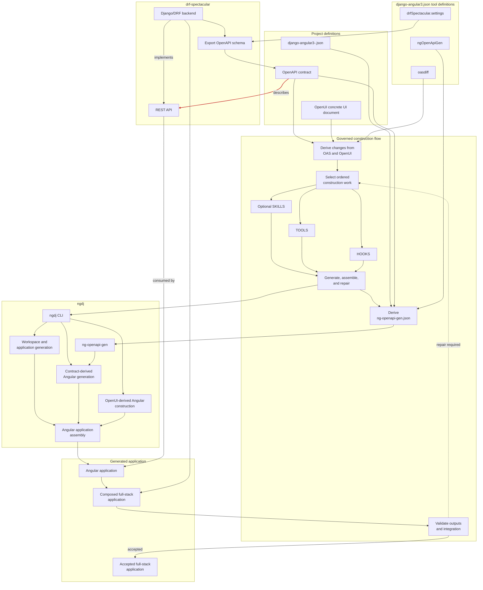

# Specifications

## 1. Purpose and scope

This document defines exact platform structures, configuration relationships,
development diagnostics, generated-application organization, and deployment
topologies that satisfy the outcomes in
[APPLICATION_FUNCTIONAL_REQUIREMENTS.md] and
[APPLICATION_QUALITY_REQUIREMENTS.md]. It does not define
product requirements, interface contracts, automation contracts, or
implementation sequencing.

Normative boundary contracts are defined in [CONTRACTS.md]. AI automation
contracts are defined in [AI_AUTOMATION_CONTRACTS.md]. Architecture and design
rationale are defined in [ARCHITECTURE.md]. Exact AI automation realization is
defined in [AI_AUTOMATION_SPECIFICATIONS.md].

## 2. Configuration and inputs

### 2.1. Configuration and input categories

The platform uses these distinct configuration and input categories:

- **Tool configurations** configure `djng` and its integrated tools:
  - `django-angular3.json` configures `djng`.
  - Its `ngOpenApiGen` clause configures the global `ng-openapi-gen` behavior.
  - Its `drfSpectacular.settings` clause configures the global
    `drf-spectacular` behavior.
  - Its `oasdiff` clause configures `oasdiff` schema comparison behavior.
- **Project configuration** identifies the generated application and provides
  command run-time locations for its OAS schema, OpenUI concrete UI document,
  and Angular workspace. It does not duplicate tool settings or OAS/OpenUI
  content.
- **OAS schema** defines API-contract-derived content. In model-first workflows,
  it is extracted from the Django/DRF layer; it drives generation of Angular
  interfaces to that content and uses the OpenAPI Specification (OAS).
- **OpenUI concrete UI document** defines UI requirements from user-provided and
  predefined parts. It drives Angular generation for the required UI and uses
  the `openui-spec` schema and catalog.

Their ownership is:

| Main category | Subcategory | Item / file | Owner | Purpose and relationship |
|---|---|---|---|---|
| Project configuration | — | `django-angular3-<project_name>.json` | `djng` package user | Defines the generated application's identity and locations of its OAS schema, OpenUI concrete UI document, and Angular workspace. |
| Tool configurations | `django-angular3` | `django-angular3.json` | `djng` | Canonical SSOT for global `djng` configuration. `DJANGO_ANGULAR3` and `DjangoAngularSettings` are derived from it. |
| Tool configurations | `ng-openapi-gen` | `ngOpenApiGen` clause in `django-angular3.json` | `djng` | Global `ng-openapi-gen` settings, including `serviceSuffix` and `modelIndex`. |
| Tool configurations | `ng-openapi-gen` | `ng-openapi-gen.json` in the project Angular workspace | `djng` | Derived per-run tool-configuration file. It combines global settings with command run-time `input` and `output` parameters. |
| Tool configurations | `ng-openapi-gen` | `tests/fixtures/artifacts/ng-openapi-gen/ng-openapi-gen.json` | This repository | Validation-only fixture; it is not production configuration and is not released. |
| Tool configurations | `drf-spectacular` | `drfSpectacular.settings` clause in `django-angular3.json` | `djng` | Global `drf-spectacular` settings from which `SPECTACULAR_SETTINGS` is derived for schema export. |
| Tool configurations | `oasdiff` | `oasdiff` clause in `django-angular3.json` | `djng` | Global output settings from which `oasdiff.settings` is derived. The executable and current/previous schema paths are run-time invocation parameters. |
| OAS schema | — | OpenAPI document | `djng` package user | Defines API-contract-derived content consumed during a command run. |
| OpenUI concrete UI document | — | OpenUI document | `djng` package user | Defines UI requirements consumed during a command run. |

The table classifies sources and artifacts. Executable configuration models
remain authoritative for supported fields and validation behavior.

### 2.2. Configuration and tool relationships

### 2.3. Configuration validation

Configuration loading rejects missing required clauses, invalid field types,
and invalid values before the affected command runs. The configuration model
has one authority for every setting; duplicated runtime-setting authority is
not permitted.

## 3. Development diagnostics

When the generated application's Django server runs with `DEBUG=True`, a Python
exception raised by a `djng` management command or `build_app` invocation
surfaces through Django's standard unhandled-exception traceback page. It is
not swallowed or reduced to stdout-only output.

The generated application exposes `/ng/build` for development diagnostics. The
page shows:

- the last `ng build` exit status and timestamp;
- TypeScript compilation errors and warnings;
- a bundle-size summary;
- ESLint output when configured; and
- a build retrigger control.

The page is available only when `DEBUG=True` or
`ENABLE_NG_BUILD_PAGE=True`. It is never exposed in production.

## 4. Generated application structure

### 4.1. Backend structure

The generated application backend is organized as discrete Django apps with
bounded responsibilities:

- A `common` app provides shared base models, utilities, and reusable
  pagination, filtering, and exception helpers.
- An `accounts` app owns user account management, authentication, and
  authorization.
- An `access` app owns roles, groups, permission mapping, and object-level
  authorization helpers where required.
- Domain-specific business modules are separate apps, keeping module logic
  isolated from the shared platform apps.

### 4.2. Frontend structure

The generated Angular application is organized into areas with clearly bounded
responsibilities:

- A `core` area owns application bootstrap, authentication state, HTTP
  interceptors, shell layout, global navigation, route guards, and app-wide
  services.
- A `shared` area owns reusable UI components, common form helpers, table
  wrappers, dialogs, and utility code.
- A `features` area owns page components, feature routing, API service wrappers
  per module, and feature-specific models and forms.
- The frontend does not depend on Django template rendering or DRF UI
  facilities for the main product experience.

### 4.3. UI patterns

The generated application standardizes and reuses patterns for tables, lists,
detail views, forms, dialogs, snackbars, and confirmation flows rather than
implementing them independently per feature.

## 5. Deployment topology

### 5.1. Production deployment

The generated application uses a same-origin production deployment:

- The Angular application is built into static assets served from the same
  origin as the Django backend.
- Django serves API endpoints under `/api/` and owns authentication and
  administration routes.
- Static assets are served either by Django with a static-file layer or by a
  reverse proxy in front of Django.
- The browser communicates with one origin for both UI and API traffic.
- User-facing application routes resolve to the Angular entry point.

### 5.2. Local development topology

The generated application uses this local-development topology:

- Django runs as the backend development server.
- Angular runs its own local development server.
- The Angular development server proxies API traffic to the Django backend.
- The Angular development server owns user-facing route handling during
  development.
- Frontend routes and backend routes remain distinct in local and production
  configurations.

[AI_AUTOMATION_CONTRACTS.md]: ../contracts/AI_AUTOMATION_CONTRACTS.md
[AI_AUTOMATION_SPECIFICATIONS.md]: AI_AUTOMATION_SPECIFICATIONS.md
[APPLICATION_FUNCTIONAL_REQUIREMENTS.md]: ../requirements/APPLICATION_FUNCTIONAL_REQUIREMENTS.md
[APPLICATION_QUALITY_REQUIREMENTS.md]: ../requirements/APPLICATION_QUALITY_REQUIREMENTS.md
[ARCHITECTURE.md]: ../ARCHITECTURE.md
[CONTRACTS.md]: ../contracts/CONTRACTS.md
