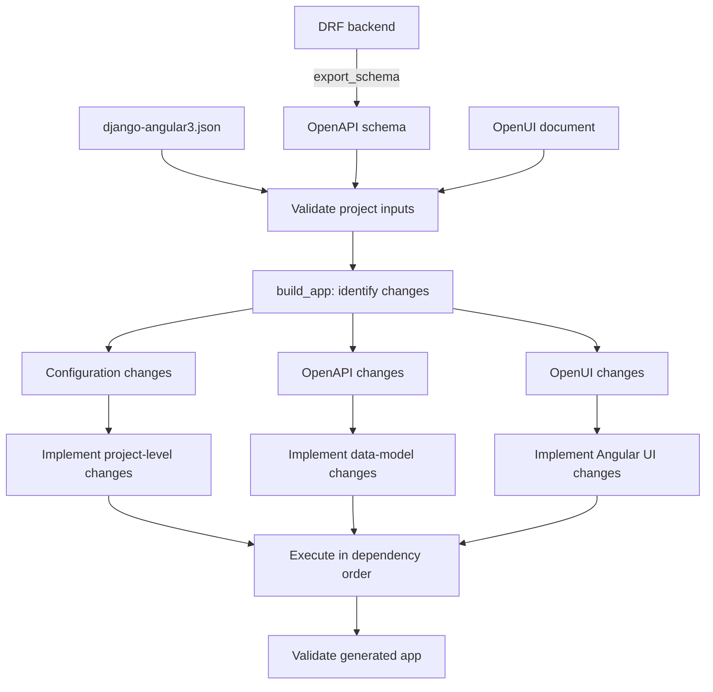

# Usage workflow

`django-angular3` is **contract-first**: the OpenAPI schema exported from your
DRF backend is the source of truth for CRM-facing functionality, and bespoke
non-CRM pages and forms are supplied separately as a structured UI definition.
This page describes the end-to-end cycle for your own project. For a guided
run-through using a ready-made sample, start with
[Getting started](getting-started.md).

## Responsibilities

- **Django + DRF** own backend data, authentication, authorization, and
  administration.
- **Angular Material** owns the end-user application and the client-side route
  tree.
- **OpenAPI** is the source of truth for CRM-facing, contract-derived content.
- **The UI definition** supplies bespoke non-CRM pages, reactive forms, and
  workflows, kept separate from the OpenAPI-derived content.

## The cycle



### 1. Export the OpenAPI contract

Inside a Django project with a live DRF backend, export the schema as a
versioned artifact. This is a Django management command (it needs DRF and
`drf-spectacular`):

```bash
python manage.py export_schema django-angular3.json
# or: python manage.py export_schema django-angular3.json --format yaml --dry-run
```

`export_schema` rotates the previous schema alongside the current one (inserting
`.previous` before the file extension) so later steps can detect changes.

### 2. Supply the UI definition

Author or update the OpenUI concrete UI document referenced by `openui.source` in
your `django-angular3.json`. The generated app convention names this document
`app.openui.json`. Its grammar and vocabulary are defined by
[shlomoa/openui-spec](https://github.com/shlomoa/openui-spec), not by djng;
consult the [OpenUI per-scope examples](https://openui-spec.readthedocs.io/en/latest/examples/)
when authoring non-CRM pages, forms, and workflows. The repository fixture at
[`spec/openui/app.openui.json`](https://github.com/shlomoa/django-angular3/blob/main/spec/openui/app.openui.json)
shows the accepted concrete-document structure.

### 3. Validate

Validate the project configuration and its referenced sources before building.
Each piece can also be validated in isolation:

```bash
django-angular3 validate-project django-angular3.json
django-angular3 validate-openapi schema.yaml
django-angular3 validate-openui openui.json
```

### 4. Build and validate the generated app

Run `build_app` to validate inputs, compare the current and prior OpenAPI and
OpenUI documents, execute the required construction commands in dependency
order, and validate the resulting generated app. Use `--dry-run` only for
validation and debugging: it validates inputs, identifies changes, and reports
the derived commands without executing them or modifying the workspace:

```bash
# Inside a generated app:
python manage.py build_app django-angular3.json
# Diagnose validation or change-translation results without execution:
python manage.py build_app django-angular3.json --dry-run
```

`build_app` is a management command. It validates the configured OpenAPI and UI
sources before executing change-derived construction commands and terminal
validation.

### 5. Run individual Angular wrappers when needed

The `ng_*` commands wrap the Angular toolchain. They require Node.js and pnpm.
Use `--dry-run` only to validate and debug a wrapper invocation without
executing it:

```bash
django-angular3 ng_workspace django-angular3.json     # bootstrap the workspace
django-angular3 ng_openapi_gen django-angular3.json   # generate API client from OpenAPI
django-angular3 ng_build django-angular3.json          # build the Angular app
```

`ng_openapi_gen` runs a locally installed `ng-openapi-gen` via `pnpm exec`, so
it only uses dependencies already present in the workspace — it never downloads
and executes packages at runtime.

### 6. Compose Angular feature components

Backend-driven artifacts (the API client, data services, contract-derived
pages) come from the schema. Bespoke feature UI is composed from Angular
components generated by the `angular-django2` schematics and wired into the
visible application hierarchy. This is a repeatable **generate → embed**
workflow.

The commands below are Angular schematics; run them inside the generated
workspace with `pnpm exec ng generate ...` (the same locally installed toolchain
the `ng_*` wrappers use). Replace `<app-name>` with your application name.

For an advanced Material component that needs theme mixins, nested children,
projection slots, or CDK overlay behavior, use the `ng_complex_component`
wrapper rather than assembling those features through `embed-component` alone:

```bash
django-angular3 ng_complex_component django-angular3.json \
  --name dashboard-card --target-path src/app/features/dashboard \
  --features mixins,nested,projection --dry-run
```

The wrapper delegates to `angular-django2:complex-component`. Use `--mode
modify` to add features, or `--mode delete --confirm` to remove the generated
component and registered theme mixin.

#### Generate a feature component

Generate a component into the intended Angular project instead of leaving it
disconnected or workspace-root-relative:

```bash
ng generate angular-django2:component dashboard-card \
  --project=<app-name> --path=src/app/features/dashboard
```

This creates the component under
`projects/<app-name>/src/app/features/dashboard/dashboard-card/` as a standalone
`OnPush` component. Unlike a plain `ng generate component`, the generated
TypeScript and template files are seeded with stable **begin/end embedding
hooks** — marker pairs around the import, injected-services, input, output, and
template `children` sections. These markers are the well-known insertion points
the `embed-component` schematic targets, so a generated component is ready to be
wired into a parent without hand-editing.

#### Embed a generated child into a parent

Generating a component does not make it visible. Wire it into a parent
component with `embed-component`, using workspace-relative `.ts` paths:

```bash
ng generate angular-django2:embed-component \
  --component=projects/<app-name>/src/app/features/dashboard/dashboard-card/dashboard-card.ts \
  --parent=projects/<app-name>/src/app/app.ts
```

**Before** — making the child visible meant several manual, error-prone edits to
the parent: add the child selector to the template, import the child class,
register it in the standalone `imports` array, wire each input/output signal, and
hand-write output callback methods.

**After** — `embed-component` performs that wiring through the generated hooks:

- inserts the child element after the parent template `children` marker
- feeds each child input signal
- binds each child output signal to an `on<Output>($event)` handler
- imports the child class in the parent
- registers the child in the parent standalone `imports` array
- adds not-implemented `on<Output>()` handler stubs to the parent class

You then fill in the generated `on<Output>()` stubs with real behavior.

#### Compose a nested feature hierarchy

Repeat the two steps to build a feature area from several components and embed the
feature parent into the app shell. Each `embed-component` call names one child
(`--component`) and one parent (`--parent`):

```bash
ng generate angular-django2:component hero-card \
  --project=<app-name> --path=src/app/features/dashboard
ng generate angular-django2:component dashboard \
  --project=<app-name> --path=src/app/features/dashboard
ng generate angular-django2:embed-component \
  --component=projects/<app-name>/src/app/features/dashboard/hero-card/hero-card.ts \
  --parent=projects/<app-name>/src/app/features/dashboard/dashboard/dashboard.ts
ng generate angular-django2:embed-component \
  --component=projects/<app-name>/src/app/features/dashboard/dashboard/dashboard.ts \
  --parent=projects/<app-name>/src/app/app.ts
```

`hero-card` is embedded into `dashboard`, then `dashboard` is embedded into the
root `app` component, producing a visible nested UI.

To embed a third-party component (for example an Angular Material control), use
package mode by adding `--from` and treating `--component` as the exported class
name, optionally with `--selector`, `--inputs`, and `--outputs`:

```bash
ng generate angular-django2:embed-component \
  --component=MatDateRangePicker --from=@angular/material/datepicker \
  --parent=projects/<app-name>/src/app/app.ts
```

#### Re-run embedding safely

`embed-component` is designed to be **idempotent**: re-running the same embed
during iterative development does not duplicate the child selector, the import,
the `imports` array entry, or the `on<Output>()` handler stubs. After embedding,
rebuild to verify the composition compiles:

```bash
django-angular3 ng_build django-angular3.json
```

### 7. Iterate

The workflow is iterative. After the backend schema changes, business records
change, or you adjust the UI definition, re-export the schema, re-validate, and
re-run the build and Angular steps. Re-verify frontend/backend alignment after
each cycle.

## Which interface should I use?

- Use the **standalone CLI** (`django-angular3 <command>`) for validation and
  Angular wrappers without a Django project — for
  example in CI or while working in this repository.
- Use the **Django management commands** (`python manage.py <command>`) inside a
  generated app — especially for `export_schema`, `build_app`, and full
  workspace lifecycle management.

See the [command reference](commands.md) for the complete list and the
availability of each command in both interfaces.
